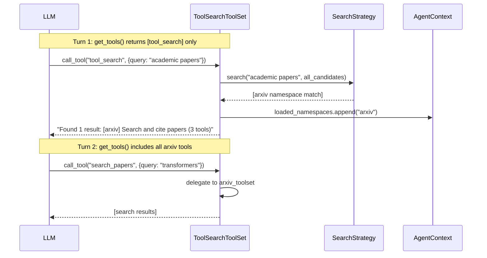
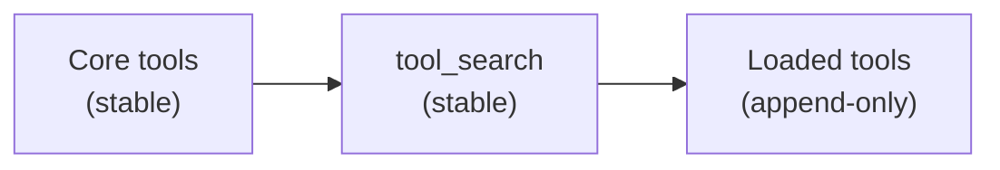

# Tool Search

ToolSearchToolSet enables dynamic tool discovery for agents with large tool libraries. Instead of loading all tool definitions into the model's context window upfront, it exposes a `tool_search` tool that the model calls to find and load only the tools it needs.

This solves two problems that compound as tool counts scale:

- **Context bloat**: Tool definitions consume context budget fast. Tool search typically reduces this by 85%+, loading only the 3-5 tools actually needed per request.
- **Tool selection accuracy**: Model accuracy in picking the right tool degrades past 30-50 tools. Dynamic loading keeps accuracy high across hundreds of tools.

## Quick Start

```python
from ya_agent_sdk.toolsets import Toolset
from ya_agent_sdk.toolsets.tool_search import ToolSearchToolSet

# Create toolsets - those with toolset_id become namespaces (atomic loading)
arxiv_toolset = Toolset(tools=[SearchPapersTool, GetPaperTool, CiteTool], toolset_id="arxiv")
github_toolset = Toolset(tools=[ListReposTool, CreateIssueTool, PRTool], toolset_id="github")

# Toolsets without id provide loose tools (individual loading)
misc_toolset = Toolset(tools=[CalculatorTool, TranslateTool])

# Wrap with tool search
search_toolset = ToolSearchToolSet(
    toolsets=[arxiv_toolset, github_toolset, misc_toolset],
    namespace_descriptions={
        "arxiv": "Search and cite academic papers on arXiv",
        "github": "GitHub repository and issue operations",
    },
    max_results=5,
)

# Use with create_agent
async with create_agent("anthropic:claude-sonnet-4", toolsets=[search_toolset]) as runtime:
    result = await runtime.agent.run("...", deps=runtime.ctx)
```

The model sees only `tool_search` initially. When it needs tools, it calls `tool_search` with a natural language query. Matching tools are loaded and become available on the next turn.

## How It Works



### Namespace vs Loose Loading

| Toolset Type  | Has `id`?                  | Loading Behavior                                                 |
| ------------- | -------------------------- | ---------------------------------------------------------------- |
| **Namespace** | Yes (`toolset_id="arxiv"`) | All tools load atomically when any tool or the namespace matches |
| **Loose**     | No                         | Individual tools load independently                              |

**Namespace loading**: When any tool from a namespace matches a search (or the namespace itself matches), all tools in that namespace become available. This is ideal for cohesive tool groups (e.g., all GitHub tools together).

**Loose loading**: Each tool loads independently. Good for miscellaneous utilities that don't belong to a group.

## Session Restore

Loaded tool state is stored in `AgentContext` and automatically persisted via `ResumableState`. When a session is restored, previously loaded tools and namespaces are immediately available without re-searching.

```python
# Session 1: discover and use tools
async with create_agent("openai:gpt-4o", toolsets=[search_toolset]) as runtime:
    result = await runtime.agent.run("Search arxiv for transformers", deps=runtime.ctx)

    # Export state - includes tool_search_loaded_namespaces and tool_search_loaded_tools
    state = runtime.ctx.export_state()
    save_to_disk(state)

# Session 2: restore - arxiv tools are immediately available
async with create_agent("openai:gpt-4o", toolsets=[search_toolset], state=saved_state) as runtime:
    # No need to call tool_search again for arxiv tools
    result = await runtime.agent.run("Get paper details for 2401.12345", deps=runtime.ctx)
```

The state fields:

- `AgentContext.tool_search_loaded_namespaces`: List of loaded namespace IDs
- `AgentContext.tool_search_loaded_tools`: List of individually loaded loose tool names

## Configuration

### Constructor Parameters

| Parameter                | Type                        | Default                   | Description                                      |
| ------------------------ | --------------------------- | ------------------------- | ------------------------------------------------ |
| `toolsets`               | `Sequence[AbstractToolset]` | required                  | Wrapped toolsets. Those with `id` are namespaces |
| `namespace_descriptions` | `dict[str, str] \| None`    | `None`                    | Human-readable descriptions for namespaces       |
| `search_strategy`        | `SearchStrategy \| None`    | `KeywordSearchStrategy()` | Search algorithm                                 |
| `max_results`            | `int`                       | `5`                       | Max results returned per search                  |

### Namespace Description Resolution

When building the search index, namespace descriptions are resolved in priority order:

1. `namespace_descriptions[toolset.id]` -- explicit user override
2. `toolset.description` -- from `BaseToolset.description` property or `Toolset(description=...)`
3. `toolset.instructions` -- first line of MCP server instructions (available after initialization)
4. `toolset.label` -- pydantic-ai label (if not the default class name)
5. Auto-generated: `"Toolset: {toolset.id}"`

```python
# Explicit descriptions (highest priority)
ToolSearchToolSet(
    toolsets=[arxiv_toolset],
    namespace_descriptions={"arxiv": "Search academic papers on arXiv"},
)

# Or set description on the toolset itself
arxiv_toolset = Toolset(
    tools=[...],
    toolset_id="arxiv",
    description="Search academic papers on arXiv",
)
```

## Search Strategies

### KeywordSearchStrategy (default)

Zero external dependencies. Uses case-insensitive regex matching across tool names, descriptions, parameter names, and namespace names.

Scoring:

- Name match: 3 points
- Description match: 2 points
- Namespace match: 2 points
- Parameter name/description match: 1 point each

```python
from ya_agent_sdk.toolsets.tool_search import ToolSearchToolSet, KeywordSearchStrategy

ts = ToolSearchToolSet(
    toolsets=[...],
    search_strategy=KeywordSearchStrategy(),  # this is the default
)
```

Supports regex patterns: the model can search with `"get_.*data"` to match `get_user_data`, `get_weather_data`, etc.

### EmbeddingSearchStrategy (semantic)

Semantic search using [FastEmbed](https://github.com/qdrant/fastembed) (ONNX-based local embeddings). Better at matching intent rather than exact keywords.

**Install:**

```bash
pip install ya-agent-sdk[tool-search]
# or: pip install fastembed numpy
```

**Usage:**

```python
from ya_agent_sdk.toolsets.tool_search import ToolSearchToolSet, EmbeddingSearchStrategy

ts = ToolSearchToolSet(
    toolsets=[...],
    search_strategy=EmbeddingSearchStrategy(),
)
```

| Property | Value                               |
| -------- | ----------------------------------- |
| Model    | `BAAI/bge-small-en-v1.5` (384 dims) |
| Size     | ~50MB (downloaded on first use)     |
| Runtime  | ONNX Runtime (~50MB), no PyTorch    |
| GPU      | Not required                        |
| Latency  | ~5ms per query on CPU               |

Custom model:

```python
strategy = EmbeddingSearchStrategy(model_name="BAAI/bge-base-en-v1.5")
```

### Automatic Strategy Selection

Use `create_best_strategy()` to automatically select the best available strategy. It tries `EmbeddingSearchStrategy` first (including model loading verification), and falls back to `KeywordSearchStrategy` if fastembed is not installed or the model fails to load.

```python
from ya_agent_sdk.toolsets.tool_search import ToolSearchToolSet, create_best_strategy

ts = ToolSearchToolSet(
    toolsets=[...],
    search_strategy=create_best_strategy(),
)
```

This is the recommended approach for applications that want the best search quality when available without hard-depending on fastembed.

### Custom Strategy

Implement the `SearchStrategy` protocol:

```python
from ya_agent_sdk.toolsets.tool_search import SearchStrategy, ToolMetadata

class MySearchStrategy:
    def build_index(self, tools: list[ToolMetadata]) -> None:
        """Pre-compute index (called when tool registry changes)."""
        ...

    def search(
        self,
        query: str,
        candidates: list[ToolMetadata],
        max_results: int = 5,
    ) -> list[ToolMetadata]:
        """Return ranked results from candidates."""
        ...
```

## When to Use Tool Search

**Good use cases:**

- 10+ tools in your system
- Tool definitions consuming >10K tokens
- Multiple toolsets / MCP servers combined
- Tool library growing over time

**When regular toolsets are better:**

- Fewer than 10 tools total
- All tools are frequently used in every request
- Very small tool definitions

## Architecture

### Tool Ordering

ToolSearchToolSet is designed for stable, append-only tool positioning:

- **`tool_search` is always the first tool** returned by `get_tools()`. This gives it a fixed position in the model's tool list regardless of how many tools have been dynamically loaded.
- **Loaded tools are appended after `tool_search`**. Each time the model discovers new tools, they appear after existing tools in the list, never before.

To ensure dynamically loaded tools do not shift the positions of other toolsets, **register ToolSearchToolSet as the last toolset**:

```python
# Always-visible core tools
core_toolset = Toolset(tools=[ViewTool, EditTool, ShellTool])

# Dynamic tools via search -- LAST in the list
search_toolset = ToolSearchToolSet(
    toolsets=[web_toolset, db_toolset, cloud_toolset],
    namespace_descriptions={...},
)

# Combine: core first, search last
async with create_agent(
    "openai:gpt-4o",
    toolsets=[core_toolset, search_toolset],
) as runtime:
    ...
```

This produces a stable tool order:



If ToolSearchToolSet were placed before other toolsets, dynamically loaded tools would shift those toolsets' positions in the tool list on each load.

### Separation of Concerns

ToolSearchToolSet is purely for dynamic loading. Always-visible tools should be placed in separate toolsets passed directly to `create_agent`:

```python
# Always-visible core tools
core_toolset = Toolset(tools=[ViewTool, EditTool, ShellTool])

# Dynamic tools via search
search_toolset = ToolSearchToolSet(
    toolsets=[web_toolset, db_toolset, cloud_toolset],
    namespace_descriptions={...},
)

# Combine both
async with create_agent(
    "openai:gpt-4o",
    toolsets=[core_toolset, search_toolset],
) as runtime:
    ...
```

## See Also

- [toolset.md](toolset.md) -- Toolset architecture and BaseTool
- [subagent.md](subagent.md) -- Subagent system with tool inheritance
- [context.md](context.md) -- AgentContext and session persistence
