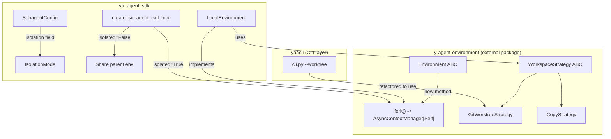
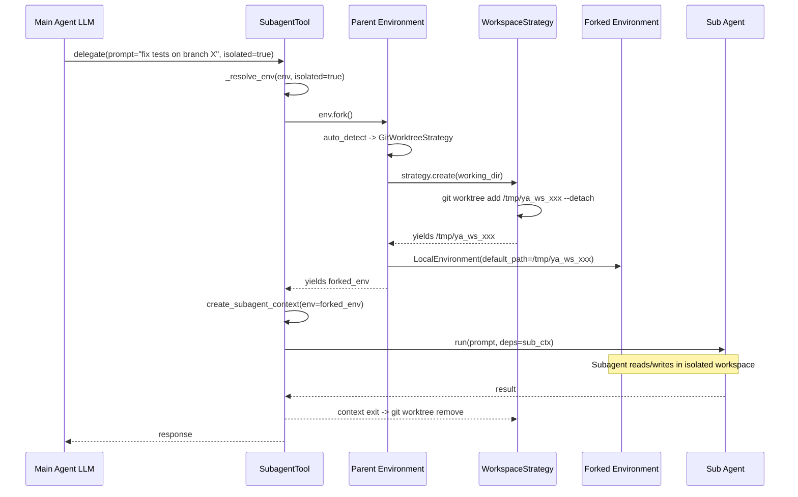

# Workspace Isolation (Environment Fork)

## Overview

Workspace isolation allows subagents to operate in an independent copy of the working directory, preventing file conflicts between parallel agents. The core abstraction is `Environment.fork()`, which creates a temporary, isolated clone of the current environment.

Git worktree is the primary strategy for git repositories; other strategies (copy, symlink) serve as fallbacks for non-git workspaces.

## Architecture



## Design Decisions

### Why `Environment.fork()` instead of a standalone workspace manager

The Environment already owns the file_operator, shell, and resource lifecycle. Creating an isolated workspace means creating a new Environment with a different working directory. Making `fork()` a method on Environment keeps this ownership clear and allows each Environment subclass to define its own isolation semantics (e.g., `SandboxEnvironment` could spawn a new container).

### Why WorkspaceStrategy is separate from Environment

The *mechanism* for creating an isolated directory (git worktree, rsync, symlink) is orthogonal to the Environment type. A `LocalEnvironment` should be able to use git worktree or copy depending on the project. Strategy injection keeps this flexible.

### Why IsolationMode on SubagentConfig

Three modes control the `isolated` parameter visibility on the subagent tool:

| Mode              | `isolated` param | Behavior                   |
| ----------------- | ---------------- | -------------------------- |
| `never` (default) | Hidden           | Always shares parent env   |
| `always`          | Hidden           | Always forks env           |
| `optional`        | Exposed to LLM   | LLM decides per invocation |

This lets config authors set sensible defaults while giving the main agent LLM runtime control when appropriate.

## Components

### 1. WorkspaceStrategy (in `y-agent-environment`)

```python
class WorkspaceStrategy(ABC):
    """Strategy for creating an isolated workspace directory."""

    @abstractmethod
    def is_available(self, working_dir: Path) -> bool:
        """Check if this strategy can create a workspace for the given directory."""
        ...

    @abstractmethod
    def create(self, working_dir: Path) -> AbstractAsyncContextManager[Path]:
        """Create an isolated workspace directory.

        Yields the path to the new workspace. Cleanup (e.g., git worktree remove,
        rmtree) happens automatically when the context manager exits.
        """
        ...
```

Built-in strategies:

- **GitWorktreeStrategy**: `git worktree add <tmp> --detach` / `git worktree remove <tmp>`. Available when `working_dir` is inside a git repo with at least one commit.
- **CopyStrategy**: `shutil.copytree` with optional ignore patterns. Always available as fallback.

### 2. Environment.fork() (in `y-agent-environment`)

```python
class Environment(ABC):
    # ... existing ...

    def __init__(self, ..., fork_strategy: WorkspaceStrategy | None = None):
        self._fork_strategy = fork_strategy

    @asynccontextmanager
    async def fork(self) -> AsyncIterator[Self]:
        """Create an isolated copy of this environment.

        The forked environment has its own file_operator and shell pointing
        to an isolated workspace directory. Resources are NOT shared -- the
        forked environment starts with an empty resource registry.

        Yields:
            A new Environment instance with isolated workspace.

        Raises:
            NotImplementedError: If no fork_strategy is configured and
                auto-detection finds no suitable strategy.
        """
        raise NotImplementedError
```

Default implementation raises `NotImplementedError`. `LocalEnvironment` overrides with strategy-based forking.

### 3. LocalEnvironment.fork() (in `ya_agent_sdk`)

```python
class LocalEnvironment(Environment):
    def __init__(self, ..., fork_strategy: WorkspaceStrategy | None = None):
        super().__init__(..., fork_strategy=fork_strategy)

    @asynccontextmanager
    async def fork(self) -> AsyncIterator[LocalEnvironment]:
        strategy = self._fork_strategy or _auto_detect(self._default_path)
        if strategy is None:
            raise NotImplementedError(
                "Cannot fork: no workspace strategy available "
                "and auto-detection found no suitable strategy."
            )
        async with strategy.create(self._default_path) as ws_path:
            forked = LocalEnvironment(
                default_path=ws_path,
                allowed_paths=[ws_path],
                shell_timeout=self._shell_timeout,
                enable_tmp_dir=self._enable_tmp_dir,
            )
            async with forked:
                yield forked


def _auto_detect(working_dir: Path | None) -> WorkspaceStrategy | None:
    """Auto-select best available strategy."""
    if working_dir is None:
        return None
    git = GitWorktreeStrategy()
    if git.is_available(working_dir):
        return git
    return CopyStrategy()
```

### 4. IsolationMode and SubagentConfig (in `ya_agent_sdk`)

```python
class IsolationMode(StrEnum):
    NEVER = "never"
    ALWAYS = "always"
    OPTIONAL = "optional"


class SubagentConfig(BaseModel):
    # ... existing fields ...
    isolation: IsolationMode = IsolationMode.NEVER
```

In markdown frontmatter:

```yaml
---
name: executor
description: Execute tasks independently
isolation: optional
---
```

### 5. Subagent call_func integration (in `ya_agent_sdk`)

```python
@asynccontextmanager
async def _resolve_env(
    env: Environment | None,
    isolated: bool,
) -> AsyncIterator[Environment | None]:
    """Fork environment if isolated, passthrough otherwise."""
    if not isolated or env is None:
        yield env
        return
    async with env.fork() as forked:
        yield forked
```

The `create_subagent_call_func` uses `_resolve_env` to wrap the subagent execution. When `isolation == OPTIONAL`, the generated tool signature includes an `isolated: bool = False` parameter.

## Data Flow



## Backward Compatibility

- `IsolationMode.ALWAYS` is the default: subagents run in isolated workspaces by default.
- `Environment.fork()` defaults to `NotImplementedError`: existing Environment subclasses are unaffected.
- Graceful degradation: when fork is not supported, subagents fall back to shared environment automatically.
- `LocalEnvironment.__init__` gains an optional `fork_strategy` parameter with default `None`.
- No changes to `AgentContext.create_subagent_context` interface -- env override already works via `**override`.

## Custom Environments

When building a custom Environment subclass, workspace isolation works out of the box
via graceful degradation. No changes are required to existing Environment implementations:

1. **Without fork() support**: The SDK detects `NotImplementedError` on the first subagent
   call, caches the result per environment type, and silently falls back to shared environment
   for all subsequent calls. A single warning is logged.

2. **With fork() support**: Override `fork()` to return an async context manager yielding
   a new Environment instance. Use `WorkspaceStrategy` for directory isolation, or implement
   custom logic (e.g., spawning a new container).

```python
from contextlib import asynccontextmanager
from ya_agent_sdk.workspace import GitWorktreeStrategy

class MyEnvironment(Environment):
    @asynccontextmanager
    async def fork(self):
        strategy = GitWorktreeStrategy()
        async with strategy.create(self._working_dir) as ws_path:
            forked = MyEnvironment(working_dir=ws_path)
            async with forked:
                yield forked
```

## yaacli Unification

yaacli's existing `--worktree` implementation (`_create_worktree` in `cli.py`) can be refactored to use `GitWorktreeStrategy` for the main agent's workspace, and pass the strategy to `TUIEnvironment` so subagents can also fork. This is a follow-up change, not part of the core implementation.
