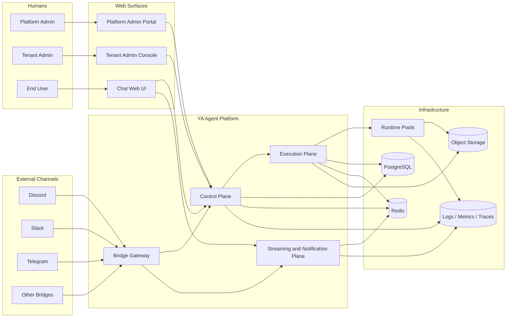

# 000 Platform Overview

## Goal

`ya-agent-platform` turns `ya-agent-sdk` into a cloud-ready agent platform with durable tenancy, administration, browser-based chat, bridge integrations, and environment-aware runtime execution.

The package serves three classes of users at the same time:

1. platform operators running the service
2. tenant administrators configuring agents and policies
3. end users interacting with agents through web chat and external channels

## What Changes Relative to Netherbrain

Netherbrain validated the runtime-centered loop:

- persistent conversations and sessions
- event streaming
- web chat
- IM gateway integration

YA Agent Platform keeps that loop and rebuilds the surrounding system around cloud defaults:

- tenants replace single-instance ownership
- admin surfaces become first-class product surfaces
- runtime execution moves behind schedulable runtime pools
- environment selection becomes explicit per agent and per session
- storage assumes PostgreSQL, Redis, and object storage instead of local-first paths
- browser chat and bridge channels share one multi-tenant conversation model

## Product Thesis

The platform is one product with three connected surfaces:

- a Web UI for end users and workspace operators
- a tenant admin console for configuring agents, workspaces, bridges, and policies
- a platform admin portal for operating the whole service

External channels such as Discord, Slack, Telegram, WeCom, email, and future connectors enter through the same control plane and execution plane.

## Scope

### In scope

- tenant and workspace lifecycle
- human identity, service identity, and access control
- agent profile and environment profile management
- conversation, session, streaming, and async execution
- bridge installation and normalized bridge protocol
- first-party Web UI for chat and administration
- cloud deployment topology and runtime scheduling

### Out of scope for the first implementation wave

- billing and invoicing
- marketplace-style third-party app ecosystem
- arbitrary customer-defined compute orchestration plugins
- full low-code workflow builder

## Domain Language

| Term                | Meaning                                                                             |
| ------------------- | ----------------------------------------------------------------------------------- |
| Platform            | The full multi-tenant service operated by YA Agent Platform maintainers             |
| Tenant              | Top-level customer or organizational boundary                                       |
| Workspace           | A tenant-scoped operational space for projects, policies, agents, and conversations |
| Agent Profile       | Reusable agent configuration built on `ya-agent-sdk`                                |
| Environment Profile | A reusable definition of where and how an agent is allowed to execute               |
| Runtime Pool        | A schedulable execution capacity group with shared capabilities and isolation rules |
| Conversation        | A logical thread of interaction across Web UI or external channels                  |
| Session             | An immutable execution snapshot inside a conversation                               |
| Bridge Installation | A configured external-channel binding owned by a tenant or workspace                |
| Delivery            | One inbound or outbound message exchange through a surface or bridge                |
| Platform Admin      | Operator with service-wide control                                                  |
| Tenant Admin        | Customer-side administrator with tenant-scoped control                              |

## Design Principles

1. **Tenant first**

   - every durable resource carries a tenant boundary
   - every request resolves identity and authorization before business logic

2. **Cloud ready by default**

   - control and execution are separable
   - workers can scale independently from APIs and Web UI
   - object storage is the durable home for session state and artifacts

3. **One conversation model across surfaces**

   - web chat and external channels share the same conversation and session abstractions
   - bridges translate surface-specific behavior into normalized platform events

4. **Environment-aware execution**

   - agents can run in different environments under a stable platform contract
   - environment selection is a product feature, not an infrastructure afterthought

5. **SDK-native runtime**

   - `ya-agent-sdk` remains the substrate for agent execution, tools, state restore, and streaming
   - platform code owns tenancy, policy, scheduling, and delivery semantics

## System Context

## Initial Success Criteria

Phase 1 is successful when the platform can:

1. host multiple tenants with isolated workspaces and conversations
2. authenticate platform admins, tenant admins, members, and service integrations
3. schedule sessions onto the correct runtime pool according to environment profiles
4. stream agent execution to Web UI clients and bridge adapters
5. manage bridge installations and deliver normalized inbound and outbound messages
6. expose one Web UI with role-aware chat and administration surfaces
