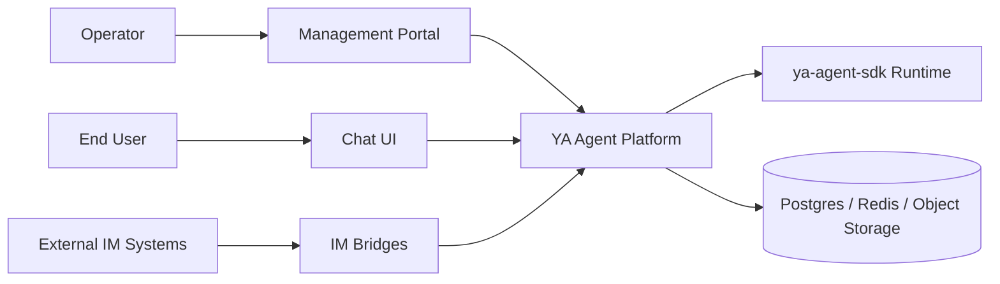

# 000 Platform Overview

## Goal

`ya-agent-platform` is a cloud-ready agent platform built on top of `ya-agent-sdk`.
It turns the SDK runtime model into an operated product surface with administration,
chat delivery, and external bridge integration.

## Why This Exists

Netherbrain proved the core interaction loop:

- persistent runtime
- web chat
- IM integration

The next platform iteration targets stronger cloud assumptions:

- multiple first-party surfaces instead of a single embedded UI
- normalized bridge contracts instead of per-channel coupling
- clearer control plane and execution plane boundaries
- deployment topology that scales past homelab assumptions

## Product Surfaces

1. **Management Portal**
   - manage workspaces, agents, presets, bridges, credentials, and policies
2. **Chat UI**
   - first-party browser interface for end users and operators
3. **IM Bridges**
   - adapters for Discord, Telegram, Slack, WeCom, email, and future channels
4. **Runtime APIs**
   - programmatic entry points for sessions, events, streaming, and tooling

## Core Design Principles

- keep the runtime contract compatible with `ya-agent-sdk`
- separate control-plane concerns from conversation delivery
- normalize ingress and egress through a shared bridge event model
- prefer stateless edge adapters and durable central orchestration
- write the spec before expanding implementation breadth

## Initial Domain Language

| Term          | Meaning                                                                  |
| ------------- | ------------------------------------------------------------------------ |
| Workspace     | Top-level tenant or project boundary                                     |
| Agent Profile | Reusable agent configuration and capability bundle                       |
| Session       | Long-lived conversation state anchored to a workspace and agent          |
| Surface       | First-party interaction entry such as admin or chat                      |
| Bridge        | Adapter that converts an external system into normalized platform events |
| Delivery      | A single inbound or outbound message exchange across a surface or bridge |

## System Context

## Phase 1 Scope

Phase 1 establishes:

- backend service skeleton and local run path
- frontend shell for management and chat surfaces
- platform terminology and boundaries
- bridge protocol draft
- first HTTP API draft

## Phase 2 Scope

Phase 2 adds:

- persistence model
- authn and authz model
- session orchestration
- streaming transport
- first real bridge implementation
