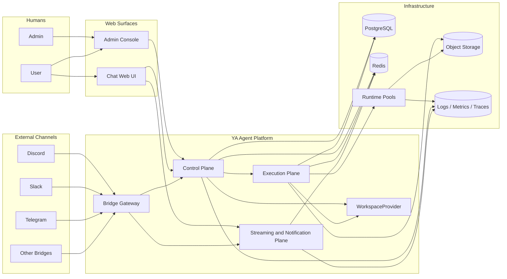

# 000 Platform Overview

## Goal

`ya-agent-platform` turns `ya-agent-sdk` into a cloud-ready agent platform with durable isolation, administration, browser-based chat, bridge integrations, a pluggable `WorkspaceProvider`, environment-aware runtime execution, and cost-aware usage attribution.

The package serves three classes of actors at the same time:

1. admins operating the service and global configuration
2. users working inside assigned tenants and business-defined conversations
3. service integrations such as bridges and automation clients

## What Changes Relative to Netherbrain

Netherbrain validated the runtime-centered loop:

- persistent conversations and sessions
- event streaming
- web chat
- IM gateway integration

YA Agent Platform keeps that loop and rebuilds the surrounding system around cloud defaults:

- tenants replace single-instance ownership as the isolation boundary
- admin surfaces become first-class product surfaces
- runtime execution moves behind schedulable runtime pools
- environment selection becomes explicit per agent and per session
- storage assumes PostgreSQL, Redis, and object storage as the durable baseline
- browser chat and bridge channels share one multi-tenant conversation model
- cost centers provide budgeting and reporting across isolated tenants
- `WorkspaceProvider` resolves runtime project bindings from `project_ids`

## Product Thesis

The platform is one product with three connected surfaces:

- a Web UI for end users and admins
- an admin console for global operators and configuration workflows
- a bridge gateway for external channels

External channels such as Discord, Slack, Telegram, WeCom, email, and future connectors enter through the same control plane and execution plane.

The platform provides the infrastructure layer. Business-specific conversation-to-project composition stays above this layer. An IM gateway is one example of such a business layer.

`WorkspaceProvider` belongs to the platform deployment layer. Business code chooses `project_ids`. A code-registered provider implementation selected by deployment config turns those ids into a runnable environment binding.

## Scope

### In scope

- tenant lifecycle and isolation
- human identity, service identity, and access control
- admin and user role model with scoped grants
- cost-center attribution for quotas, usage, and reporting
- agent profile and environment profile management
- one pluggable `WorkspaceProvider` per service instance
- conversation, session, streaming, and async execution
- bridge installation and normalized bridge protocol
- first-party Web UI for chat and administration
- cloud deployment topology and runtime scheduling

### Out of scope for the first implementation wave

- billing and invoicing
- marketplace-style third-party app ecosystem
- arbitrary customer-defined compute orchestration plugins
- full low-code workflow builder
- a built-in business model above tenant isolation and runtime orchestration

## Domain Language

| Term                | Meaning                                                                                          |
| ------------------- | ------------------------------------------------------------------------------------------------ |
| Platform            | The full multi-tenant service operated by YA Agent Platform maintainers                          |
| Tenant              | An isolation boundary for data, policy, execution, and secrets                                   |
| Cost Center         | A budgeting and reporting grouping that can span one or more tenants                             |
| Project ID          | An opaque identifier understood by the configured `WorkspaceProvider`                            |
| WorkspaceProvider   | A service-level abstraction that maps `project_ids` and provider input into an agent environment |
| Project Binding     | A resolved runtime snapshot returned by the `WorkspaceProvider` for one session                  |
| Agent Profile       | Reusable agent configuration built on `ya-agent-sdk`                                             |
| Environment Profile | A reusable definition of where and how an agent is allowed to execute                            |
| Runtime Pool        | A schedulable execution capacity group with shared capabilities and isolation rules              |
| Conversation        | A logical thread of interaction across Web UI or external channels                               |
| Session             | An immutable execution snapshot inside a conversation                                            |
| Bridge Installation | A configured external-channel binding owned by a tenant                                          |
| Delivery            | One inbound or outbound message exchange through a surface or bridge                             |
| Admin               | Operator with global visibility and configuration authority                                      |
| User                | Authenticated actor with scoped access to assigned tenants and cost centers                      |

## Design Principles

1. **Isolation first**

   - every durable resource carries a tenant boundary
   - every request resolves identity and authorization before business logic

2. **Cloud ready by default**

   - control and execution are separable
   - workers can scale independently from APIs and Web UI
   - object storage is the durable home for session state and artifacts

3. **One conversation model across surfaces**

   - web chat and external channels share the same conversation and session abstractions
   - bridges translate surface-specific behavior into normalized platform events

4. **Provider-driven environment mapping**

   - `project_ids` stay opaque to the platform core
   - `WorkspaceProvider` turns runtime project intent into concrete environment bindings
   - future deployers can implement their own provider without changing the platform contract

5. **Cost-aware operations**

   - every execution resolves an effective cost center for quotas and reporting
   - cost attribution stays queryable across sessions, artifacts, and deliveries

6. **SDK-native runtime**

   - `ya-agent-sdk` remains the substrate for agent execution, tools, state restore, and streaming
   - platform code owns isolation, policy, scheduling, and delivery semantics

## System Context

## Initial Success Criteria

Phase 1 is successful when the platform can:

1. host multiple tenants with isolated conversations and sessions
2. authenticate admins, users, and service integrations
3. schedule sessions onto the correct runtime pool according to environment profiles
4. resolve `project_ids` into runnable environments through the configured `WorkspaceProvider`
5. attribute usage and quotas to effective cost centers
6. stream agent execution to Web UI clients and bridge adapters
7. manage bridge installations and deliver normalized inbound and outbound messages
8. expose one Web UI with role-aware chat and admin surfaces
