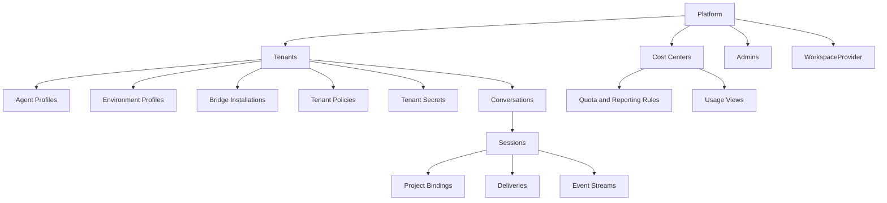

# 001 Product Model

## Product Surfaces

YA Agent Platform exposes one product with multiple role-aware surfaces.

| Surface        | Primary Users                                  | Core Jobs                                                                                         |
| -------------- | ---------------------------------------------- | ------------------------------------------------------------------------------------------------- |
| Chat Web UI    | users                                          | talk to agents, review runs, choose `project_ids`, upload files, approve tools, inspect results   |
| Admin Console  | admins and scoped users with management grants | manage tenants, cost centers, profiles, bridges, policies, quotas, and provider-facing operations |
| Bridge Gateway | bridge workers and channel adapters            | deliver normalized inbound events and receive outbound deliveries                                 |
| Public API     | automation, SDK clients, internal apps         | integrate with control plane and chat surfaces programmatically                                   |

The first-party web application can ship as one codebase with role-aware navigation and route guards.

## Primary Personas

### Admin

Owns global operations:

- create and inspect tenants
- create and inspect cost centers
- manage runtime pools and regions
- review audit trails and incident state
- tune global auth, policy, and provider configuration

### User

Works inside assigned scopes:

- chat with agents inside allowed tenants
- provide `project_ids` for a run when the business flow requires project context
- manage profiles and bridges when granted
- inspect conversations, artifacts, and failures in assigned scopes
- review cost and usage for assigned cost centers when granted

### Bridge Service

Acts as a machine identity:

- submits inbound channel events
- fetches installation configuration
- acknowledges outbound delivery results

## Resource Hierarchy

A tenant is an isolation boundary.
A cost center is a budgeting and reporting boundary.
`WorkspaceProvider` is a deployment-level adapter that turns `project_ids` into environment bindings.

## Ownership Model

### Tenant-scoped resources

- agent profiles
- environment profiles
- bridge installations
- secrets and policies
- conversations, sessions, artifacts, and deliveries

### Platform-scoped resources

- admins and user identities
- cost centers
- runtime pools
- regions
- the configured `WorkspaceProvider`
- global auth connectors
- audit and observability configuration

## Project Binding Model

The platform has no built-in project-container resource.

Project context enters the system through session requests:

- callers send an ordered `project_ids` list
- callers can optionally send provider-specific input
- the configured `WorkspaceProvider` resolves those values into one project binding snapshot
- the session stores that snapshot for restore, replay, and audit

This keeps higher-level business composition outside the platform while preserving a stable runtime contract.

## Agent Profile vs Environment Profile

Netherbrain combined many concerns into one runtime preset. YA Agent Platform separates them.

### Agent Profile

Describes the cognitive side of the agent:

- model selection
- system prompt and prompt templates
- toolsets and tool config
- subagent graph
- approval behavior
- MCP and external tool bindings

### Environment Profile

Describes the execution side of the agent:

- executor kind
- runtime pool selector
- filesystem and shell capability
- browser capability
- provider binding policy
- network egress rules
- secret projection rules
- timeout, concurrency, and isolation settings

This split lets one agent profile run in different environments under policy control.

## Surface Capability Matrix

| Capability                     | Chat Web UI | Admin Console     | Bridge Gateway   |
| ------------------------------ | ----------- | ----------------- | ---------------- |
| Start conversation             | Yes         | Yes               | Via API          |
| View session stream            | Yes         | Yes               | Via API          |
| Supply `project_ids` for a run | Yes         | Yes               | Via route policy |
| Manage agent profiles          | Scoped      | Scoped or global  | No               |
| Manage environment profiles    | Scoped      | Scoped or global  | No               |
| Manage cost centers            | No          | Global or granted | No               |
| Inspect provider capabilities  | Limited     | Yes               | Limited          |
| Manage runtime pools           | No          | Global admin      | No               |
| Manage bridge installations    | Scoped      | Scoped or global  | Bootstrap only   |
| Review audits and incidents    | Limited     | Scoped or global  | No               |

## Product Rules

1. every conversation belongs to exactly one tenant
2. every session resolves one agent profile and one environment profile at execution time
3. every session resolves one effective cost center for quotas and reporting
4. every session snapshots one project binding resolved from `project_ids`
5. bridge installations are tenant-owned
6. admins can inspect all tenants and cost centers through audited access
