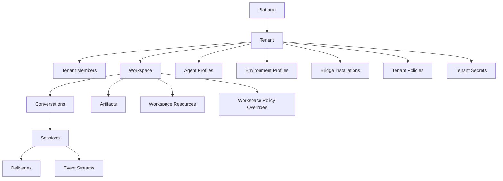

# 001 Product Model

## Product Surfaces

YA Agent Platform exposes one product with multiple role-aware surfaces.

| Surface               | Primary Users                                     | Core Jobs                                                                           |
| --------------------- | ------------------------------------------------- | ----------------------------------------------------------------------------------- |
| Chat Web UI           | end users, operators                              | talk to agents, review runs, upload files, approve tools, inspect results           |
| Tenant Admin Console  | tenant owners, tenant admins, workspace operators | manage members, workspaces, agent profiles, environment profiles, bridges, policies |
| Platform Admin Portal | platform operators                                | manage tenants, regions, runtime pools, support access, incidents, global policy    |
| Bridge Gateway        | bridge workers and channel adapters               | deliver normalized inbound events and receive outbound deliveries                   |
| Public API            | automation, SDK clients, internal apps            | integrate with control plane and chat surfaces programmatically                     |

The first-party web application can ship as one codebase with role-aware navigation and route guards.

## Primary Personas

### Platform Admin

Owns service-wide operations:

- tenant provisioning and suspension
- region enablement
- runtime pool health and isolation settings
- support access and audit review
- global auth and security policy

### Tenant Owner / Tenant Admin

Owns customer configuration:

- invite members and assign roles
- create workspaces
- manage agent profiles and environment profiles
- install channel bridges
- define tenant secrets, quotas, and policies

### Workspace Operator

Owns workspace execution quality:

- choose profiles for a workspace
- inspect conversations and session history
- review failures, approvals, and artifacts
- tune bridge routing and workspace-specific instructions

### End User

Consumes the product through chat:

- start or continue conversations
- upload content and receive outputs
- trigger approvals when policy requires them
- use browser chat or external channels

### Bridge Service

Acts as a machine identity:

- submits inbound channel events
- fetches installation configuration
- acknowledges outbound delivery results

## Resource Hierarchy

## Ownership Model

### Tenant-owned resources

- members and service principals
- workspaces
- agent profiles
- environment profiles
- bridge installations
- secrets and policies
- conversations, sessions, artifacts, and deliveries

### Platform-owned resources

- platform admins
- runtime pools
- regions
- global auth connectors
- support access policies
- global audit and observability configuration

## Workspace Model

A workspace is the operational unit where conversations happen.

A workspace can reference:

- one default agent profile
- one default environment profile
- zero or more project/resource bindings
- zero or more bridge routing rules
- workspace-level instructions, secrets, and quotas

This gives each workspace a stable execution identity while still allowing per-request overrides inside policy boundaries.

## Agent Profile vs Environment Profile

Netherbrain combined many concerns into one runtime preset. YA Agent Platform separates them.

### Agent Profile

Describes the cognitive side of the agent:

- model selection
- system prompt and prompt templates
- toolsets and tool config
- subagent graph
- approval behavior
- MCP and external tool bindings

### Environment Profile

Describes the execution side of the agent:

- executor kind
- runtime pool selector
- filesystem and shell capability
- browser capability
- network egress rules
- workspace materialization rules
- secret projection rules
- timeout, concurrency, and isolation settings

This split lets one agent profile run in different environments under policy control.

## Surface Capability Matrix

| Capability                  | Chat Web UI | Tenant Admin Console | Platform Admin Portal | Bridge Gateway |
| --------------------------- | ----------- | -------------------- | --------------------- | -------------- |
| Start conversation          | Yes         | Yes                  | Yes                   | Via API        |
| View session stream         | Yes         | Yes                  | Yes                   | Via API        |
| Manage agent profiles       | Scoped      | Yes                  | Yes                   | No             |
| Manage environment profiles | Scoped      | Yes                  | Yes                   | No             |
| Manage members              | No          | Tenant scoped        | Platform wide         | No             |
| Manage runtime pools        | No          | No                   | Yes                   | No             |
| Manage bridge installations | Scoped      | Yes                  | Yes                   | Bootstrap only |
| Review audits and incidents | Limited     | Tenant scoped        | Platform wide         | No             |

## Product Rules

1. every conversation belongs to exactly one workspace
2. every workspace belongs to exactly one tenant
3. every session resolves one agent profile and one environment profile at execution time
4. bridge installations are tenant-owned and can optionally pin to one workspace
5. platform admins can inspect all tenants through audited support access
