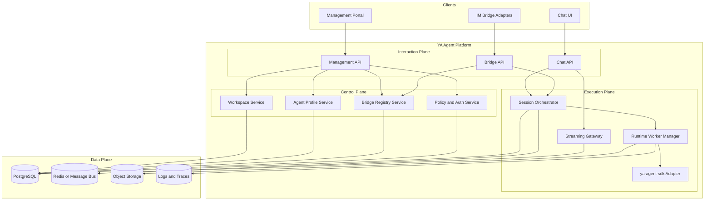

# 001 System Architecture

## Layered Model

The platform starts with four layers.

| Layer             | Responsibility                                                            |
| ----------------- | ------------------------------------------------------------------------- |
| Interaction Plane | browser chat, admin UX, bridge ingress and outbound delivery              |
| Control Plane     | workspace config, agent profiles, bridge registry, policy, secrets, audit |
| Execution Plane   | session orchestration, worker scheduling, streaming, tool execution       |
| Data Plane        | PostgreSQL, Redis or message bus, object storage, logs, traces            |

## High-Level Topology

## Architectural Decisions

### 1. Bridge Adapters Stay Stateless

Bridge adapters should carry channel-specific auth, webhook parsing, and delivery translation.
Conversation state, routing, retries, and policy stay in the platform core.

### 2. Runtime Execution Stays Behind a Platform Boundary

The platform owns scheduling, tenancy, quotas, and delivery semantics.
`ya-agent-sdk` owns agent execution, environment handling, tools, and resumable runtime state.

### 3. Chat UI and Bridge API Share the Same Session Model

A browser user and an IM user both drive the same normalized session abstractions:

- workspace
- actor
- session
- message event
- stream event

### 4. Storage Is Split by Concern

- PostgreSQL stores durable metadata and session records
- Redis or a message bus handles transient coordination and fan-out
- object storage holds large artifacts and exported session assets

## Initial Deployable Unit

Phase 1 ships as one backend process plus one frontend app.
The code structure keeps clear boundaries so later extraction into multiple services stays straightforward.
