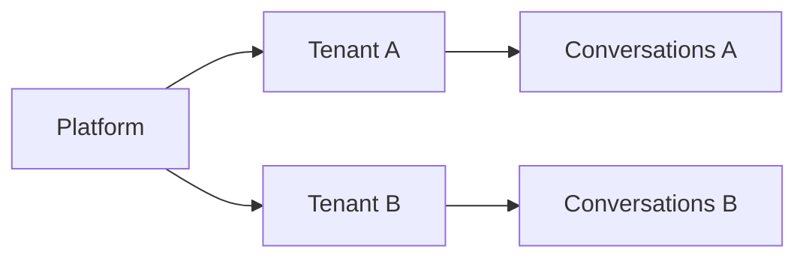
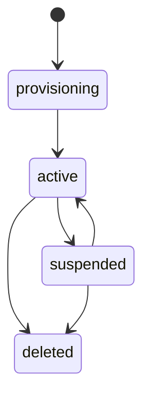

# 002 Multi-Tenancy and Identity

## Tenancy Model

YA Agent Platform is tenant-native.

Every durable business resource is scoped by `tenant_id`, except platform-owned operator resources.

A tenant is an isolation mechanism for data, policy, secrets, and execution.
An application built on top of YA Agent Platform can map its own customer or organizational model onto one or more tenants.

## Cost-Center Model

A cost center is the primary grouping for:

- quota policy
- usage reporting
- budget attribution
- chargeback or showback in higher-level systems

A cost center can span multiple tenants.
A tenant can declare a default cost center.
A session always resolves one effective cost center.

## Isolation Boundaries

### Durable storage isolation

- PostgreSQL rows include `tenant_id`
- object storage uses tenant-prefixed paths
- Redis keys include tenant prefixes where business data is involved

### Identity isolation

- users authenticate once and receive scoped access to assigned tenants and cost centers
- machine identities and bridge tokens belong to exactly one tenant
- admins can inspect all tenants with audited actions

### Execution isolation

- runtime pool selection is tenant-aware
- environment profiles declare allowed executor kinds and capabilities
- `WorkspaceProvider` resolves `project_ids` inside tenant-aware policy boundaries
- secrets are projected into runs according to tenant scope
- quotas and concurrency limits are enforced per tenant, profile, and effective cost center

## Role Model

YA Agent Platform uses a simple top-level role model.

| Role      | Scope    | Permissions                                                                                                 |
| --------- | -------- | ----------------------------------------------------------------------------------------------------------- |
| `admin`   | platform | full visibility across all tenants, cost centers, runtime pools, policies, provider status, and audit views |
| `user`    | scoped   | access limited to assigned tenants, cost centers, and granted management actions                            |
| `service` | scoped   | API-based integrations, bridges, automation, and runtime registration                                       |

Top-level roles stay simple. Fine-grained access comes from scoped grants.

## Scoped Grants

A user or service identity can receive grants at these scopes:

- tenant
- cost center

Common grant families:

- `chat`
- `manage_profiles`
- `manage_bridges`
- `view_audit`
- `view_usage`
- `manage_cost_center`
- `use_provider`

Project-level authorization belongs to the business layer and `WorkspaceProvider` implementation, not to a built-in platform project-container resource.

## Authentication Methods

### Human authentication

Primary human auth is OIDC.

Supported modes:

- platform-managed OIDC for hosted deployments
- email/password bootstrap for development or break-glass scenarios

### Machine authentication

Machine identities use scoped credentials:

- service tokens for automation
- bridge installation tokens for inbound and outbound channel traffic
- runtime registration tokens for remote runtimes
- short-lived signed execution tokens for internal worker coordination

### Break-glass admin

The platform supports a root recovery credential configured through environment variables.

Use cases:

- initial bootstrap
- database recovery
- emergency operator access

All break-glass usage is audited.

## Authorization Model

Authorization evaluates four dimensions:

1. actor role
2. actor grants and bound scopes
3. tenant ownership of the target resource
4. action policy including quotas, approvals, provider rules, and cost-center rules

The enforcement model is deny-by-default with explicit grants through scoped bindings and policy rules.

## Admin Access

Admins can inspect all tenants directly.

The platform records:

- actor identity
- target tenant
- target cost center when resolved
- action type and outcome

Optional impersonation sessions can exist for support workflows. Every impersonation event is audited.

## Tenant Lifecycle

| State          | Meaning                                                        |
| -------------- | -------------------------------------------------------------- |
| `provisioning` | tenant record exists and baseline resources are being created  |
| `active`       | tenant can be used for access and execution                    |
| `suspended`    | access and new execution are blocked while data remains intact |
| `deleted`      | tenant is tombstoned or scheduled for retention-based purge    |

## Identity Objects

| Object                | Purpose                                                |
| --------------------- | ------------------------------------------------------ |
| User                  | human identity record                                  |
| Scope Binding         | grant binding to a tenant or cost center               |
| Service Identity      | non-human identity for integrations                    |
| API Token             | bearer token or signed token for services              |
| Auth Session          | browser or API session state                           |
| Impersonation Session | audited admin-as-user session when support requires it |

## Rules That Shape the API

1. the authenticated context resolves `role`, `grants`, `tenant_scope`, and `cost_center_scope`
2. write APIs require idempotency keys for retriable external clients when side effects matter
3. resource lookups avoid cross-tenant leakage in error messages and pagination
4. every audit record stores actor, target scope, tenant, effective cost center, action, and outcome
