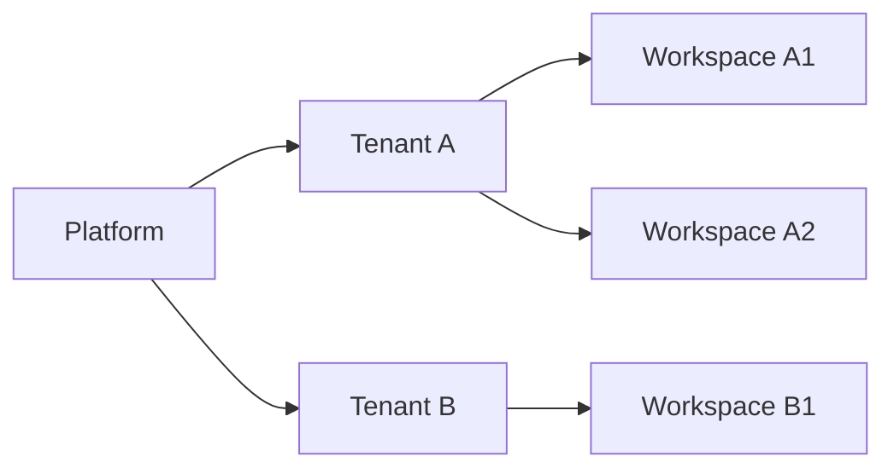
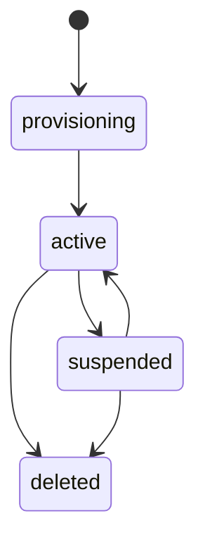

# 002 Multi-Tenancy and Identity

## Tenancy Model

YA Agent Platform is tenant-native.

Every durable business resource is scoped by `tenant_id`, except platform-owned operator resources.

The platform never depends on process-level single ownership assumptions.

## Isolation Boundaries

### Durable storage isolation

- PostgreSQL rows include `tenant_id`
- object storage uses tenant-prefixed paths
- Redis keys include tenant and workspace prefixes where business data is involved

### Identity isolation

- human users authenticate into one tenant context at a time unless they have multi-tenant memberships
- service principals and bridge tokens belong to exactly one tenant
- platform admins operate above tenants with audited access

### Execution isolation

- runtime pool selection is tenant-aware
- environment profiles declare allowed executor kinds and capabilities
- secrets are projected into runs according to tenant and workspace scope
- quotas and concurrency limits are enforced per tenant, workspace, and profile

## Role Model

### Platform roles

| Role                | Scope    | Permissions                                                       |
| ------------------- | -------- | ----------------------------------------------------------------- |
| `platform_admin`    | platform | full service control, tenant lifecycle, runtime pool management   |
| `platform_operator` | platform | operations, support, incident handling, limited policy management |
| `platform_auditor`  | platform | read-only access to audit, health, usage, and config metadata     |

### Tenant roles

| Role                 | Scope               | Permissions                                                                 |
| -------------------- | ------------------- | --------------------------------------------------------------------------- |
| `tenant_owner`       | tenant              | full tenant control including billing-facing settings and member management |
| `tenant_admin`       | tenant              | manage workspaces, profiles, bridges, policies, and members                 |
| `workspace_operator` | workspace or tenant | operate workspaces, inspect runs, manage workspace routing                  |
| `workspace_member`   | workspace or tenant | chat, upload files, review own or allowed conversations                     |
| `workspace_viewer`   | workspace or tenant | read-only access to conversations and artifacts                             |
| `service_principal`  | tenant              | API-based integrations, bridges, automation                                 |

Role bindings can be direct on the tenant or narrowed to specific workspaces.

## Authentication Methods

### Human authentication

Primary human auth is OIDC.

Supported modes:

- platform-managed OIDC for SaaS login
- tenant-specific SSO connectors for enterprise tenants
- email/password bootstrap only for development or break-glass scenarios

### Machine authentication

Machine identities use scoped credentials:

- service tokens for automation
- bridge installation tokens for inbound and outbound channel traffic
- runtime registration tokens for remote runtimes
- short-lived signed execution tokens for internal worker coordination

### Break-glass admin

The platform supports a root recovery credential configured through environment variables.

Use cases:

- initial bootstrap
- database recovery
- tenant lockout recovery
- emergency operator access

All break-glass usage is audited.

## Authorization Model

Authorization evaluates four dimensions:

1. actor identity
2. tenant membership or platform role
3. workspace scope if the resource is workspace-bound
4. action policy including quotas, approvals, and support-access state

The enforcement model is deny-by-default with explicit grants through role bindings and policy rules.

## Support Access

Platform operators often need tenant support access. The model is explicit and auditable.

### Support session rules

- support access can require tenant approval
- access can be time-bounded
- all read and write actions carry `acting_as` and `approved_by` metadata
- sensitive secret material stays redacted unless the policy explicitly grants reveal access

## Tenant Lifecycle

| State          | Meaning                                                        |
| -------------- | -------------------------------------------------------------- |
| `provisioning` | tenant record exists and baseline resources are being created  |
| `active`       | tenant can authenticate and execute workloads                  |
| `suspended`    | access and new execution are blocked while data remains intact |
| `deleted`      | tenant is tombstoned or scheduled for retention-based purge    |

## Identity Objects

| Object               | Purpose                                   |
| -------------------- | ----------------------------------------- |
| User                 | human identity record                     |
| Membership           | tenant or workspace role binding          |
| Service Principal    | non-human identity for integrations       |
| API Token            | bearer token or signed token for services |
| Auth Session         | browser or API session state              |
| Support Access Grant | audited operator elevation into a tenant  |

## Rules That Shape the API

1. the authenticated context resolves `platform_role`, `tenant_id`, and `workspace_scope`
2. write APIs require idempotency keys for retriable external clients when side effects matter
3. resource lookups avoid cross-tenant leakage in error messages and pagination
4. every audit record stores actor, acting scope, tenant, target resource, action, and outcome
