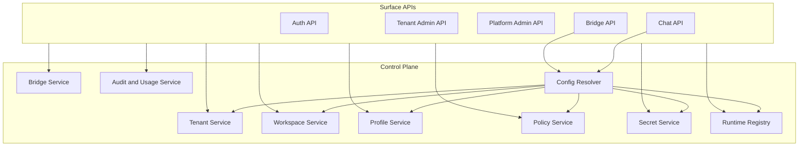
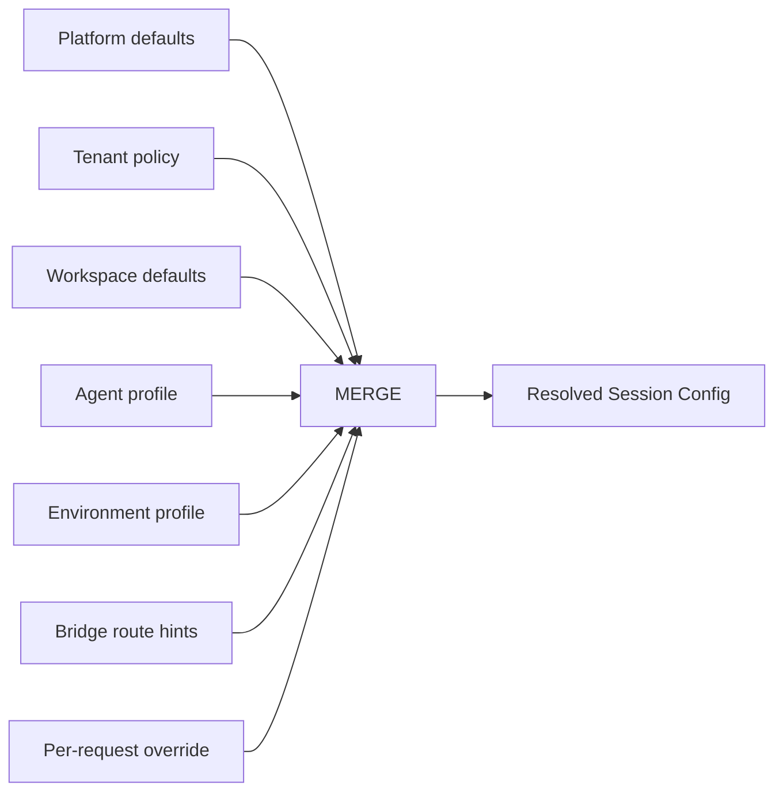

# 003 Control Plane

## Responsibility

The control plane is the durable brain of the platform.

It owns configuration, identity, policy, routing, and orchestration metadata. It decides what is allowed to run, where it should run, and how the surrounding surfaces should route traffic.

The execution plane owns live agent execution. The control plane owns everything needed to prepare and govern that execution.

## Control-Plane Domains

| Domain               | Responsibilities                                                      |
| -------------------- | --------------------------------------------------------------------- |
| Tenant Management    | tenant lifecycle, memberships, service principals, support access     |
| Workspace Management | workspace defaults, resource bindings, workspace instructions, quotas |
| Profile Management   | agent profiles and environment profiles                               |
| Bridge Management    | bridge installations, routing rules, delivery policies, credentials   |
| Policy Management    | authz, approval policy, network policy, data retention, quotas        |
| Secrets Management   | secret references, projection rules, rotation metadata                |
| Runtime Registry     | runtime pools, regions, remote runtimes, capability inventory         |
| Audit and Usage      | audit logs, quota counters, metering inputs, operator events          |

## Service Topology

The package can start as one backend process with modular boundaries and later extract these domains into separate services when scale requires it.

## Core Control-Plane Objects

### Tenant

Stores identity, lifecycle, region policy, quotas, and feature flags.

### Workspace

Stores execution defaults, resource bindings, bridge routing rules, and workspace-specific policy overlays.

### Agent Profile

Stores prompt, model, toolsets, subagents, and agent-facing configuration.

### Environment Profile

Stores executor kind, capabilities, sandbox policy, materialization rules, and runtime selection policy.

### Bridge Installation

Stores external channel config, route bindings, auth mode, and outbound delivery settings.

### Secret Reference

Stores metadata only. Secret values come from a secret manager or encrypted store and are projected at runtime according to policy.

## Config Resolution

Every session resolves a final executable config through layered composition.

### Resolution rules

1. platform defaults set baseline limits and safe defaults
2. tenant policy can tighten or expand within platform-allowed ranges
3. workspace defaults choose the common operating posture for that workspace
4. agent profile provides agent behavior
5. environment profile provides execution behavior
6. bridge routes can inject surface-origin metadata and defaults
7. request overrides can only modify fields marked as overridable by policy

## Policy Categories

| Policy Type      | Examples                                               |
| ---------------- | ------------------------------------------------------ |
| Access Policy    | role grants, support access, API scopes                |
| Execution Policy | allowed environment kinds, max concurrency, timeouts   |
| Approval Policy  | tool approval thresholds, human review requirements    |
| Network Policy   | allowed domains, MCP allowlists, egress classes        |
| Data Policy      | retention, artifact persistence, transcript export     |
| Bridge Policy    | allowed channel kinds, delivery retries, mention rules |
| Usage Policy     | model allowlists, token ceilings, workspace quotas     |

## Secret Projection Model

Secrets are attached by reference, not embedded into agent profiles.

Projection scopes:

- tenant-level secret
- workspace-level secret
- bridge-installation secret
- environment runtime secret

Projection targets:

- SDK tool configuration
- runtime environment variables
- bridge worker credentials
- outbound webhook signing

The final projection plan is computed during config resolution and enforced by the execution plane.

## Audit Model

Every control-plane mutation emits an audit event with:

- actor identity
- acting scope
- tenant and workspace context
- target resource type and id
- diff or mutation summary
- outcome and timestamp

Operator and support actions are never silent.

## Initial Control-Plane Build Order

1. tenants and memberships
2. workspaces
3. agent profiles
4. environment profiles
5. bridge installations
6. policies and secrets
7. runtime registry and scheduling selectors
