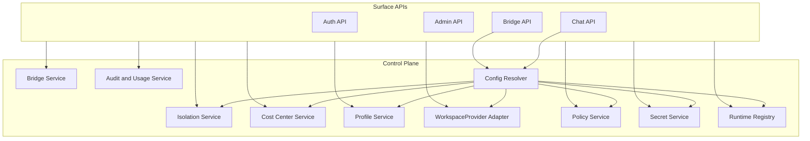
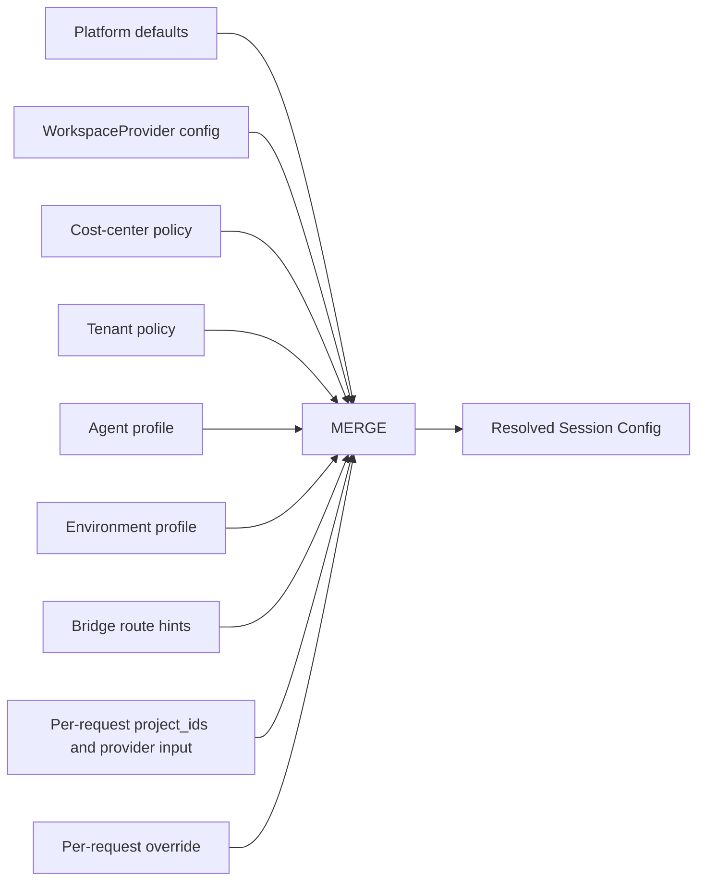

# 003 Control Plane

## Responsibility

The control plane is the durable brain of the platform.

It owns configuration, identity, policy, routing, cost attribution, `WorkspaceProvider` integration, and orchestration metadata. It decides what is allowed to run, where it should run, and how the surrounding surfaces should route traffic.

The execution plane owns live agent execution. The control plane owns everything needed to prepare and govern that execution.

## Control-Plane Domains

| Domain                        | Responsibilities                                                           |
| ----------------------------- | -------------------------------------------------------------------------- |
| Isolation Management          | tenant lifecycle, scoped grants, service identities, admin access          |
| Cost Center Management        | cost-center lifecycle, budget metadata, quota policy, reporting boundaries |
| Profile Management            | agent profiles and environment profiles                                    |
| WorkspaceProvider Integration | provider capabilities, provider policy, provider-facing runtime config     |
| Bridge Management             | bridge installations, routing rules, delivery policies, credentials        |
| Policy Management             | authz, approval policy, network policy, data retention, quotas             |
| Secrets Management            | secret references, projection rules, rotation metadata                     |
| Runtime Registry              | runtime pools, regions, remote runtimes, capability inventory              |
| Audit and Usage               | audit logs, quota counters, usage summaries, operator events               |

## Service Topology

The package can start as one backend process with modular boundaries and later extract these domains into separate services when scale requires it.

## Core Control-Plane Objects

### Tenant

Stores isolation metadata, defaults, region policy, quota envelope, and default cost-center binding.

### Cost Center

Stores budget metadata, reporting configuration, effective quota defaults, and accounting tags.

### Scope Binding

Stores which users or service identities can access which tenants and cost centers.

### WorkspaceProvider Configuration

`WorkspaceProvider` uses a code-defined provider registry.
Each provider implementation registers itself under a stable provider key in application code.

Deployment config selects one provider key for the service instance and supplies bootstrap configuration through environment variables, config files, or injected secrets.

One service instance uses one selected provider.
The control plane exposes provider registry state, selected provider key, capabilities, and runtime status through read-only inspection APIs.
The control plane does not switch provider implementation at runtime through tenant-facing or admin CRUD.

### Agent Profile

Stores prompt, model, toolsets, subagents, and agent-facing configuration.

### Environment Profile

Stores executor kind, capabilities, provider-binding policy, and runtime selection policy.

### Bridge Installation

Stores external channel config, route bindings, auth mode, and outbound delivery settings.

### Secret Reference

Stores metadata only. Secret values come from a secret manager or encrypted store and are projected at runtime according to policy.

## Config Resolution

Every session resolves a final executable config through layered composition.

### Resolution rules

1. platform defaults set baseline limits and safe defaults
2. the code-defined provider registry and deployment-selected provider key supply provider capabilities and runtime integration rules
3. cost-center policy applies budget, quota, and reporting defaults
4. tenant policy applies isolation and policy defaults
5. agent profile provides agent behavior
6. environment profile provides execution behavior
7. bridge routes can inject surface-origin metadata and project defaults
8. request `project_ids` and provider input drive runtime project binding
9. request overrides can only modify fields marked as overridable by policy

## Responsibility Split

| Layer               | Responsibility                                                                                                       |
| ------------------- | -------------------------------------------------------------------------------------------------------------------- |
| Platform core       | tenancy, identity, policy, scheduling, persistence, streaming, and audit                                             |
| `WorkspaceProvider` | resolve `project_ids` and provider input into concrete project bindings through the selected provider implementation |
| Business layer      | decide how conversations, users, and domain objects map to `project_ids`                                             |

## Policy Categories

| Policy Type      | Examples                                                                |
| ---------------- | ----------------------------------------------------------------------- |
| Access Policy    | scoped grants, admin audit requirements, API scopes                     |
| Execution Policy | allowed environment kinds, max concurrency, timeouts                    |
| Provider Policy  | allowed project-id shapes, provider input rules, materialization limits |
| Approval Policy  | tool approval thresholds, human review requirements                     |
| Network Policy   | allowed domains, MCP allowlists, egress classes                         |
| Data Policy      | retention, artifact persistence, transcript export                      |
| Bridge Policy    | allowed channel kinds, delivery retries, mention rules                  |
| Usage Policy     | model allowlists, token ceilings, cost-center quotas                    |

## Secret Projection Model

Secrets are attached by reference, not embedded into agent profiles.

Projection scopes:

- tenant-level secret
- bridge-installation secret
- environment runtime secret

Projection targets:

- SDK tool configuration
- runtime environment variables
- bridge worker credentials
- outbound webhook signing

The final projection plan is computed during config resolution and enforced by the execution plane.

## Audit Model

Every control-plane mutation emits an audit event with:

- actor identity
- role and grant scope
- tenant context
- effective cost center when resolved
- target resource type and id
- diff or mutation summary
- outcome and timestamp

## Initial Control-Plane Build Order

1. tenants and scope bindings
2. cost centers
3. provider integration and config
4. agent profiles
5. environment profiles
6. bridge installations
7. policies and secrets
8. runtime registry and scheduling selectors
