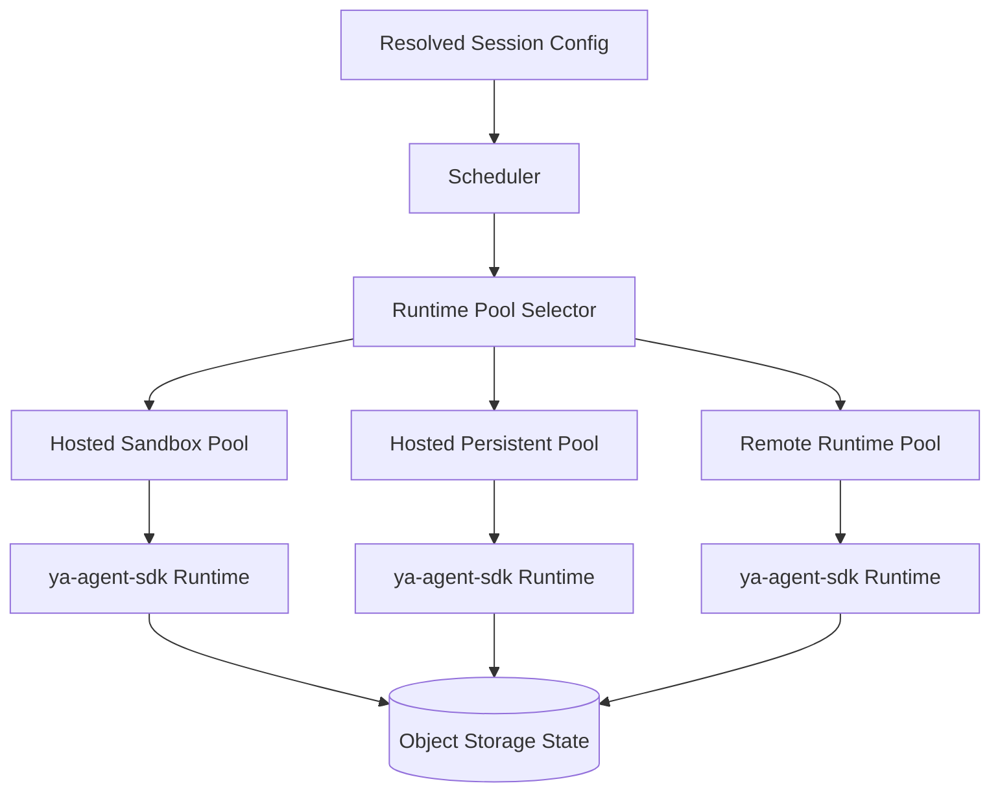

# 004 Runtime and Environments

## Why Environment-Aware Execution Matters

An agent platform that runs in the cloud needs a stable execution contract even when the underlying runtime environment changes.

The same agent profile may need to run in:

- a pure chat environment with no filesystem
- a hosted ephemeral sandbox with shell and files
- a long-lived tenant workspace runtime
- a remote customer-managed runtime registered back to the platform

YA Agent Platform treats the environment as a first-class resolved profile.

## Execution Architecture

The platform selects a runtime pool by policy and capability instead of assuming a single host process.

## Environment Profile

An environment profile describes how a session is allowed to run.

| Field                       | Description                                                         |
| --------------------------- | ------------------------------------------------------------------- |
| `environment_profile_id`    | unique tenant-scoped identifier                                     |
| `executor_kind`             | where the session runs                                              |
| `runtime_pool_selector`     | rules for matching an eligible runtime pool                         |
| `capabilities`              | filesystem, shell, browser, MCP, external network, background tasks |
| `workspace_materialization` | how workspace resources become visible to the agent                 |
| `secret_projection`         | which secret references can be projected                            |
| `network_policy`            | allowed destinations and egress class                               |
| `timeouts`                  | queue timeout, execution timeout, idle timeout                      |
| `concurrency`               | per-session and per-workspace concurrency limits                    |
| `artifact_policy`           | persistence and retention for outputs                               |
| `approval_policy_binding`   | default human approval behavior                                     |

## Executor Kinds

### `chat_only`

For conversational agents that rely on models, tools without local state, and optional MCP or web access.

Capabilities typically include:

- no workspace filesystem
- no shell
- optional web tools
- optional MCP
- optional browser automation through hosted services

### `hosted_sandbox`

Ephemeral platform-managed compute for coding and execution tasks.

Characteristics:

- isolated container or pod per session
- workspace materialized as a snapshot or mounted working set
- shell and filesystem available
- strong timeout and cleanup guarantees

### `hosted_persistent`

Long-lived platform-managed runtime for tenants that need a warm environment.

Characteristics:

- stable runtime identity across sessions
- cached dependencies and local state
- stronger scheduling affinity
- controlled concurrency and lease management

### `remote_runtime`

Customer-managed or operator-managed execution environment that registers with the platform.

Characteristics:

- platform schedules work to a remote connector
- environment can live in another VPC or on-prem network
- secrets and artifact exchange follow the same resolved contract
- runtime heartbeat and capability registration are mandatory

## Runtime Pool Model

A runtime pool is a schedulable capacity group.

| Field             | Description                              |
| ----------------- | ---------------------------------------- |
| `runtime_pool_id` | unique pool identifier                   |
| `region`          | deployment region                        |
| `executor_kind`   | pool execution type                      |
| `capabilities`    | concrete runtime capabilities            |
| `tenant_affinity` | shared, dedicated, or allowlist-based    |
| `capacity`        | max concurrent sessions and burst limits |
| `health_state`    | healthy, degraded, draining, offline     |

A pool can be:

- multi-tenant shared
- tenant-dedicated
- workspace-dedicated for sensitive workloads

## Workspace Materialization

The platform does not assume a local disk tree exists on the API server.

Workspace resources can come from:

- uploaded files stored in object storage
- Git repository snapshots
- synced project mirrors
- bridge attachments promoted into workspace artifacts
- external document stores exposed through tools or connectors

Materialization strategies:

| Strategy         | When Used                                        |
| ---------------- | ------------------------------------------------ |
| `none`           | chat-only agents                                 |
| `snapshot_mount` | immutable workspace snapshot for one run         |
| `writable_copy`  | per-session writable working copy                |
| `shared_volume`  | long-lived runtime with persistent tenant volume |
| `remote_proxy`   | remote runtime exposes files through a connector |

## Runtime Registration For Remote Environments

Remote runtimes register with the control plane and advertise:

- tenant affinity
- region and location metadata
- executor kind
- capabilities
- heartbeat TTL
- current capacity
- optional labels such as `gpu`, `browser`, `private-network`

The scheduler only places work on remote runtimes that satisfy the resolved environment profile.

## Capability Contract With `ya-agent-sdk`

Every runtime environment is mapped into SDK primitives:

- `Environment` carries filesystem, shell, resource, and instruction context
- `ResumableState` restores prior session state
- toolsets receive resolved config and secret projections
- message bus and event hooks feed platform streaming and control flows

This keeps the agent contract stable while the execution substrate changes.

## Scheduling Rules

1. resolve the environment profile before queueing work
2. match eligible runtime pools by region, executor kind, capabilities, tenant affinity, and health
3. create a lease for the selected worker or runtime
4. emit queue and assignment events for operator visibility
5. requeue or fail according to retry policy when placement is unavailable

## Safety Defaults

- environment profiles define the maximum capability envelope
- request-time overrides can only choose a narrower capability set unless policy grants expansion
- secret projection is explicit and scoped
- hosted sandboxes default to isolated network egress classes
- remote runtimes must heartbeat and prove registration before they receive work
