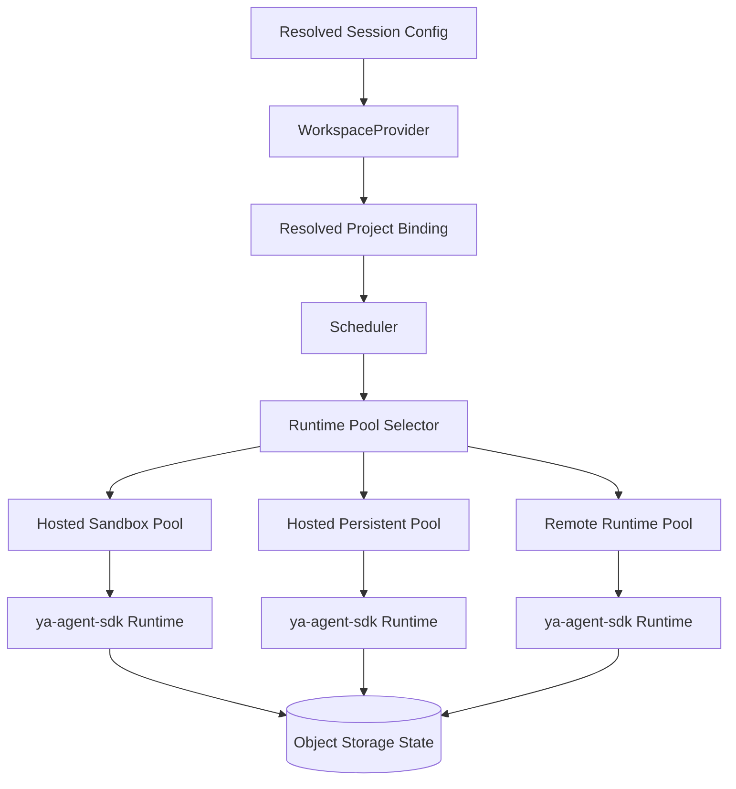

# 004 Runtime and Environments

## Why Environment-Aware Execution Matters

An agent platform that runs in the cloud needs a stable execution contract even when the underlying runtime environment changes.

The same agent profile may need to run in:

- a pure chat environment with no filesystem
- a hosted ephemeral sandbox with shell and files
- a long-lived provider-backed runtime with mounted project directories
- a remote customer-managed runtime registered back to the platform

YA Agent Platform treats the environment as a first-class resolved profile.

## Execution Architecture



The platform selects a runtime pool by policy and capability instead of assuming a single host process.

## Single WorkspaceProvider Per Service Instance

One YA Agent Platform service instance supports one selected `WorkspaceProvider` from a code-defined provider registry.

This model gives the platform a stable environment contract while allowing deployers to implement their own provider logic.

The provider can support cases such as:

- local directory resolution
- docker-in-docker directory mounts
- repository checkout and snapshot materialization
- remote project proxying
- business-specific project lookup rules

The platform core stays provider-agnostic. It only understands `project_ids`, provider input, and resolved project bindings.

Provider implementations register in code under stable provider keys. Deployment config selects one provider key and supplies bootstrap configuration. The platform exposes inspection and health information for the selected provider and keeps provider selection fixed for the lifetime of the service instance.

## WorkspaceProvider Contract

The selected provider receives ordered `project_ids` and optional provider input from a session request.

Conceptual request:

```json
{
  "tenant_id": "tenant_acme",
  "conversation_id": "conv_123",
  "project_ids": ["repo-a", "repo-b"],
  "provider_input": {
    "container_id": "devbox-1"
  },
  "environment_profile_id": "sandbox-default"
}
```

Conceptual response:

```json
{
  "binding_id": "pb_01J...",
  "project_ids": ["repo-a", "repo-b"],
  "default_project_id": "repo-a",
  "default_workdir": "/workspace/repo-a",
  "allowed_paths": [
    "/workspace/repo-a",
    "/workspace/repo-b"
  ],
  "mounts": [
    {
      "source": "/host/projects/repo-a",
      "target": "/workspace/repo-a",
      "mode": "rw"
    }
  ],
  "instructions": [
    "repo-a is the default working directory"
  ]
}
```

The concrete implementation can enrich this shape with provider-specific metadata. The platform stores the resulting binding snapshot for restore and audit.

### Registry and selection model

- provider implementations are registered in code
- one provider key is selected through deployment config
- provider-specific bootstrap values come from environment variables, config files, or injected secrets
- admin APIs expose the registry entries, selected provider key, config summary, capabilities, and health

## Authority Split

| Layer               | Owns                                                                                                            |
| ------------------- | --------------------------------------------------------------------------------------------------------------- |
| Platform            | tenant policy, environment policy, cost attribution, scheduling, persistence                                    |
| `WorkspaceProvider` | `project_ids` lookup, mount mapping, working-directory selection, provider-specific instructions                |
| Business layer      | conversation-to-project semantics, project selection UX, domain-specific authorization before the platform call |

## Environment Profile

An environment profile describes how a session is allowed to run.

| Field                     | Description                                                                       |
| ------------------------- | --------------------------------------------------------------------------------- |
| `environment_profile_id`  | unique tenant-scoped identifier                                                   |
| `executor_kind`           | where the session runs                                                            |
| `runtime_pool_selector`   | rules for matching an eligible runtime pool                                       |
| `capabilities`            | filesystem, shell, browser, MCP, external network, background tasks               |
| `provider_binding_policy` | how the configured `WorkspaceProvider` may materialize and mount project bindings |
| `secret_projection`       | which secret references can be projected                                          |
| `network_policy`          | allowed destinations and egress class                                             |
| `timeouts`                | queue timeout, execution timeout, idle timeout                                    |
| `concurrency`             | per-session and per-tenant concurrency limits                                     |
| `artifact_policy`         | persistence and retention for outputs                                             |
| `approval_policy_binding` | default human approval behavior                                                   |

## Executor Kinds

### `chat_only`

For conversational agents that rely on models, tools without local state, and optional MCP or web access.

Capabilities typically include:

- no provider-backed filesystem
- no shell
- optional web tools
- optional MCP
- optional browser automation through hosted services

### `hosted_sandbox`

Ephemeral platform-managed compute for coding and execution tasks.

Characteristics:

- isolated container or pod per session
- provider binding materialized as mounts or snapshots
- shell and filesystem available
- strong timeout and cleanup guarantees

### `hosted_persistent`

Long-lived platform-managed runtime for tenants that need a warm environment.

Characteristics:

- stable runtime identity across sessions
- cached dependencies and local state
- stronger scheduling affinity
- controlled concurrency and lease management

### `remote_runtime`

Customer-managed or operator-managed execution environment that registers with the platform.

Characteristics:

- platform schedules work to a remote connector
- environment can live in another VPC or on-prem network
- provider binding and artifact exchange follow the same resolved contract
- runtime heartbeat and capability registration are mandatory

## Runtime Pool Model

A runtime pool is a schedulable capacity group.

| Field             | Description                              |
| ----------------- | ---------------------------------------- |
| `runtime_pool_id` | unique pool identifier                   |
| `region`          | deployment region                        |
| `executor_kind`   | pool execution type                      |
| `capabilities`    | concrete runtime capabilities            |
| `tenant_affinity` | shared, dedicated, or allowlist-based    |
| `capacity`        | max concurrent sessions and burst limits |
| `health_state`    | healthy, degraded, draining, offline     |

A pool can be:

- multi-tenant shared
- tenant-dedicated
- environment-dedicated for sensitive workloads

## Provider-Driven Materialization

The platform does not assume a local disk tree exists on the API server.

`WorkspaceProvider` can materialize project context from sources such as:

- local directories
- uploaded files stored in object storage
- Git repository snapshots
- synchronized project mirrors
- bridge attachments promoted into provider-visible files
- remote document stores exposed through connectors

Materialization strategies:

| Strategy         | When Used                                                 |
| ---------------- | --------------------------------------------------------- |
| `none`           | chat-only agents                                          |
| `snapshot_mount` | immutable snapshot for one run                            |
| `writable_copy`  | per-session writable working copy                         |
| `shared_volume`  | long-lived runtime with persistent mounted state          |
| `remote_proxy`   | provider exposes project content through a remote adapter |

## Runtime Registration For Remote Environments

Remote runtimes register with the control plane and advertise:

- tenant affinity
- region and location metadata
- executor kind
- capabilities
- heartbeat TTL
- current capacity
- optional labels such as `gpu`, `browser`, `private-network`

The scheduler only places work on remote runtimes that satisfy the resolved environment profile.

## Capability Contract With `ya-agent-sdk`

Every runtime environment is mapped into SDK primitives:

- `Environment` carries filesystem, shell, resource, and instruction context
- `ResumableState` restores prior session state
- toolsets receive resolved config, secret projections, and provider binding data
- message bus and event hooks feed platform streaming and control flows

This keeps the agent contract stable while the execution substrate changes.

## Scheduling Rules

1. resolve the environment profile before queueing work
2. resolve `project_ids` through the configured `WorkspaceProvider`
3. match eligible runtime pools by region, executor kind, capabilities, tenant affinity, and health
4. create a lease for the selected worker or runtime
5. emit queue and assignment events for operator visibility
6. requeue or fail according to retry policy when placement is unavailable

## Safety Defaults

- environment profiles define the maximum capability envelope
- provider binding rules define how `project_ids` may turn into runnable mounts or filesystems
- request-time overrides can only choose a narrower capability set unless policy grants expansion
- secret projection is explicit and scoped
- hosted sandboxes default to isolated network egress classes
- remote runtimes must heartbeat and prove registration before they receive work
