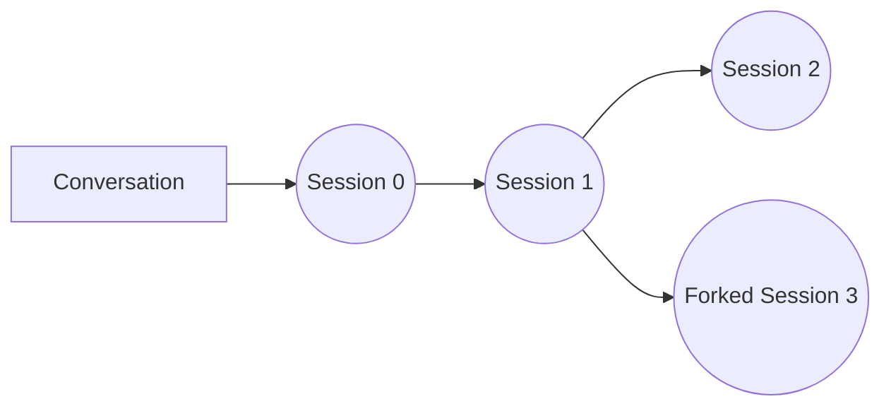
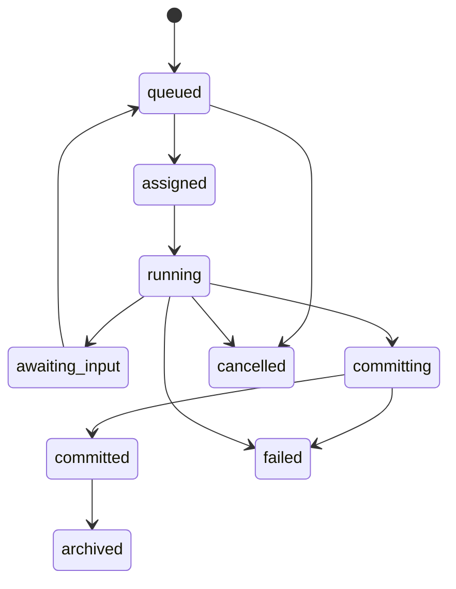
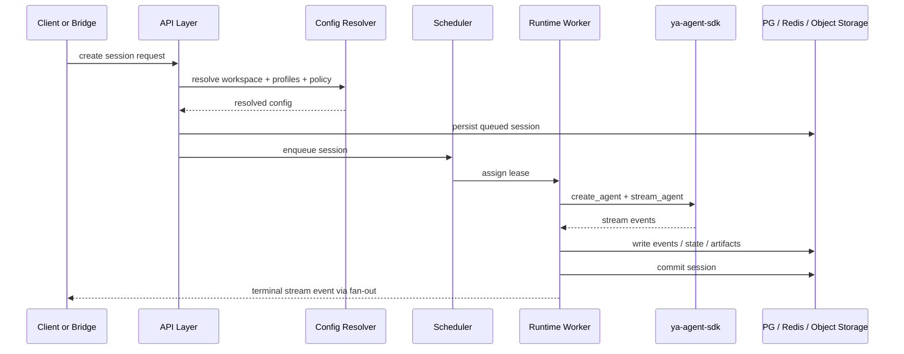

# 005 Session and Execution Model

## Core Model

A conversation is a durable interaction thread.
A session is an immutable execution snapshot inside that conversation.

This keeps the strong parts of the Netherbrain model while making it schedulable across runtime pools.

## Why Keep Immutable Sessions

Immutable sessions provide:

- stable audit history
- deterministic parent-child restore points
- natural support for branching and async continuations
- clean separation between queued work, running work, and committed state

## Conversation

A conversation belongs to exactly one tenant and one workspace.

Key fields:

| Field                            | Description                               |
| -------------------------------- | ----------------------------------------- |
| `conversation_id`                | primary identifier                        |
| `tenant_id`                      | tenant scope                              |
| `workspace_id`                   | workspace scope                           |
| `surface_kind`                   | `web_chat`, `admin_chat`, `bridge`, `api` |
| `owner_actor_id`                 | initiating actor or route owner           |
| `default_agent_profile_id`       | default profile for new sessions          |
| `default_environment_profile_id` | default execution environment             |
| `status`                         | active, archived, suspended               |
| `metadata`                       | surface- and app-specific metadata        |

## Session

A session records one execution request and its committed result.

Key fields:

| Field                    | Description                                                 |
| ------------------------ | ----------------------------------------------------------- |
| `session_id`             | immutable session id                                        |
| `tenant_id`              | tenant scope                                                |
| `workspace_id`           | workspace scope                                             |
| `conversation_id`        | parent conversation                                         |
| `parent_session_id`      | previous snapshot when continuing or forking                |
| `session_type`           | `agent`, `async_subagent`, `bridge_followup`, `system_task` |
| `origin`                 | `web`, `bridge`, `api`, `admin`                             |
| `agent_profile_id`       | resolved agent profile                                      |
| `environment_profile_id` | resolved environment profile                                |
| `runtime_pool_id`        | pool chosen for execution                                   |
| `status`                 | lifecycle state                                             |
| `input_parts`            | normalized user or system input                             |
| `final_message`          | final user-facing text or summary                           |
| `run_summary`            | usage, timings, and outcome metadata                        |
| `state_ref`              | object-store reference for SDK state                        |
| `display_ref`            | object-store reference for replayable display events        |
| `artifact_refs`          | produced files and assets                                   |

## Session Lifecycle

| State            | Meaning                                      |
| ---------------- | -------------------------------------------- |
| `queued`         | waiting for scheduler placement              |
| `assigned`       | worker lease acquired                        |
| `running`        | agent is executing                           |
| `awaiting_input` | waiting for approval or external tool result |
| `committing`     | final state and artifacts are being written  |
| `committed`      | durable session snapshot complete            |
| `failed`         | execution failed or could not commit         |
| `cancelled`      | cancelled by user, policy, or operator       |
| `archived`       | soft-hidden from normal views                |

## Execution Flow

## Parent-Child Rules

| Scenario         | parent_session_id                    | conversation_id     |
| ---------------- | ------------------------------------ | ------------------- |
| new conversation | null                                 | new conversation id |
| continue         | latest committed session             | same conversation   |
| fork             | chosen historical session            | new conversation id |
| async subagent   | spawner session or prior async child | same conversation   |

## Async Subagents

Async subagents remain a platform feature.

Rules:

- async subagents run as their own sessions
- they inherit tenant, workspace, and conversation scope from the parent
- they can resolve a different agent profile and environment profile if policy allows
- their outcomes are delivered through the conversation mailbox and event stream

This preserves Netherbrain's useful orchestration pattern while fitting the multi-tenant scheduler.

## Approval And External Result Loops

A session can enter `awaiting_input` when:

- a tool requires human approval
- an external callback tool awaits result delivery
- a bridge flow requires user confirmation

The next continuation request creates a new queued attempt using the same parent session state and the provided approval payloads.

## Concurrency Rules

- one active primary `agent` session per conversation by default
- multiple async subagent sessions can exist concurrently
- workspace and tenant policies can cap concurrent sessions
- runtime pools can reject assignment when capacity or policy is exceeded

## Storage Split

| Store          | Contents                                                 |
| -------------- | -------------------------------------------------------- |
| PostgreSQL     | queryable metadata, status, usage, ownership, routing    |
| Object Storage | SDK resumable state, event replay blobs, large artifacts |
| Redis          | ephemeral fan-out, queues, locks, live stream buffers    |

## Failure Model

A worker failure does not erase the session record.

Recovery behavior:

1. orphaned `assigned` or `running` sessions are detected by lease expiry
2. the scheduler can retry according to policy when the session is retryable
3. committed sessions stay immutable even when downstream delivery fails
4. delivery retries are tracked separately from session execution success
