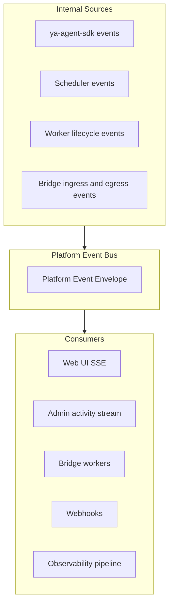

# 006 Events, Streaming, and Notifications

## Event Strategy

The platform needs one normalized event model that can serve:

- chat streaming in the Web UI
- operator visibility in admin surfaces
- bridge delivery and acknowledgement loops
- usage, audit, and lifecycle notifications

The design keeps AG-UI-compatible chat rendering where it helps and wraps everything in a platform envelope with tenant, workspace, and session context.

## Event Layers



## Platform Event Envelope

```json
{
  "event_id": "evt_01J...",
  "event_type": "session.message.delta",
  "tenant_id": "tenant_acme",
  "workspace_id": "ws_support",
  "conversation_id": "conv_123",
  "session_id": "sess_456",
  "sequence": 42,
  "occurred_at": "2026-04-17T03:00:00Z",
  "source": {
    "component": "runtime-worker",
    "runtime_pool_id": "pool_shared_sandbox_us_east"
  },
  "payload": {}
}
```

The envelope is stable across surfaces. The `payload` shape varies by `event_type`.

## Event Categories

| Category              | Examples                                                                                          |
| --------------------- | ------------------------------------------------------------------------------------------------- |
| Session lifecycle     | `session.queued`, `session.assigned`, `session.started`, `session.finished`, `session.failed`     |
| Message streaming     | `session.message.started`, `session.message.delta`, `session.message.completed`                   |
| Reasoning and tooling | `session.reasoning.delta`, `session.tool.called`, `session.tool.result`                           |
| Approval and control  | `session.approval.requested`, `session.approval.resolved`, `session.cancelled`, `session.steered` |
| Bridge routing        | `bridge.inbound.accepted`, `bridge.delivery.queued`, `bridge.delivery.acknowledged`               |
| Admin and policy      | `tenant.updated`, `workspace.policy.changed`, `runtime_pool.draining`                             |
| Notifications         | `notification.created`, `notification.read`                                                       |

## Chat Rendering Model

For chat surfaces, the payloads can carry AG-UI-compatible content blocks so the Web UI can reuse a standard renderer for:

- text deltas
- reasoning blocks
- tool calls
- tool results
- custom annotations such as subagent start and completion

The platform event envelope adds the tenancy and routing metadata that AG-UI alone does not carry.

## Transport Model

### Browser transport

First implementation uses SSE for chat and activity streams.

Reasons:

- straightforward with FastAPI
- good fit for append-only event streams
- easy reconnection with last event id semantics

### Internal fan-out transport

Redis is the first internal stream buffer and fan-out substrate.

Uses:

- live session event fan-out
- delivery queues for bridges
- lightweight distributed coordination for scheduler and workers

### Durable replay

Durable replay comes from committed session event blobs in object storage plus queryable PostgreSQL metadata.

Redis is the live buffer. Object storage is the durable replay source.

## Notification Model

Notifications are separate from raw session events.

Examples:

- approval requested for a workspace operator
- bridge delivery repeatedly failing
- runtime pool capacity exhausted
- support access requested or granted

Notification records are user- or role-targeted and point back to the relevant resource ids.

## Ordering Rules

- per-session event order is monotonic through `sequence`
- cross-session ordering is best-effort and time-based
- delivery retries emit new events with links to the original delivery id
- terminal session events close the live stream for that session

## Event Persistence

| Layer                     | Persistence                               |
| ------------------------- | ----------------------------------------- |
| Redis live stream         | short-lived                               |
| PostgreSQL metadata       | durable indexes and counters              |
| Object storage event blob | durable replay and audit-adjacent history |

## Reconnection Rules

A consumer reconnecting to a live session stream provides the last seen event id.

Behavior:

1. if the live buffer still contains the cursor, replay from cursor
2. if the session already committed and the live buffer expired, fall back to committed replay data
3. if the cursor is invalid, restart from the latest committed checkpoint or the beginning of the active stream according to endpoint semantics

## Observability Hook

Every event can be mirrored into metrics and traces.

Examples:

- queue latency from `session.queued` to `session.assigned`
- run latency from `session.started` to `session.finished`
- delivery failure rate per bridge kind
- approval response time by tenant or workspace
