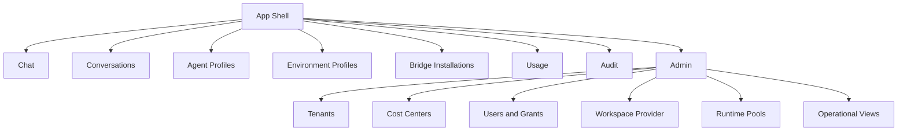

# 009 Web UI

## Product Position

`apps/ya-agent-platform-web` is the first-party browser surface for the platform.

It serves two connected experiences from one codebase:

- chat for everyday agent use
- administration for global and scoped management workflows

The UI is role-aware and route-aware.

The first-party Web UI is the platform's own interaction surface. Business-specific products can also call the same APIs directly and render their own frontend experience.

## Navigation Model

## Chat Experience

The chat surface is the default landing experience for users.

Core features:

- conversation list and search
- session streaming with reasoning and tool cards
- project selector backed by the configured `WorkspaceProvider` or by the calling business flow
- file and artifact upload
- approval prompts and result submission
- environment-aware affordances such as file browser or shell visibility when the chosen environment supports them
- conversation fork and async follow-up visibility
- usage and cost-center attribution for the current conversation when policy allows

The UI renders the normalized event stream and uses AG-UI-compatible message blocks for chat content.

## Admin Experience

The admin surface supports both global admins and scoped users with management grants.

Pages:

| Page                 | Purpose                                                       |
| -------------------- | ------------------------------------------------------------- |
| Tenants              | create and inspect isolation boundaries                       |
| Cost Centers         | define budget and reporting groups                            |
| Users and Grants     | bind users to tenants and cost centers                        |
| Agent Profiles       | define models, prompts, tools, and subagents                  |
| Environment Profiles | choose executor kind, capability, and provider-binding policy |
| Workspace Provider   | inspect provider capabilities and integration status          |
| Bridges              | install and route external channels                           |
| Usage                | inspect usage by tenant, profile, and cost center             |
| Audit                | inspect configuration changes and sensitive operations        |
| Runtime Pools        | inspect capacity, health, and draining state                  |

## Role-Aware Visibility

| Capability                           | User                          | Admin |
| ------------------------------------ | ----------------------------- | ----- |
| Chat                                 | Yes                           | Yes   |
| View assigned conversation sessions  | Yes                           | Yes   |
| Supply `project_ids` for a run       | Scoped grant or business flow | Yes   |
| Manage assigned agent profiles       | Scoped grant                  | Yes   |
| Manage assigned environment profiles | Scoped grant                  | Yes   |
| Manage assigned bridges              | Scoped grant                  | Yes   |
| View assigned usage and cost centers | Scoped grant                  | Yes   |
| Inspect provider capabilities        | Limited                       | Yes   |
| Manage tenants                       | No                            | Yes   |
| Manage runtime pools                 | No                            | Yes   |
| Manage global grants                 | No                            | Yes   |

## UI Design Rules

1. chat remains the most polished and fastest path for everyday use
2. admin pages expose effective config, grants, provider behavior, and policy resolution clearly
3. cost-center attribution stays visible wherever usage or quota matters
4. every mutating action links back to audit history
5. feature visibility depends on role, grants, provider capabilities, and environment capabilities

## Streaming Model In The Browser

The browser uses SSE for the first implementation.

Expected behavior:

- open stream when a session is queued or running
- resume with last event id after transient disconnects
- fall back to committed replay for completed sessions
- surface queue, assignment, provider resolution, failure, and cost attribution states inline in the conversation view

## Provider-Backed Resource Browsing

Resource browsing is API-backed.

The UI does not assume the browser talks to a local filesystem.

When the resolved environment profile and project binding expose filesystem access, the UI can show:

- project tree
- file preview
- artifact list
- session outputs
- optional shell panel backed by runtime control APIs

When the environment does not expose filesystem access, the chat experience remains fully functional and hides those panels.

## Initial Build Order For The Web App

1. auth shell and actor context
2. conversation list and chat run flow with `project_ids`
3. live chat view with session streaming and usage attribution
4. admin pages for profiles, bridges, and provider status
5. cost-center and usage pages
6. admin pages for tenants, users, grants, and runtime pools
