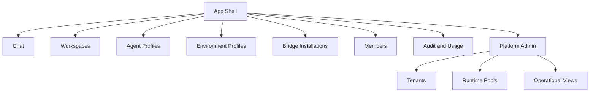

# 009 Web UI

## Product Position

`apps/ya-agent-platform-web` is the first-party browser surface for the platform.

It serves three experiences from one codebase:

- chat for end users
- tenant administration for customer operators
- platform administration for service operators

The UI is role-aware and route-aware.

## Navigation Model

## Chat Experience

The chat surface is the default landing experience for workspace members.

Core features:

- conversation list and search
- session streaming with reasoning and tool cards
- file and artifact upload
- approval prompts and result submission
- environment-aware affordances such as file browser or shell visibility when the chosen environment supports them
- conversation fork and async follow-up visibility

The UI renders the normalized event stream and uses AG-UI-compatible message blocks for chat content.

## Tenant Admin Experience

Tenant admins need full control over their operating surface.

Pages:

| Page                 | Purpose                                             |
| -------------------- | --------------------------------------------------- |
| Tenant Overview      | usage, health, limits, recent incidents             |
| Members              | invite, role binding, service principals            |
| Workspaces           | create and configure workspaces                     |
| Agent Profiles       | define models, prompts, tools, subagents            |
| Environment Profiles | choose executor kind, capability, network policy    |
| Bridges              | install and route external channels                 |
| Policies and Secrets | manage quotas, approvals, secret references         |
| Audit                | inspect tenant-scoped changes and execution history |

## Platform Admin Experience

Platform admins operate the service.

Pages:

| Page           | Purpose                                        |
| -------------- | ---------------------------------------------- |
| Tenants        | lifecycle, health, region policy, suspension   |
| Runtime Pools  | capacity, health, draining, affinity           |
| Support Access | view and approve operator access flows         |
| Global Audit   | search all control-plane actions               |
| Operations     | scheduler health, queue depth, delivery health |

## Role-Aware Visibility

| Capability                  | Workspace Member | Workspace Operator | Tenant Admin | Platform Admin |
| --------------------------- | ---------------- | ------------------ | ------------ | -------------- |
| Chat                        | Yes              | Yes                | Yes          | Yes            |
| View workspace sessions     | Scoped           | Yes                | Yes          | Yes            |
| Manage workspaces           | No               | Scoped             | Yes          | Yes            |
| Manage agent profiles       | No               | Scoped             | Yes          | Yes            |
| Manage environment profiles | No               | Scoped             | Yes          | Yes            |
| Manage bridges              | No               | Scoped             | Yes          | Yes            |
| Manage tenants              | No               | No                 | No           | Yes            |
| Manage runtime pools        | No               | No                 | No           | Yes            |

## UI Design Rules

1. chat remains the most polished and fastest path for everyday use
2. tenant admin pages expose effective config and policy resolution clearly
3. platform admin pages favor operational density and live status visibility
4. every mutating action links back to audit history
5. feature visibility depends on both role and environment capabilities

## Streaming Model In The Browser

The browser uses SSE for the first implementation.

Expected behavior:

- open stream when a session is queued or running
- resume with last event id after transient disconnects
- fall back to committed replay for completed sessions
- surface queue, assignment, approval, and failure states inline in the conversation view

## Workspace Resource Browsing

Workspace resource browsing is API-backed.

The UI does not assume the browser talks to a local filesystem.

When the resolved environment profile exposes filesystem access, the UI can show:

- resource tree
- file preview
- artifact list
- session outputs
- optional shell panel backed by runtime control APIs

When the environment does not expose filesystem access, the chat experience remains fully functional and hides those panels.

## Initial Build Order For The Web App

1. auth shell and actor context
2. workspace and conversation list
3. live chat view with session streaming
4. tenant admin pages for workspaces and profiles
5. bridge installation pages
6. platform admin pages for tenants and runtime pools
