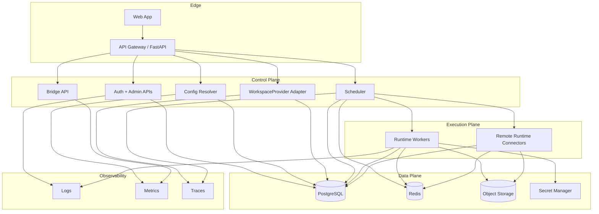

# 010 Deployment Topology

## Deployment Assumption

YA Agent Platform is designed to run in the cloud.

A single-process development mode remains useful for local development, but the target operating model is a distributed service with separate scaling for APIs, Web UI, and runtime workers.

## Reference Topology

## Deployment Modes

### Development monolith

One backend process plus one web app build.

Use cases:

- local development
- integration tests
- first implementation milestone

### Shared SaaS region

One logical deployment serving many tenants in one region.

Characteristics:

- shared control plane
- shared runtime pools with tenant-aware isolation
- one configured `WorkspaceProvider` for the service instance
- managed PostgreSQL, Redis, and object storage

### Multi-region SaaS

Multiple regions with a shared platform control layer and region-local execution pools.

Characteristics:

- tenant home region affinity
- region-local streaming and runtime placement
- object storage replication or region pinning by policy
- provider deployment strategy aligned with each region

### Dedicated tenant deployment

One deployment or one dedicated runtime pool reserved for a single tenant.

Characteristics:

- strong isolation
- custom networking
- tenant-dedicated runtime pools and secret scopes
- provider behavior tailored to that deployment

### Hybrid with remote runtimes

Platform control plane remains hosted while some workloads execute in remote customer environments.

Characteristics:

- remote runtime registration and heartbeat
- platform-originated scheduling with tenant affinity
- provider binding and object exchange through the same session contract

## Regional Placement Rules

Placement decisions consider:

- tenant region policy
- environment profile pool selector
- provider capability availability
- data residency requirements
- runtime capability availability

## Scaling Rules

- API and Web UI scale independently from runtime workers
- runtime pools scale by executor kind and region
- `WorkspaceProvider` can scale as an in-process adapter or as a dedicated sidecar or service
- Redis handles short-lived fan-out and coordination, not long-term truth
- PostgreSQL remains the source of truth for metadata and durable status
- object storage holds session state, replay blobs, binding snapshots, and artifacts

## Operational Requirements

### Health

The platform exposes:

- liveness probes
- readiness probes
- component health for PostgreSQL, Redis, object storage, runtime registry, and provider integration

### Draining

Runtime pools and bridge workers support a `draining` mode.

Effects:

- no new assignments
- in-flight work continues to completion or controlled handoff
- admin portal exposes drain state and reason

### Disaster Recovery

Required backups and recovery layers:

- PostgreSQL backups and point-in-time recovery
- object storage versioning or durable replication
- infrastructure-as-code for runtime pools and edge services
- provider configuration recovery procedure
- secret recovery procedure

## Implementation Path In This Repository

The package can start from the current combined backend model and grow along this path:

1. monolithic FastAPI app with control-plane modules, provider adapter, and worker loop
2. background scheduler and runtime worker separation inside the same deployable
3. dedicated worker deployment for hosted runtime pools
4. provider isolation or externalization when deployment needs it
5. remote runtime registration for hybrid environments
