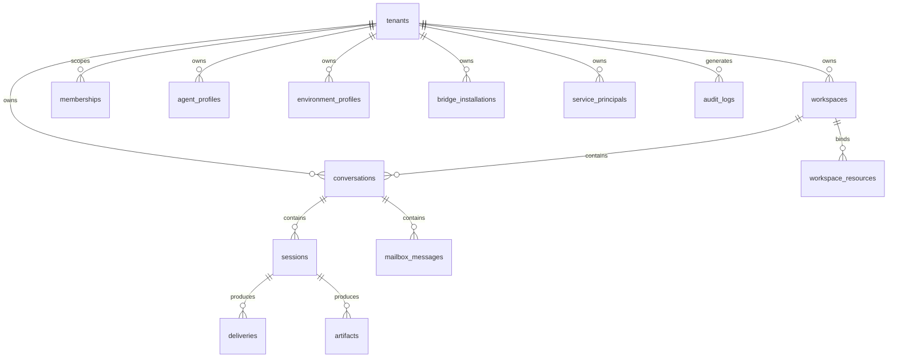

# 011 Data Model

## Storage Strategy

The platform uses storage by concern.

| Store          | Role                                                                                             |
| -------------- | ------------------------------------------------------------------------------------------------ |
| PostgreSQL     | source of truth for tenants, identities, config, conversations, sessions, deliveries, and audits |
| Redis          | ephemeral stream fan-out, queueing, lease coordination, transient caches                         |
| Object Storage | SDK resumable state, replay blobs, uploads, generated artifacts, exports                         |

## High-Level ERD



## Core PostgreSQL Tables

### `tenants`

Stores tenant lifecycle, defaults, quota envelope, region policy, and feature flags.

### `users`

Stores human identities. Global identity rows can be associated with multiple tenant memberships.

### `memberships`

Stores role bindings between users and tenants or specific workspaces.

### `service_principals`

Stores non-human identities for bridges, automation, and remote runtimes.

### `workspaces`

Stores workspace defaults, instruction blocks, and effective resource bindings.

### `agent_profiles`

Stores agent behavior config:

- model selection
- system prompt and prompt templates
- toolsets and tool config
- subagent config
- MCP bindings

### `environment_profiles`

Stores execution config:

- executor kind
- pool selector
- capabilities
- network policy
- materialization policy
- timeout and concurrency policy

### `bridge_installations`

Stores bridge routing, credentials references, health, and delivery policy.

### `conversations`

Stores durable thread metadata, defaults, and ownership.

### `sessions`

Stores immutable execution snapshots, status, usage summaries, and state references.

### `deliveries`

Stores outbound delivery records and retry state for bridges and notifications.

### `artifacts`

Stores object references for uploaded or generated files.

### `audit_logs`

Stores durable admin and control-plane action history.

## Session Storage Split

### PostgreSQL session row

Stores indexed and queryable fields:

- status
- ownership
- profile ids
- timings and usage summary
- final_message
- artifact counts
- failure summary

### Object storage session blob

Stores opaque execution payloads:

- `state.json` for SDK resumable state
- `display_events.json` for replayable event stream
- large generated outputs and attachments

Suggested layout:

```text
tenants/{tenant_id}/workspaces/{workspace_id}/sessions/{session_id}/state.json
tenants/{tenant_id}/workspaces/{workspace_id}/sessions/{session_id}/display_events.json
tenants/{tenant_id}/workspaces/{workspace_id}/artifacts/{artifact_id}
```

## Redis Key Families

Suggested initial key families:

| Key Pattern                                 | Purpose                         |
| ------------------------------------------- | ------------------------------- |
| `ya:queue:session:{region}:{executor_kind}` | schedulable work queue          |
| `ya:stream:session:{session_id}`            | live session event fan-out      |
| `ya:lease:session:{session_id}`             | worker lease and heartbeat      |
| `ya:delivery:{delivery_id}`                 | transient delivery coordination |

## Indexing Guidance

Important indexes include:

- tenant-scoped lookup indexes on all tenant-owned tables
- `(workspace_id, updated_at desc)` for conversation lists
- `(conversation_id, created_at)` for session history
- `(status, runtime_pool_id)` for operator and scheduler views
- `(bridge_installation_id, created_at)` for delivery troubleshooting
- GIN indexes for selected JSONB metadata fields that require filtering

## Retention Guidance

Retention can differ by store:

- PostgreSQL metadata follows tenant retention policy and audit requirements
- object-store replay blobs can expire earlier than session summaries when policy allows
- Redis keys expire aggressively because they are operational, not authoritative
