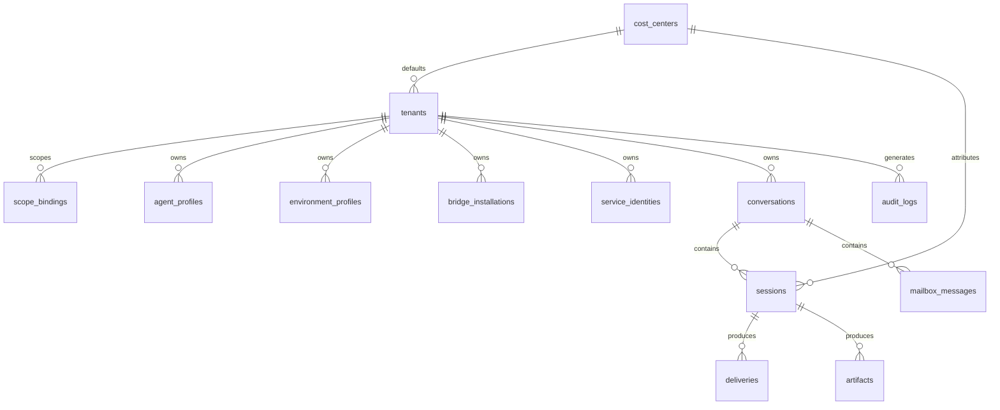

# 011 Data Model

## Storage Strategy

The platform uses storage by concern.

| Store          | Role                                                                                                           |
| -------------- | -------------------------------------------------------------------------------------------------------------- |
| PostgreSQL     | source of truth for tenants, cost centers, identities, config, conversations, sessions, deliveries, and audits |
| Redis          | ephemeral stream fan-out, queueing, lease coordination, transient caches                                       |
| Object Storage | SDK resumable state, project-binding snapshots, replay blobs, uploads, generated artifacts, exports            |

## High-Level ERD



## Core PostgreSQL Tables

### `cost_centers`

Stores budget metadata, reporting tags, and default quota settings.

### `tenants`

Stores isolation metadata, default cost-center binding, region policy, quota envelope, and feature flags.

### `users`

Stores human identities. A user can receive grants across multiple tenants and cost centers.

### `scope_bindings`

Stores grant bindings between users and target scopes such as tenants and cost centers.

### `service_identities`

Stores non-human identities for bridges, automation, and remote runtimes.

### Provider configuration storage rule

Provider implementations are registered in code and selected by deployment-level configuration, not by tenant-scoped database entities.

The platform can persist provider runtime metadata or audit snapshots when useful, while provider selection and bootstrap values come from process configuration.

### `agent_profiles`

Stores agent behavior config:

- model selection
- system prompt and prompt templates
- toolsets and tool config
- subagent config
- MCP bindings

### `environment_profiles`

Stores execution config:

- executor kind
- pool selector
- capabilities
- provider binding policy
- network policy
- timeout and concurrency policy

### `bridge_installations`

Stores bridge routing, credential references, health, and delivery policy.

### `conversations`

Stores durable thread metadata, defaults, business keys, and ownership.

### `sessions`

Stores immutable execution snapshots, status, usage summaries, `effective_cost_center_id`, ordered `project_ids`, optional `workspace_provider_input`, and `project_binding_ref`.

### `deliveries`

Stores outbound delivery records and retry state for bridges and notifications.

### `artifacts`

Stores object references for uploaded or generated files.

### `audit_logs`

Stores durable admin and control-plane action history.

## Session Storage Split

### PostgreSQL session row

Stores indexed and queryable fields:

- status
- ownership
- profile ids
- effective cost center
- ordered `project_ids`
- timings and usage summary
- final_message
- artifact counts
- failure summary

### Object storage session blob

Stores opaque execution payloads:

- `state.json` for SDK resumable state
- `project_binding.json` for the resolved provider binding snapshot
- `display_events.json` for replayable event stream
- large generated outputs and attachments

Suggested layout:

```text
tenants/{tenant_id}/conversations/{conversation_id}/sessions/{session_id}/state.json
tenants/{tenant_id}/conversations/{conversation_id}/sessions/{session_id}/project_binding.json
tenants/{tenant_id}/conversations/{conversation_id}/sessions/{session_id}/display_events.json
tenants/{tenant_id}/artifacts/{artifact_id}
```

## Redis Key Families

Suggested initial key families:

| Key Pattern                                 | Purpose                         |
| ------------------------------------------- | ------------------------------- |
| `ya:queue:session:{region}:{executor_kind}` | schedulable work queue          |
| `ya:stream:session:{session_id}`            | live session event fan-out      |
| `ya:lease:session:{session_id}`             | worker lease and heartbeat      |
| `ya:delivery:{delivery_id}`                 | transient delivery coordination |

## Indexing Guidance

Important indexes include:

- tenant-scoped lookup indexes on all tenant-owned tables
- `(effective_cost_center_id, created_at desc)` for usage and cost views
- `(tenant_id, updated_at desc)` for conversation lists
- `(conversation_id, created_at)` for session history
- `(status, runtime_pool_id)` for operator and scheduler views
- `(bridge_installation_id, created_at)` for delivery troubleshooting
- GIN indexes for selected JSONB metadata fields that require filtering

## Retention Guidance

Retention can differ by store:

- PostgreSQL metadata follows tenant retention policy and audit requirements
- object-store replay blobs and binding snapshots can expire earlier than session summaries when policy allows
- Redis keys expire aggressively because they are operational, not authoritative
