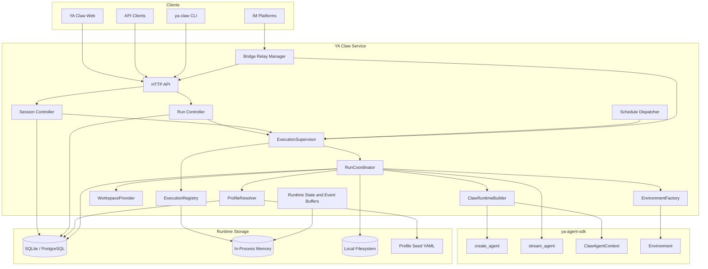

# 00 - Overview

## Definition

YA Claw is a single-node runtime web service for `ya-agent-sdk`.

It provides a durable local execution shell around SDK agent construction and streaming primitives with:

- reusable execution profiles
- one configured workspace root
- opaque `project_id` input carried by applications such as bridges and the web shell
- resolver-driven workspace binding construction
- explicit runtime assembly from binding to agent runtime
- resumable sessions and runs
- queued-run execution before active execution begins
- in-process async task coordination
- live event streaming for the current node
- committed session persistence
- a first-party web shell

## Goals

### Product Goals

- make local and self-hosted deployment the default operating model
- keep runtime file and shell access bounded by one configured workspace root
- let applications choose `project_id` and carry their own project mapping logic
- preserve SDK capabilities such as continuation, subagents, compact, and streaming
- keep the runtime small enough to understand and evolve quickly
- keep active execution management inside one process for the single-node target
- support API, schedule, and bridge ingress through one queued-run execution model

### Non-Goals

- hosted platform concerns
- organization-level control plane design
- runtime-managed project catalogs
- distributed runtime scheduling
- multi-node execution ownership

## Top-level Architecture

## Runtime Boundary

| Concern                       | Owner                     |
| ----------------------------- | ------------------------- |
| Agent execution primitives    | `ya-agent-sdk`            |
| Workspace root enforcement    | YA Claw                   |
| Profile resolution            | YA Claw                   |
| Runtime assembly              | YA Claw                   |
| Session persistence           | YA Claw                   |
| Run orchestration             | YA Claw                   |
| Active execution tracking     | YA Claw                   |
| Event delivery                | YA Claw                   |
| Committed session persistence | YA Claw                   |
| Project mapping               | bridge or web application |
| Channel transport             | bridge adapter            |
| LLM provider interaction      | SDK + model provider      |

## Core Runtime Objects

The architecture revolves around a small set of runtime objects:

- **Execution Profile**: reusable runtime configuration for model, prompt, tools, approvals, and policy
- **Workspace Binding**: declarative workspace view for one run, including host path, virtual path, cwd, path policy, and metadata
- **Environment Factory**: runtime component that turns a workspace binding into a concrete SDK `Environment`
- **ClawAgentContext**: YA Claw-specific `AgentContext` subclass that carries run, session, profile, workspace, and source metadata
- **ClawRuntimeBuilder**: runtime component that assembles `Environment`, `ClawAgentContext`, toolsets, and agent configuration into one SDK runtime
- **Execution Supervisor**: in-process manager that claims queued runs, starts coordinators, and tracks active execution
- **Run Coordinator**: short-lived per-run executor from claim to terminal state
- **Session**: durable conversational continuity
- **Run**: one execution attempt inside a session
- **Execution Registry**: in-memory registry of active run tasks and control signals

## Design Principle

YA Claw owns durable execution intent, runtime assembly, and active execution management.
Applications own project identity and high-level ingress context.
