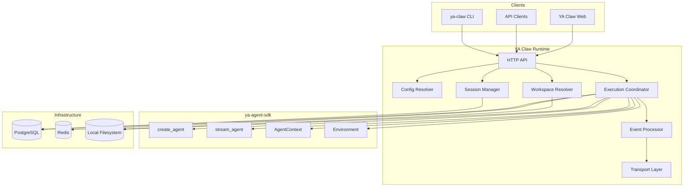

# 00 - Overview

## Definition

YA Claw is a workspace-native single-node runtime service for `ya-agent-sdk`.

It provides a durable local execution shell around SDK agent construction and streaming primitives with:

- reusable agent profiles
- provider-resolved workspaces
- resumable sessions and runs
- live event streaming
- artifact persistence
- a first-party web shell

## Goals

### Product Goals

- make local and self-hosted deployment the default operating model
- treat workspace resolution as a first-class runtime concern
- preserve SDK capabilities such as continuation, subagents, compact, and streaming
- keep the runtime small enough to understand and evolve quickly

### Non-Goals

- hosted platform concerns
- organization-level control plane design
- bridge protocol and channel adapter lifecycle
- distributed runtime scheduling

## Top-level Architecture

## Runtime Boundary

| Concern                    | Owner                     |
| -------------------------- | ------------------------- |
| Agent execution primitives | `ya-agent-sdk`            |
| Workspace resolution       | YA Claw                   |
| Session persistence        | YA Claw                   |
| Run orchestration          | YA Claw                   |
| Event transport            | YA Claw                   |
| Artifact persistence       | YA Claw                   |
| LLM provider interaction   | SDK + model provider      |
| Container lifecycle        | user or external operator |

## Core Runtime Objects

The architecture revolves around a small set of runtime objects:

- **Workspace**: a named execution target known to the runtime
- **Workspace Binding**: the resolved execution snapshot returned by `WorkspaceProvider`
- **Agent Profile**: reusable runtime configuration for model, prompt, tools, and policy
- **Session**: durable conversational continuity
- **Run**: one execution attempt inside a session
- **Artifact**: durable file output or retained input produced by a run

These objects are architectural concepts first. Exact table layouts should stay implementation-driven.

## Deployment Baseline

The reference deployment shape is:

- one YA Claw process
- one PostgreSQL
- one Redis
- one local data directory
- one bundled SPA web shell

That shape is the baseline for the rest of this spec.
