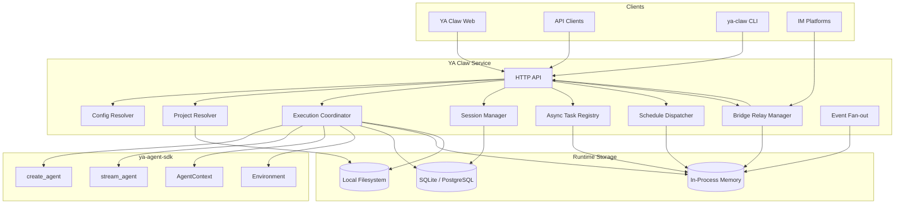

# 00 - Overview

## Definition

YA Claw is a single-node runtime web service for `ya-agent-sdk`.

It provides a durable local execution shell around SDK agent construction and streaming primitives with:

- reusable agent profiles
- one configured workspace root
- opaque `project_id` input carried by applications such as bridges and the web shell
- resolver-driven execution scope construction
- resumable sessions and runs
- session schedules for timed execution
- in-process async task coordination
- live event streaming for the current node
- bridge adapters for external IM channels
- committed session persistence
- a first-party web shell

## Goals

### Product Goals

- make local and self-hosted deployment the default operating model
- keep runtime file and shell access bounded by one configured workspace root
- let applications choose `project_id` and carry their own project mapping logic
- preserve SDK capabilities such as continuation, subagents, compact, and streaming
- keep the runtime small enough to understand and evolve quickly
- keep active state management inside one process for the single-node target
- support both scheduled session execution and channel-driven execution through one service

### Non-Goals

- hosted platform concerns
- organization-level control plane design
- runtime-managed project catalogs
- distributed runtime scheduling
- bridge provider feature parity freeze before first implementation

## Top-level Architecture



## Runtime Boundary

| Concern                       | Owner                     |
| ----------------------------- | ------------------------- |
| Agent execution primitives    | `ya-agent-sdk`            |
| Workspace root enforcement    | YA Claw                   |
| Project resolution            | YA Claw                   |
| Session persistence           | YA Claw                   |
| Run orchestration             | YA Claw                   |
| Schedule dispatch             | YA Claw                   |
| Bridge relay coordination     | YA Claw                   |
| Active task tracking          | YA Claw                   |
| Event delivery                | YA Claw                   |
| Committed session persistence | YA Claw                   |
| Project mapping               | bridge or web application |
| Channel transport             | bridge adapter            |
| LLM provider interaction      | SDK + model provider      |
| Container lifecycle           | user or external operator |

## Core Runtime Objects

The architecture revolves around a small set of runtime objects:

- **Workspace Root**: the configured top-level directory that bounds runtime file and shell access
- **Project ID**: an opaque application-provided selector that YA Claw carries and records
- **Project Resolver**: the runtime component that maps `project_id` and metadata to an execution scope
- **Execution Scope**: the resolved working directory, path access, and environment view for one run
- **Agent Profile**: reusable runtime configuration for model, prompt, tools, and policy
- **Session**: durable conversational continuity
- **Run**: one execution attempt inside a session
- **Session Schedule**: a timed trigger bound to one session or continuation target
- **Async Task**: an in-process background activity associated with one runtime process
- **Bridge Endpoint**: one configured channel integration and relay policy
- **Artifact**: durable file output or retained input produced by a run

These objects are architectural concepts first. Exact table layouts should stay implementation-driven.

## Project Resolution Model

Applications such as bridges and the web shell choose `project_id`.
YA Claw consumes that value, stores it with the session and run, and resolves it into an execution scope.

The runtime stays responsible for:

- applying one configured workspace root
- resolving effective working directory and path access
- validating that resolved paths stay inside the workspace root
- exposing the resulting scope to virtual file and shell tools

## Bridge Model

A bridge links an IM platform to the YA Claw service through a dedicated adapter.

The base interaction path is:

```text
IM <-> Bridge <-> YA Claw Service
```

Bridge adapters should support two relay modes:

- **Task Relay**: the bridge submits work to an async session flow and delivers agent output through the channel adapter or channel CLI
- **Stream Relay**: the bridge starts a foreground run, consumes SSE from YA Claw, and forwards channel-ready output in near real time

## Deployment Baseline

The reference deployment shape is:

- one YA Claw web service
- one in-process runtime state manager
- one session scheduler
- one bridge subsystem
- one SQLite database by default
- optional PostgreSQL when an external relational store is preferred
- one local data directory
- one bundled SPA web shell

That shape is the baseline for the rest of this spec.
