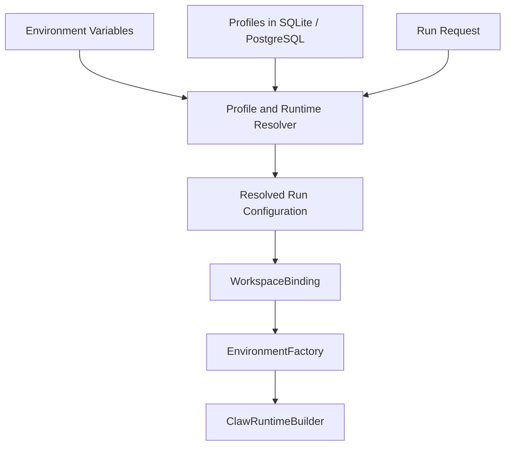
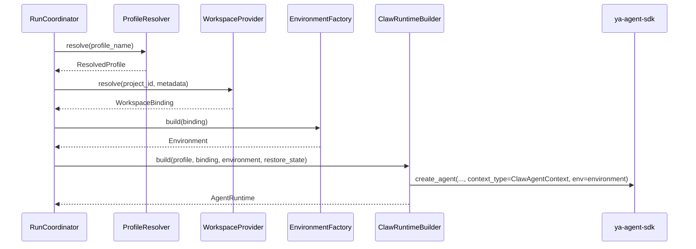

# 01 - Configuration, Profiles, and Workspace Assembly

YA Claw resolves each run from three configuration layers:

- environment variables for service infrastructure and bootstrap defaults
- storage-backed profiles for durable runtime behavior
- request-level inputs for transient run selection and execution

## Configuration Layers

## Service Configuration

### Environment Variables

| Variable                                  | Purpose                                                            |
| ----------------------------------------- | ------------------------------------------------------------------ |
| `YA_CLAW_HOST`                            | bind host                                                          |
| `YA_CLAW_PORT`                            | bind port                                                          |
| `YA_CLAW_PUBLIC_BASE_URL`                 | public base URL                                                    |
| `YA_CLAW_INSTANCE_ID`                     | runtime instance identity used for run ownership and heartbeat     |
| `YA_CLAW_API_TOKEN`                       | shared bearer token required for HTTP access                       |
| `YA_CLAW_ENVIRONMENT`                     | runtime environment label                                          |
| `YA_CLAW_DATABASE_URL`                    | SQLite or PostgreSQL connection string                             |
| `YA_CLAW_AUTO_MIGRATE`                    | startup schema migration switch                                    |
| `YA_CLAW_WEB_DIST_DIR`                    | bundled web shell directory                                        |
| `YA_CLAW_DATA_DIR`                        | runtime data root for session store                                |
| `YA_CLAW_WORKSPACE_ROOT`                  | top-level runtime workspace root for project-managed data          |
| `YA_CLAW_DATABASE_ECHO`                   | SQL logging                                                        |
| `YA_CLAW_DATABASE_POOL_SIZE`              | pool size                                                          |
| `YA_CLAW_DATABASE_MAX_OVERFLOW`           | pool overflow                                                      |
| `YA_CLAW_DATABASE_POOL_RECYCLE_SECONDS`   | connection recycle interval                                        |
| `YA_CLAW_DEFAULT_PROFILE`                 | bootstrap profile name used when a request omits `profile_name`    |
| `YA_CLAW_PROFILE_SEED_FILE`               | optional YAML seed file for profiles                               |
| `YA_CLAW_AUTO_SEED_PROFILES`              | load or refresh seeded profiles on startup                         |
| `YA_CLAW_WORKSPACE_PROVIDER_BACKEND`      | bootstrap workspace backend hint for local development or fallback |
| `YA_CLAW_WORKSPACE_PROVIDER_DOCKER_IMAGE` | Docker image for Docker-backed environment construction            |
| `YA_CLAW_MCP_CONFIG_FILE`                 | global MCP JSON file injected into every runtime                   |
| `YA_CLAW_PROJECT_MCP_CONFIG_PATH`         | per-workspace MCP JSON path with project-level priority            |

LLM provider keys and tool API keys stay in environment variables and follow `ya-agent-sdk` conventions.

### Environment Variable Principle

Environment variables own infrastructure concerns and bootstrap defaults.
Profiles own reusable execution behavior.

## Execution Profile

An execution profile is a reusable runtime template stored in the relational database.

A profile should define:

- `name`
- `model`
- `model_settings_preset`
- `model_settings_override`
- `model_config_preset`
- `model_config_override`
- `system_prompt`
- `builtin_toolsets`
- `subagents`
- `need_user_approve_tools`
- `need_user_approve_mcps`
- `enabled_mcps`
- `disabled_mcps`
- `workspace_backend_hint`
- `enabled`
- seed metadata such as `source_type` and `source_version`

### Preset Alignment Rule

Profile model configuration should align with `ya-agent-sdk` and `yaacli` preset definitions.

Recommended resolution order:

1. load `model_settings_preset` through `ya_agent_sdk.presets.get_model_settings(...)`
2. load `model_config_preset` through a YA Claw model config resolver built on SDK preset metadata
3. merge optional override JSON blocks
4. apply request-level transient overrides when explicitly allowed

### Runtime-Wide MCP Configuration

YA Claw loads MCP server definitions from a dedicated JSON file layer.

Resolution order:

1. project file at `<workspace>/.ya-claw/mcp.json`
2. global file at `~/.ya-claw/mcp.json`

The runtime builder injects the resolved MCP servers into every agent through one `ToolProxyToolset`.
Profiles keep the policy surface through `need_user_approve_mcps`, `enabled_mcps`, and `disabled_mcps`.

### YAML Seed

Profiles should support YAML seed into the database.

Recommended behavior:

- seed file is version-controlled
- seed operation upserts by profile `name`
- seed metadata records source version or checksum
- explicit prune mode removes seeded rows no longer present in YAML
- manually created rows remain first-class records

## Project References

`project_id` is application input.
YA Claw treats it as an opaque selector.

Typical examples:

- a bridge maps one group chat to one `project_id`
- the web shell restores the last used `project_id` from application state
- another application sends a one-off `project_id` with a direct API request

YA Claw also accepts `projects` for multi-project sessions and runs. Each entry contains:

- `project_id` — opaque selector mapped under the configured workspace root
- `description` — operator or application supplied context for the agent

The first normalized project is the primary project and default cwd. Every project maps to:

- host path: `{YA_CLAW_WORKSPACE_ROOT}/{project_id}`
- virtual path: `/workspace/{project_id}`
- skill path: `/workspace/{project_id}/.agents/skills/`

YA Claw does not need project CRUD or a runtime-managed project catalog.

## Official Docker Workspace Image

The default Docker workspace image is `ghcr.io/wh1isper/ya-claw-workspace:latest`.

The image provides a ready-to-use agent workspace on Debian stable with:

- Python and `pip`/`venv`
- Node.js and Corepack
- Git, OpenSSH, curl, wget, jq, unzip, zip, and common shell utilities
- Debian Chromium and browser system dependencies
- `agent-browser` installed through npm and configured to use `/usr/bin/chromium`
- an `agent-browser` discovery skill copied into mounted workspace `.agents/skills/` directories at container start

The workspace provider still treats the image as an implementation detail carried by `YA_CLAW_WORKSPACE_PROVIDER_DOCKER_IMAGE`. Deployments can override the image while keeping the same binding and environment factory contracts.

## WorkspaceProvider

`WorkspaceProvider` is the runtime boundary that turns project references plus request metadata into one declarative `WorkspaceBinding`.

A provider should return:

- one or more host workspace paths
- one or more virtual workspace paths exposed to the agent
- one default cwd
- readable and writable virtual paths
- environment overrides
- provider metadata useful for logs and UI
- runtime hints such as backend preference

### WorkspaceBinding Principle

`WorkspaceBinding` is a declarative value object.
It describes execution boundaries and path policy.
It does not own the concrete SDK `Environment` instance.

`WorkspaceBinding.project_mounts` carries the normalized project map. `readable_paths` and `writable_paths` are derived from the mount virtual paths, and the primary mount defines `cwd`.

### LocalWorkspaceProvider

Suggested shape:

- host paths under configured workspace root
- virtual paths under `/workspace/{project_id}`
- path policy restricted to mounted project roots
- backend hint `local`

### DockerWorkspaceProvider

Suggested shape:

- host workspace paths mounted into the container
- virtual paths shared by shell and file operations
- backend hint `docker`
- optional image hint from profile or service bootstrap config

## EnvironmentFactory

`EnvironmentFactory` turns `WorkspaceBinding` into a concrete SDK `Environment`.

Recommended implementations:

- `LocalEnvironmentFactory`
- `DockerEnvironmentFactory`

Responsibilities:

- instantiate the concrete environment class
- enforce path policy from the binding
- carry environment overrides into shell or resources
- keep file operations and shell execution in the same virtual path space

## ClawAgentContext

YA Claw should define a `ClawAgentContext` subclass over `ya_agent_sdk.context.AgentContext`.

This context is the primary carrier for YA Claw runtime metadata.

Suggested fields:

- `session_id`
- `claw_run_id`
- `profile_name`
- `project_id`
- `restore_from_run_id`
- `dispatch_mode`
- `workspace_binding`
- `source_kind`
- `source_metadata`
- `claw_metadata`

### Context Principle

`ClawAgentContext` carries YA Claw metadata in one stable place.
The coordinator should not become a parameter shuttle for runtime metadata.

## ClawRuntimeBuilder

`ClawRuntimeBuilder` is the assembly boundary between runtime inputs and SDK runtime creation.

Responsibilities:

- resolve profile into concrete model settings and model config
- resolve workspace binding
- build the concrete environment through `EnvironmentFactory`
- construct `ClawAgentContext`
- assemble builtin tools, MCP toolsets, approvals, subagents, and prompt template variables
- create the final `AgentRuntime`

## Runtime Assembly Flow

## Design Principle

Profiles define reusable behavior.
Workspace bindings define execution boundaries.
Environment factories define concrete runtime resources.
Runtime builder defines agent assembly.
