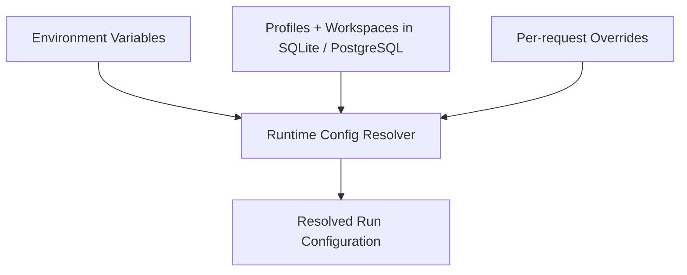
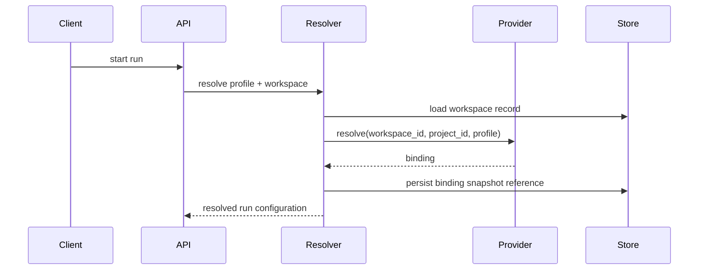

# 01 - Configuration and Workspace Provider

YA Claw resolves each run from three configuration layers:

- environment variables for service infrastructure and secrets
- storage-backed profiles and workspaces for durable runtime behavior
- request-level overrides for transient run customization

## Configuration Layers



## Service Configuration

### Environment Variables

| Variable                                | Purpose                                |
| --------------------------------------- | -------------------------------------- |
| `YA_CLAW_HOST`                          | bind host                              |
| `YA_CLAW_PORT`                          | bind port                              |
| `YA_CLAW_PUBLIC_BASE_URL`               | public base URL                        |
| `YA_CLAW_ENVIRONMENT`                   | runtime environment label              |
| `YA_CLAW_DATABASE_URL`                  | SQLite or PostgreSQL connection string |
| `YA_CLAW_AUTO_MIGRATE`                  | startup schema migration switch        |
| `YA_CLAW_WEB_DIST_DIR`                  | bundled web shell directory            |
| `YA_CLAW_DATA_DIR`                      | local data root                        |
| `YA_CLAW_DATABASE_ECHO`                 | SQL logging                            |
| `YA_CLAW_DATABASE_POOL_SIZE`            | pool size                              |
| `YA_CLAW_DATABASE_MAX_OVERFLOW`         | pool overflow                          |
| `YA_CLAW_DATABASE_POOL_RECYCLE_SECONDS` | connection recycle interval            |

LLM provider keys and tool API keys stay in environment variables and follow `ya-agent-sdk` conventions.

## Agent Profile

An agent profile is a reusable runtime template.

A profile should define:

- model selection
- system prompt
- enabled toolsets
- subagent behavior
- runtime policy defaults
- workspace selection policy defaults

### Suggested Profile Shape

| Field              | Purpose                                              |
| ------------------ | ---------------------------------------------------- |
| `model`            | model name plus model settings and overrides         |
| `system_prompt`    | reusable prompt template                             |
| `toolsets`         | enabled tool groups and tool-level options           |
| `subagents`        | delegation and async behavior                        |
| `runtime_policy`   | transport, approval, compact, and execution defaults |
| `workspace_policy` | workspace or project selection defaults              |

## Workspace Record

A workspace record should stay small.

It only needs to persist:

- stable workspace identity
- provider key
- provider input
- display metadata

Heavy resolution logic belongs to `WorkspaceProvider`, not to the workspace record.

## WorkspaceProvider

`WorkspaceProvider` is the central extension boundary of YA Claw.

It transforms user-facing workspace intent into an execution-ready binding.

### Responsibilities

The provider is responsible for:

- resolving workspace and project intent into local paths
- selecting working directory and allowed paths
- returning environment variables for execution
- exposing capability flags and metadata to the runtime

The provider boundary stays focused on resolution. Session persistence, run creation, active task management, and artifact storage stay in the core runtime.

## Resolution Contract

A conceptual provider interface is:

```python
class WorkspaceProvider(Protocol):
    async def resolve(
        self,
        workspace_id: str,
        *,
        project_id: str | None,
        profile: ResolvedProfile,
    ) -> WorkspaceBinding:
        ...
```

### Workspace Binding Output

A binding should include:

| Field               | Purpose                                             |
| ------------------- | --------------------------------------------------- |
| `workspace_id`      | workspace identity                                  |
| `project_id`        | selected project                                    |
| `workspace_root`    | resolved root path                                  |
| `working_directory` | default shell working directory                     |
| `allowed_paths`     | all paths exposed to the runtime                    |
| `environment`       | provider-resolved environment variables             |
| `capabilities`      | writable, shell, watch, or similar capability flags |
| `metadata`          | display and audit metadata                          |

## Resolution Flow



## Provider Selection Model

One YA Claw deployment should use one configured provider implementation.

That provider may manage many workspace records.

This keeps the runtime simple while preserving room for different resolution strategies.

## Starter Provider Shapes

- **Local Registry Provider**: one workspace maps directly to one local root
- **Monorepo Provider**: one root hosts many projects inside a tree
- **Git Worktree Provider**: one workspace maps to managed worktree roots
