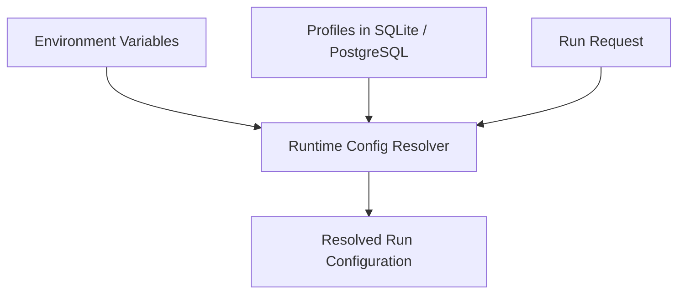
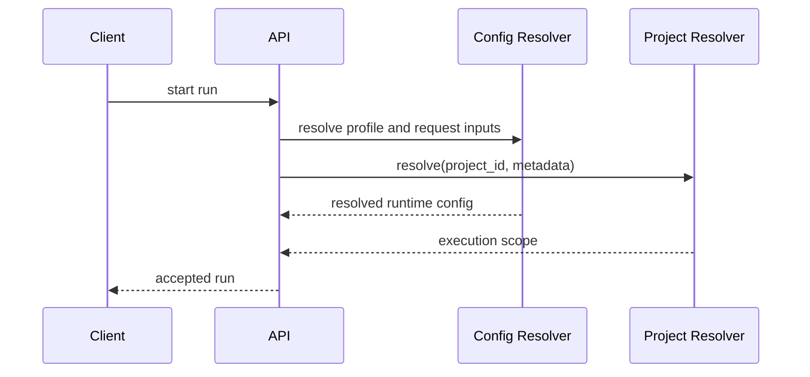

# 01 - Configuration and Execution Scope

YA Claw resolves each run from three configuration layers:

- environment variables for service infrastructure and secrets
- storage-backed profiles for durable runtime behavior
- request-level inputs for transient run selection and execution

## Configuration Layers

## Service Configuration

### Environment Variables

| Variable                                | Purpose                                                   |
| --------------------------------------- | --------------------------------------------------------- |
| `YA_CLAW_HOST`                          | bind host                                                 |
| `YA_CLAW_PORT`                          | bind port                                                 |
| `YA_CLAW_PUBLIC_BASE_URL`               | public base URL                                           |
| `YA_CLAW_API_TOKEN`                     | shared bearer token required for HTTP access              |
| `YA_CLAW_ENVIRONMENT`                   | runtime environment label                                 |
| `YA_CLAW_DATABASE_URL`                  | SQLite or PostgreSQL connection string                    |
| `YA_CLAW_AUTO_MIGRATE`                  | startup schema migration switch                           |
| `YA_CLAW_WEB_DIST_DIR`                  | bundled web shell directory                               |
| `YA_CLAW_DATA_DIR`                      | runtime data root for session store                       |
| `YA_CLAW_WORKSPACE_ROOT`                | top-level runtime workspace root for project-managed data |
| `YA_CLAW_DATABASE_ECHO`                 | SQL logging                                               |
| `YA_CLAW_DATABASE_POOL_SIZE`            | pool size                                                 |
| `YA_CLAW_DATABASE_MAX_OVERFLOW`         | pool overflow                                             |
| `YA_CLAW_DATABASE_POOL_RECYCLE_SECONDS` | connection recycle interval                               |

LLM provider keys and tool API keys stay in environment variables and follow `ya-agent-sdk` conventions.

Default local paths:

- SQLite database: `~/.ya-claw/ya_claw.sqlite3`
- runtime data root: `~/.ya-claw/data`
- workspace root: `~/.ya-claw/workspace`

## Agent Profile

An agent profile is a reusable runtime template.

A profile should define:

- model selection
- system prompt
- enabled toolsets
- subagent behavior
- runtime policy defaults

Profile management can stay implementation-driven.
The initial runtime only needs a stable way to choose a profile for a run.

## Opaque Project ID

`project_id` is application input.
YA Claw treats it as an opaque selector.

Typical examples:

- a bridge maps one group chat to one `project_id`
- the web shell restores the last used `project_id` from application state
- another application sends a one-off `project_id` with a direct API request

YA Claw does not need project CRUD or a runtime-managed project catalog.

## Project Resolver

The project resolver is the main runtime boundary for project-aware execution.

It transforms `project_id` plus request metadata into an execution scope.
The resolver may use local configuration, external state, or application metadata.
That choice stays implementation-driven.

The runtime stays responsible for:

- applying one configured workspace root
- resolving the effective working directory
- resolving readable and writable paths
- resolving environment overrides for execution
- validating that all resolved paths stay inside the workspace root

## Execution Scope

An execution scope is the execution-ready view for one run.

At the overview level it should include:

| Field            | Purpose                                    |
| ---------------- | ------------------------------------------ |
| `cwd`            | default working directory                  |
| `readable_paths` | paths visible to virtual file operations   |
| `writable_paths` | paths writable during the run              |
| `env_overrides`  | execution-time environment additions       |
| `metadata`       | resolver metadata useful for logging or UI |

YA Claw uses the execution scope to construct virtual file access and sandboxed shell execution for the SDK runtime.

## Resolution Flow

## Design Principle

YA Claw owns execution constraints.
Applications own project identity and project mapping.
