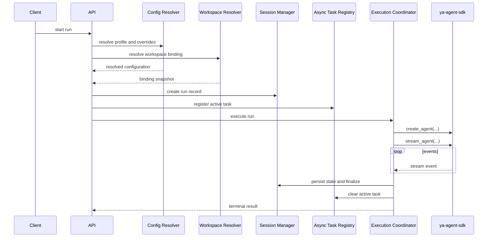
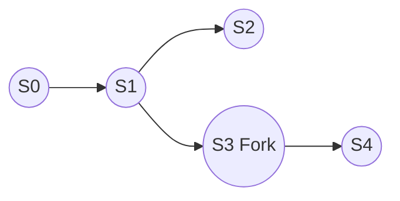
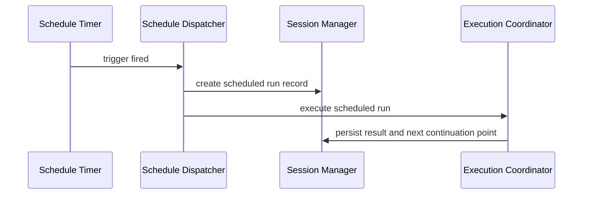

# 02 - Execution and Session

The execution coordinator owns one run from initial request to final state commit.

## Execution Flow

## Execution Responsibilities

The coordinator is responsible for:

- loading the previous committed session state when continuing
- constructing the SDK runtime and environment
- processing stream events into external protocol events
- persisting final summaries, artifacts, and exported state
- updating the in-process task registry during active execution
- coordinating schedule-triggered runs and bridge-triggered runs through the same session model

## Session Model

YA Claw should use an immutable session lineage model.

A continuation creates a new session snapshot linked to its parent. A fork creates a new root lineage from a historical point.

## Run Model

A run is one execution attempt inside a session.

### Run States

| Status      | Meaning                    |
| ----------- | -------------------------- |
| `queued`    | accepted but not started   |
| `running`   | currently executing        |
| `completed` | finished successfully      |
| `failed`    | finished with error        |
| `cancelled` | stopped by user or cleanup |

## Runtime Setup

A run starts from four inputs:

- session context
- agent profile
- workspace binding
- request payload

The runtime should construct an SDK `Environment` from the resolved workspace binding, including:

- default working directory
- allowed file paths
- environment variables
- provider metadata exposed as runtime context instructions

## In-Process Active State

The single-node runtime keeps active state inside the process.

That active state should include:

- foreground run handles
- background task handles
- cancellation tokens
- connected event subscribers
- transient stream buffers
- schedule timers and wake-up bookkeeping
- bridge relay handles

Durable session continuity, run summaries, and artifacts still commit to storage.

## State Restore

If the run continues an existing session, YA Claw restores:

- exported SDK state
- message history
- environment resource state

## Background Task Model

Background tasks stay attached to one YA Claw process.

The in-process task registry should track:

- task identity
- associated session or run
- lifecycle status
- start and finish timestamps
- cancellation hooks

Longer-lived work should commit durable checkpoints at natural run boundaries.

## Session Commit Output

At a committed boundary, especially at session end, YA Claw should write:

- the latest session state snapshot to `state.json`
- exported SDK state
- the compacted committed conversation record to `message.json`
- metadata that links the committed message view to the session and run

## Session Schedule Model

A session schedule triggers a run on a defined cadence or at a defined time.

A schedule should bind:

- one target session or session template
- one profile
- one workspace binding intent
- one trigger definition
- one delivery policy
- one enabled state

### Schedule Trigger Types

- interval trigger
- cron trigger
- one-shot trigger

### Schedule Dispatch Flow

### Schedule Delivery Policy

A schedule may target one of these delivery policies:

- stored result only
- bridge callback delivery
- channel post delivery

## Bridge Relay Model

Bridge-triggered execution also reuses the same session and run model.

### Task Relay

Task relay is the default bridge path for async work.

The flow is:

1. bridge receives a channel event
2. bridge resolves the bridge endpoint policy
3. bridge creates or continues an async session
4. execution runs in background task form
5. bridge adapter or channel CLI delivers the resulting output back to the IM channel

### Stream Relay

Stream relay is the interactive bridge path for foreground work.

The flow is:

1. bridge receives a channel event
2. bridge starts a foreground run through the YA Claw service
3. bridge consumes SSE from the run event stream
4. bridge transforms runtime events into channel-ready messages
5. bridge pushes incremental output to the IM channel

## Completion Path

On successful completion the coordinator should:

1. collect final output summary
2. export SDK state
3. persist the latest session state snapshot to `state.json`
4. compact and persist the committed conversation record to `message.json`
5. persist artifacts produced or retained during the run
6. mark the run `completed`
7. advance the session into a ready-to-continue state
8. release in-process task resources

## Failure Path

On failure the coordinator should:

1. capture error metadata
2. flush terminal events when possible
3. mark the run `failed`
4. preserve the previously committed session state as the latest valid continuation point
5. release in-process task resources

## Recovery Principle

The runtime should keep the last known good exported state until the new run has committed successfully.

## Subagents and Compact

YA Claw should preserve SDK-native support for:

- subagent delegation
- compaction checkpoints
- continuation from compacted state

The architecture should record these as run- and session-level events without freezing the final data model too early.

## Concurrency Rule

One active foreground run per session is the clean default for the single-node runtime.

Parallelism should come from independent sessions, subagents, scheduled runs, or background tasks tracked by the same process.
