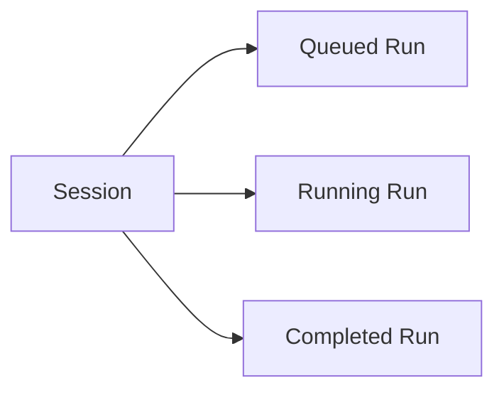
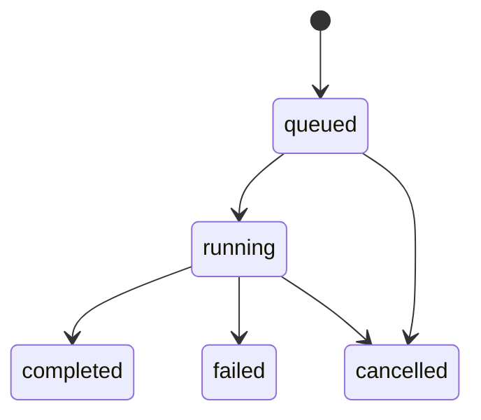
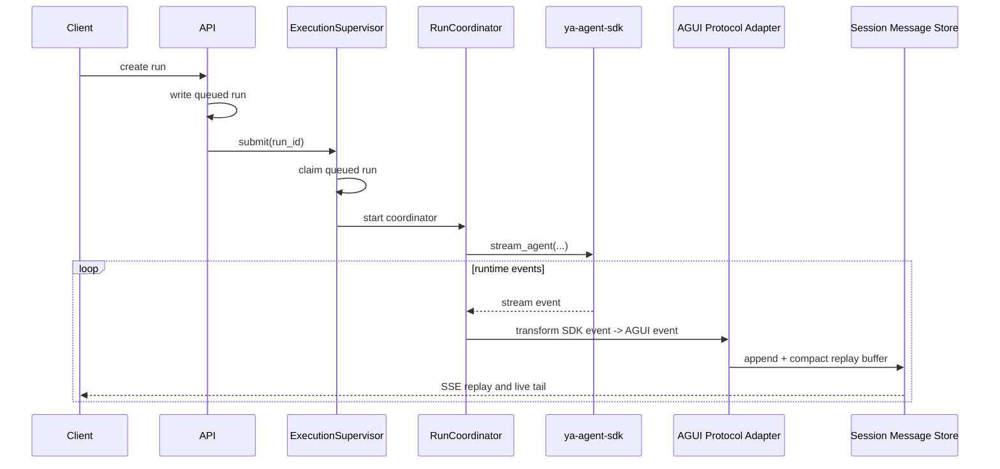

# 02 - Execution and Session

YA Claw uses queued runs as the durable execution intent.

The execution stack has two runtime layers:

- `ExecutionSupervisor` manages queued claims and active coordinators
- `RunCoordinator` executes one claimed run from start to terminal state

## Core Model

YA Claw uses two durable layers:

- a **run** is the atomic execution and commit unit
- a **session** is the high-level view over a run lineage and its continuation pointers

## Session Model

A session carries durable metadata plus continuation pointers stored in the relational database.

Suggested session fields:

- `id`
- `parent_session_id`
- `profile_name`
- `project_id`
- `metadata`
- `head_run_id`
- `head_success_run_id`
- `active_run_id`
- `created_at`
- `updated_at`

### Session Meaning

- `head_run_id` points to the latest run created in the session
- `head_success_run_id` points to the latest successfully committed run
- `active_run_id` points to the currently claimed and executing run when one exists

### Session Continuation Rule

A high-level session continuation follows this rule:

1. use explicit `restore_from_run_id` when provided
2. otherwise use `head_success_run_id`

## Run Model

A run is one execution attempt inside a session.

Suggested run fields:

- `id`
- `session_id`
- `sequence_no`
- `restore_from_run_id`
- `status`
- `trigger_type`
- `profile_name`
- `project_id`
- `input_parts`
- `metadata`
- `output_summary`
- `error_message`
- `termination_reason`
- `created_at`
- `started_at`
- `finished_at`
- `committed_at`

### Run States

| Status      | Meaning                                            |
| ----------- | -------------------------------------------------- |
| `queued`    | durable run intent accepted, waiting to be claimed |
| `running`   | claimed by supervisor and currently executing      |
| `completed` | committed successfully                             |
| `failed`    | ended with error                                   |
| `cancelled` | stopped before completion                          |

### Run State Flow

### Why `queued` Exists

`queued` is the durable handoff point between ingress and execution.

It enables:

- API acceptance before execution begins
- unified execution for API, schedules, and bridges
- concurrency control and future worker scaling
- cancellation before claim
- restart recovery and claim scans after process restart

## ExecutionSupervisor

`ExecutionSupervisor` is the long-lived in-process execution manager.

Responsibilities:

- accept new queued run notifications
- scan and claim queued runs on startup or recovery
- atomically transition `queued -> running`
- create and track one `RunCoordinator` task per active run
- route stop signals to active runs
- enforce concurrency limits and execution policy

### Claim Rule

Claim should be explicit and atomic.

Recommended shape:

1. load candidate queued run
2. update `status` from `queued` to `running` with a conditional write
3. set run claim ownership through `claimed_by` and `claimed_at`
4. update `started_at` and session `active_run_id`
5. record runtime instance liveness in the `runtime_instances` heartbeat table
6. only the successful claimant starts the coordinator

## RunCoordinator

`RunCoordinator` is the short-lived per-run executor.

Responsibilities:

- load session and run state
- load restore point from prior committed run when available
- resolve profile and workspace binding
- assemble the SDK runtime through `ClawRuntimeBuilder`
- stream execution events into runtime state buffers
- persist best-effort checkpoints
- commit final continuity blobs
- advance run and session pointers through the execution state machine

## Execution Registry and Runtime State

The single-node runtime keeps active execution state in memory.

Recommended split:

- `ExecutionRegistry` for active coordinator tasks and control handles
- runtime event buffer store for replayable events, steering queues, and termination signals

This split keeps execution ownership separate from event delivery.

## Input Model

Run creation, session continuation, and steering share one structured input protocol.

The request payload should use:

- `input_parts: Sequence[InputPart]`

`InputPart` supports:

- `text`
- `url`
- `file`
- `binary`
- `mode`
- `command`

The execution input mapper converts `input_parts` into the SDK `UserPrompt` shape.

## Event Flow

## Commit Semantics

Successful completion commits run output into the durable run store.

A successful commit should:

1. persist `state.json` for the run
2. persist compacted AGUI replay events to `message.json`
3. set `committed_at`
4. set session `head_success_run_id`
5. clear session `active_run_id`

## Failure and Interrupt Semantics

A failed or interrupted run keeps value as an explicit restore source.

The coordinator should:

1. keep `head_success_run_id` unchanged when no new successful commit exists
2. best-effort persist the latest compacted AGUI replay list for the interrupted or failed run
3. make that run addressable through `restore_from_run_id`

## Concurrency Rule

One active run per session is the clean default for the single-node runtime.

Parallelism should come from:

- independent sessions
- supervisor-managed background execution
- schedules
- bridges
- SDK subagents
