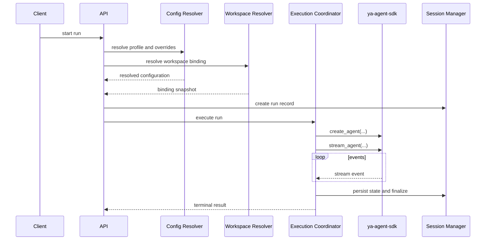
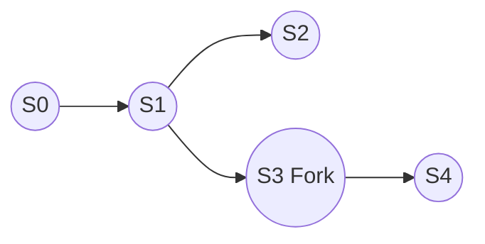

# 02 - Execution and Session

The execution coordinator owns one run from initial request to final state commit.

## Execution Flow

## Execution Responsibilities

The coordinator is responsible for:

- loading the previous committed session state when continuing
- constructing the SDK runtime and environment
- processing stream events into external protocol events
- persisting final summaries, artifacts, and exported state

## Session Model

YA Claw should use an immutable session lineage model.

A continuation creates a new session snapshot linked to its parent. A fork creates a new root lineage from a historical point.

## Run Model

A run is one execution attempt inside a session.

### Run States

| Status      | Meaning                    |
| ----------- | -------------------------- |
| `queued`    | accepted but not started   |
| `running`   | currently executing        |
| `completed` | finished successfully      |
| `failed`    | finished with error        |
| `cancelled` | stopped by user or cleanup |

## Runtime Setup

A run starts from four inputs:

- session context
- agent profile
- workspace binding
- request payload

The runtime should construct an SDK `Environment` from the resolved workspace binding, including:

- default working directory
- allowed file paths
- environment variables
- provider metadata exposed as runtime context instructions

## State Restore

If the run continues an existing session, YA Claw restores:

- exported SDK state
- message history
- environment resource state

## Completion Path

On successful completion the coordinator should:

1. collect final output summary
2. export SDK state
3. persist artifacts produced or retained during the run
4. mark the run `completed`
5. advance the session into a ready-to-continue state

## Failure Path

On failure the coordinator should:

1. capture error metadata
2. flush terminal events when possible
3. mark the run `failed`
4. preserve the previously committed session state as the latest valid continuation point

## Recovery Principle

The runtime should never overwrite the last known good exported state until the new run has committed successfully.

## Subagents and Compact

YA Claw should preserve SDK-native support for:

- subagent delegation
- compaction checkpoints
- continuation from compacted state

The architecture should record these as run- and session-level events without freezing the final data model too early.

## Concurrency Rule

One active foreground run per session is the clean default for the single-node runtime.

Parallelism should come from independent sessions or subagents, not from concurrent foreground writes into one session lineage.
