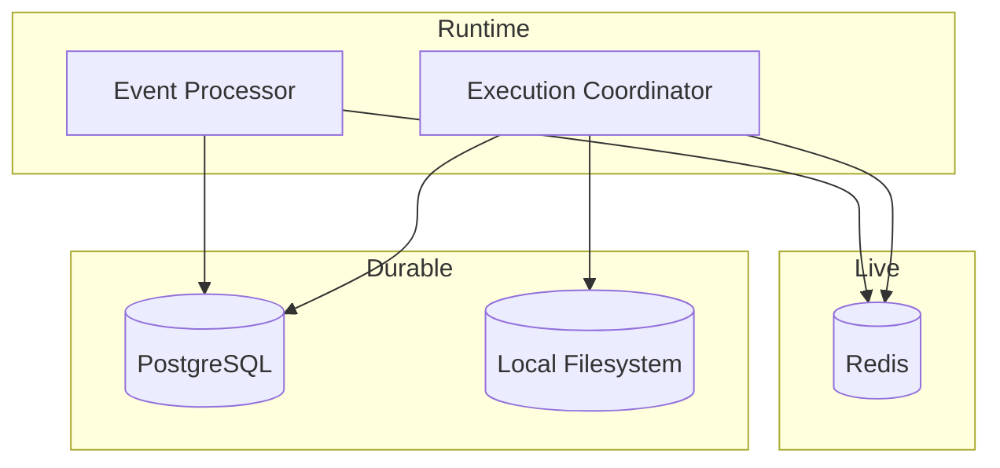

# 03 - Storage and Streaming

YA Claw uses three storage roles with clear separation of concerns.

## Storage Topology



## PostgreSQL

PostgreSQL is the durable source of truth for queryable runtime state.

It should store:

- workspaces and profile records
- session and run indexes
- status, timestamps, summaries, and searchable metadata
- artifact metadata and references
- event checkpoints or replay summaries where needed

### PostgreSQL Principle

PostgreSQL should answer runtime inspection and list queries without requiring large blob reads.

## Redis

Redis is the live coordination and delivery layer.

It should carry:

- active run event fan-out
- short-lived stream buffers
- cancellation and interruption signals
- watcher presence or transport state when needed

### Redis Principle

Redis owns short-lived runtime state.
PostgreSQL owns durable runtime state.

## Local Filesystem

The local filesystem stores large immutable payloads.

It should store:

- exported SDK state blobs
- retained uploads
- generated files
- run logs and traces
- optional archived event chunks

Suggested layout:

```text
data/
├── sessions/
│   └── {session_id}/
├── runs/
│   └── {run_id}/
│       ├── logs/
│       ├── traces/
│       └── artifacts/
└── uploads/
```

## Event Delivery Model

### Internal Flow

1. SDK emits stream events
2. execution coordinator enriches them with run context
3. event processor converts them into external protocol events
4. transport layer publishes them through SSE and Redis-backed delivery

### Transport Shape

The single-node baseline should support:

- direct SSE for browser-native clients
- Redis-backed stream buffers for resumable or decoupled consumers

## Replay Model

The runtime should retain enough durable summary data to support:

- session timeline views
- run detail views
- debugging and audit inspection

The full live stream does not need to remain in Redis after run completion.

## Artifact Principle

Artifact metadata should stay queryable from PostgreSQL.
Artifact payloads should stay on the filesystem under the runtime data root.
