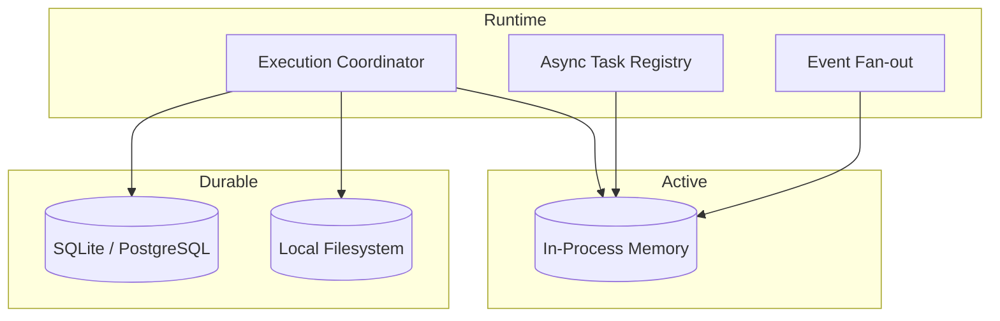

# 03 - Storage and Streaming

YA Claw uses three storage roles with clear separation of concerns.

## Storage Topology



## Relational Store

The relational store is the durable source of truth for queryable runtime state.

It should store:

- profile records when profiles are runtime-managed
- session and run indexes
- status, timestamps, summaries, and searchable metadata
- opaque `project_id` values carried with sessions and runs
- artifact metadata and references
- event checkpoints or replay summaries where needed

### Relational Store Principle

The relational store should answer runtime inspection and list queries without requiring large blob reads.

## Backend Selection

YA Claw should support one relational backend per deployment.

- SQLite is the default backend for local and self-hosted single-node deployments
- PostgreSQL is an optional backend for deployments that prefer an external relational store

## In-Process Memory

In-process memory owns active runtime state for one node.

It should carry:

- active run handles
- async task registry entries
- cancellation and interruption signals
- live SSE subscriber fan-out
- short-lived stream buffers for connected clients

### In-Process Memory Principle

Process memory owns active runtime state.
The relational store owns committed runtime state.

## Local Filesystem

The local filesystem has two durable areas:

- an **artifact store** for run outputs and retained files
- a **session store** for durable session state and compacted conversation records

### Artifact Store

The artifact store holds durable payloads produced or retained by runs.
Each run directory should stay simple.

It should store:

- generated files
- retained uploads
- run logs and traces
- exported artifacts intended for download or later inspection

### Session Store

The session store holds durable session continuity data.
Each session directory should stay simple.

It should store:

- `state.json`
- `message.json`

### Session State File

Each session should have one durable `state.json` file that captures the committed continuation point.

That file should include:

- exported SDK state
- message history
- run and session metadata needed for restore
- compact metadata such as last committed run, compact version, and timestamps
- effective `project_id` and useful continuation metadata

### Message File

`message.json` is the durable Web UI conversation record.
It should be written at session end or at another committed boundary and should contain:

- compacted conversation messages for the completed round
- AGUI-aligned message metadata for rendering a session timeline
- references to associated run, session, and artifact records

`message.json` is the preferred source for Web UI conversation history.
It keeps the UI aligned with an AGUI-style message model while the runtime continues to use live event streaming for active runs.

Suggested layout:

```text
data/
├── artifacts/
│   └── {run_id}/
└── session-store/
    └── {session_id}/
        ├── state.json
        └── message.json
```

## AGUI Alignment

YA Claw should align its user-facing session transport with AGUI principles:

- event-based streaming for active runs
- durable message records for user-facing history
- structured state continuity between the runtime and Web UI

The runtime may emit richer internal events than the Web UI needs.
The session store should retain the committed message view that the UI reads back later.

## Event Delivery Model

### Internal Flow

1. SDK emits stream events
2. execution coordinator enriches them with run context
3. runtime fan-out publishes them to connected clients from in-process memory
4. committed summaries, `state.json`, and `message.json` land in durable storage at commit boundaries

### Transport Shape

The single-node baseline should support:

- direct SSE for browser-native clients
- in-process subscriber fan-out for connected watchers
- AGUI-aligned message views for committed session history
- durable run and session summaries for reconnect and inspection workflows

## Replay Model

The runtime should retain enough durable summary data to support:

- session timeline views
- run detail views
- debugging and audit inspection
- committed conversation history in the Web UI

Live event buffers stay scoped to the process lifetime.
Committed summaries, `state.json`, and `message.json` should stay durable.

## Artifact Principle

Artifact metadata should stay queryable from the relational store.
Artifact payloads should stay in the artifact store under the runtime data root.
Session continuity data should stay in the session store under the runtime data root.
