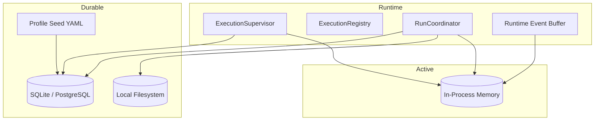

# 03 - Storage and Streaming

YA Claw uses three storage roles with clear ownership.

## Storage Topology



## Relational Store

The relational store is the durable source of truth for queryable runtime state.

It should store:

- session metadata
- session continuation pointers
- run indexes and restore relationships
- queued, running, and terminal run state
- profile records and seed provenance
- `project_id`, `profile_name`, and request metadata needed for routing

### Session Metadata Principle

Session metadata belongs in the database.
The runtime treats session metadata as structured queryable state.

### Profile Principle

Execution profiles belong in the database.
YAML seed is an input source for profile rows, not the runtime source of truth.

## Run Store

The local filesystem keeps committed continuity data in a flat run store.

Suggested layout:

```text
~/.ya-claw/
├── ya_claw.sqlite3
├── data/
│   └── run-store/
│       └── {run_id}/
│           ├── state.json
│           └── message.json
└── workspace/
    └── ... project-managed files ...
```

### Run Store Principle

Committed runtime blobs are keyed by `run_id`.
The filesystem does not need a session-first directory structure.

## `state.json`

Each committed run may write one `state.json` file.

It should include:

- exported `ClawAgentContext` resumable state
- restore metadata
- run and session identifiers needed for replay and restore
- compact metadata such as timestamps and version markers
- workspace binding snapshot when useful for later inspection
- resolved profile identity when useful for replay and debugging

## `message.json`

Each committed or best-effort checkpointed run may write one `message.json` file.

`message.json` stores a compacted replay list of AGUI events.

Recommended shape:

- top-level JSON array
- each item is one AGUI event object
- event order matches replay order
- the array is directly replayable by clients without wrapper unwrapping

Related run and session metadata live in the run record and `state.json`.
Checkpoint metadata belongs in store-side bookkeeping rather than the replay list payload.

## In-Process Runtime State

Process memory owns active runtime state for one node.

Recommended split:

### Execution Registry

Carries:

- active run IDs
- `run_id -> task` mapping
- stop and interrupt handles
- basic supervisor metadata such as started time and dispatch mode

### Event Buffer Store

Carries:

- replayable per-run event buffers
- session to latest run mapping for live session event routing
- AGUI replay buffers used for dynamic compaction
- steering queues
- termination signals
- live subscriber counts

## Incremental Event Buffer

The runtime keeps an in-memory incremental event buffer per active run.

Responsibilities:

- capture coordinator-observed SDK events
- transform them into AGUI events through a protocol adapter boundary
- stream replayable events over SSE
- maintain a dynamically compacted AGUI replay list for resume and history queries
- flush the compacted replay list to `message.json` at commit or best-effort checkpoint boundaries

## Session Read View

Session GET endpoints read from run-store through session pointers.

Recommended behavior:

- session status resolves from the latest run
- session run history can inline the compacted AGUI replay list for each run
- explicit rerun requests may target a failed or interrupted `restore_from_run_id`
- run GET endpoints read the addressed run directly and return `session + run + state + message`

## Event Delivery Model

### Foreground Streaming

Foreground requests may stream events directly over SSE.

### Background Execution

Queued runs are started by the supervisor and expose SSE endpoints for later subscription.

### Resume

The SSE replay contract should support:

- monotonic event IDs
- `Last-Event-ID`
- replay from the requested cursor
- live tail after replay completes

## Best-effort Checkpoints

Interrupted or failed runs should still try to persist a usable message view.

Preferred initial checkpoints are:

- after each model request starts or completes
- after each model response starts or completes when available in the SDK stream

This gives the rerun path a durable best-effort message snapshot without advancing the session success pointer.

## Storage Principle

- database for sessions, runs, profiles, and execution indexes
- run store for committed or checkpointed continuity blobs
- in-memory registry and event buffers for active execution and replay
