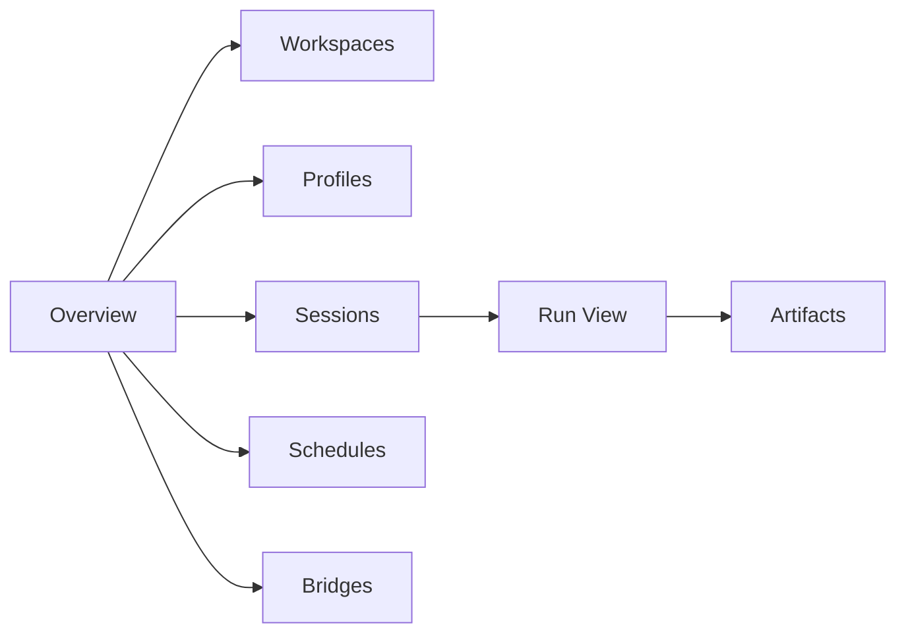

# 05 - Web UI and Operations

YA Claw ships with a bundled web shell and a simple single-node operations model.

## Web Shell Goal

The web shell is the first-party runtime console.

It should let a user:

- inspect workspaces
- choose profiles
- create and continue sessions
- manage schedules
- watch live run output
- read compacted conversation history for completed rounds
- inspect bridge endpoints and relay activity
- inspect artifacts and run summaries

## Web Shell Sections

### Overview

Shows runtime health, active sessions, active schedules, bridge activity, and recent runs.

### Workspaces

Lists configured workspaces and resolution previews.

### Profiles

Lists reusable profiles and their runtime settings.

### Sessions

Shows session lineage, latest state, continuation entry points, and compacted conversation history loaded from `message.json` in the session store.

### Schedules

Shows next fire time, last run status, target session, and delivery policy.

### Bridges

Shows bridge endpoints, relay mode, recent dispatches, and channel health.

### Run View

Shows live event output, final summary, AGUI-aligned event flow, and error state when needed.

### Artifacts

Shows files produced or retained by a run.

## Startup Flow

The default startup path is:

1. load environment configuration
2. initialize the relational store and in-process runtime state manager
3. initialize schedule dispatcher and bridge subsystem
4. run migrations when auto-migrate is enabled
5. mount API routes
6. mount bundled web assets when present

## Health Model

`/healthz` should report:

- service status
- relational storage connectivity
- in-process runtime state manager health
- schedule dispatcher health
- bridge subsystem health
- optional web bundle availability

## Logging

The runtime should emit structured logs for:

- startup configuration summary
- workspace resolution failures
- run lifecycle transitions
- schedule trigger and dispatch lifecycle
- bridge ingress and relay lifecycle
- event delivery failures
- shutdown and cleanup

## Local Deployment Baseline

Recommended local deployment shapes:

- one supervised process
- one Docker deployment
- one systemd-managed service on a host

Each shape should keep the same core baseline:

- one YA Claw web service
- one SQLite database by default
- optional PostgreSQL for external relational storage
- one persistent local data directory
- in-process active state, schedule dispatch, and bridge coordination

## Bridge Operations

The bridge subsystem should live inside the `ya-claw` package as both:

- a `ya_claw.bridge` subpackage for adapter implementations
- a `ya-claw bridge` CLI group for operational commands

A bridge adapter may target platforms such as:

- Lark
- Slack
- Discord
- Telegram

## Docker Alignment

Two image definitions exist in the repository:

- `Dockerfile.ya-claw` for the active runtime
- `Dockerfile.ya-agent-platform` for the WIP stateless agent service image

## AGUI Web UI Model

The Web UI should follow an AGUI-aligned split:

- live session interaction comes from streamed events in process memory
- committed conversation history comes from `message.json` in the session store
- state restore views read `state.json` from the session store

## Operational Principle

Single-node operations should stay clear enough that one developer can inspect runtime health, storage, active runs, schedules, bridge activity, and committed conversation history through one service.
