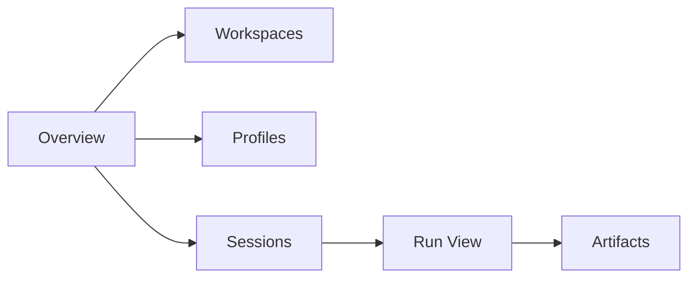

# 05 - Web UI and Operations

YA Claw ships with a bundled web shell and a simple single-node operations model.

## Web Shell Goal

The web shell is the first-party runtime console.

It should let a user:

- inspect workspaces
- choose profiles
- create and continue sessions
- watch live run output
- inspect artifacts and run summaries

## Web Shell Sections

### Overview

Shows runtime health, active sessions, and recent runs.

### Workspaces

Lists configured workspaces and resolution previews.

### Profiles

Lists reusable profiles and their runtime settings.

### Sessions

Shows session lineage, latest state, and continuation entry points.

### Run View

Shows live event output, final summary, and error state when needed.

### Artifacts

Shows files produced or retained by a run.

## Startup Flow

The default startup path is:

1. load environment configuration
2. initialize PostgreSQL and Redis clients
3. run migrations when auto-migrate is enabled
4. mount API routes
5. mount bundled web assets when present

## Health Model

`/healthz` should report:

- service status
- PostgreSQL connectivity
- Redis connectivity
- optional web bundle availability

## Logging

The runtime should emit structured logs for:

- startup configuration summary
- workspace resolution failures
- run lifecycle transitions
- event transport failures
- shutdown and cleanup

## Local Deployment Baseline

Recommended local deployment shapes:

- one supervised process
- one Docker deployment
- one systemd-managed service on a host

Each shape still relies on the same core baseline:

- one PostgreSQL
- one Redis
- one persistent local data directory

## Docker Alignment

Two image definitions exist in the repository:

- `Dockerfile.ya-claw` for the active runtime
- `Dockerfile.ya-agent-platform` for the reserved package image

## Operational Principle

Single-node operations should stay clear enough that one developer can inspect runtime health, storage, and active runs without introducing a separate control plane.
