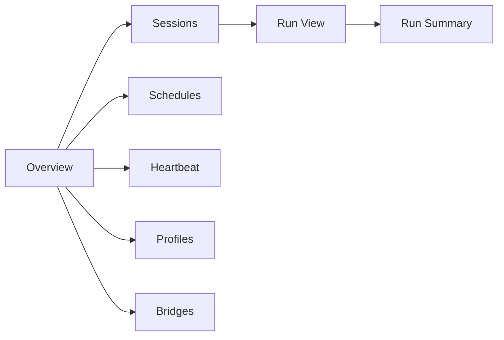
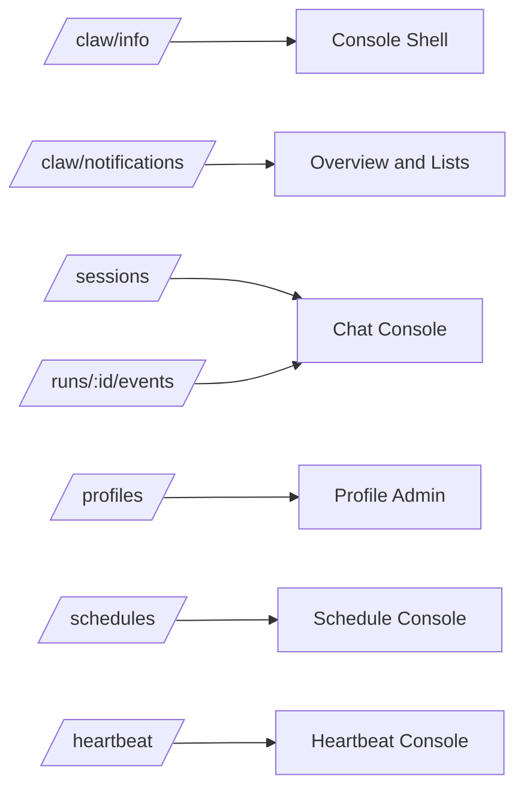

# 05 - Web UI and Operations

YA Claw ships with a bundled web shell and a simple single-node operations model.

## Web Shell Goal

The web shell is the first-party runtime console.

It should let a user:

- create and continue sessions
- manage schedules
- inspect heartbeat configuration and fire history
- watch live run output
- read compacted conversation history for completed rounds
- inspect bridge endpoints and relay activity
- inspect run summaries
- manage execution profiles

The web shell acts as an application on top of YA Claw. It uses the single configured workspace exposed by the runtime.

## Web Shell Sections

### Overview

Shows runtime health, active sessions, active schedules, next schedule fire, heartbeat status, bridge activity, and recent runs.

### Sessions

Shows session lineage, latest state, continuation entry points, and compacted conversation history loaded from `message.json` in the run store.

### Schedules

Shows schedule definitions and fire history.

Important fields:

- status
- trigger kind and next fire time
- execution mode: `continue_session`, `fork_session`, or `isolate_session`
- target session or source session when present
- active-session policy for `continue_session`
- last fire, last created session, and last run
- owner kind and owner session

The schedule detail view should support create, edit, pause, resume, delete, and manual trigger actions.

### Heartbeat

Shows runtime-owned heartbeat configuration and fire history.

Important fields:

- enabled state
- interval
- profile
- prompt
- `HEARTBEAT.md` path and existence
- next fire time
- last fire status
- last session and run

The heartbeat view can expose an admin manual trigger action. Heartbeat management belongs to runtime and admin surfaces.

### Profiles

Shows profile CRUD, seed status, enabled built-in toolsets, model configuration, MCP filters, approval policy, and subagent configuration.

### Bridges

Shows bridge adapters, bridge dispatch mode, recent inbound events, conversation mapping, run dispatches, and channel health.

### Run View

Shows live event output, final summary, AGUI-aligned event flow, trigger type, source metadata, and error state when needed.

### Run Summary

Shows the final run result, commit metadata, source metadata, schedule or heartbeat fire links, and continuation readiness.

## Console API Contract

The web shell uses these API layers:

- `/api/v1/claw/info` for startup handshake, capability flags, storage model, workspace backend, and auth mode
- `/api/v1/claw/notifications` for global SSE notifications that refresh overview lists and selected session metadata
- `/api/v1/sessions` and nested run routes for chat creation, continuation, lineage, turns, and committed replay
- `/api/v1/runs/{run_id}/events` and `/api/v1/sessions/{session_id}/events` for detailed AGUI-aligned live output
- `/api/v1/profiles` for AgentProfile management
- `/api/v1/schedules` for schedule CRUD, manual trigger, and fire history
- `/api/v1/heartbeat/*` for effective heartbeat config, status, and fire history

The web shell should implement SSE through `fetch` and `ReadableStream` parsing so bearer authorization headers are sent consistently. The global notification stream updates collection state, while nested run and session streams render active AGUI output.

## Startup Flow

The default startup path is:

1. load environment configuration
2. initialize the relational store and in-process runtime state manager
3. run migrations when auto-migrate is enabled
4. initialize execution supervisor
5. initialize schedule dispatcher
6. initialize heartbeat dispatcher
7. initialize bridge subsystem
8. mount API routes
9. mount bundled web assets when present

## Health Model

`/healthz` should report:

- service status
- relational storage connectivity
- in-process runtime state manager health
- execution supervisor health
- schedule dispatcher health
- heartbeat dispatcher health
- bridge subsystem health
- optional web bundle availability

## Logging

The runtime should emit structured logs for:

- startup configuration summary
- workspace resolution failures
- run lifecycle transitions
- schedule trigger and dispatch lifecycle
- heartbeat trigger and dispatch lifecycle
- bridge ingress and relay lifecycle
- event delivery failures
- shutdown and cleanup

## Local Deployment Baseline

Recommended local deployment shapes:

- one supervised process
- one Docker deployment
- one systemd-managed service on a host

Each shape should keep the same core baseline:

- one YA Claw web service
- one SQLite database by default
- optional PostgreSQL for external relational storage
- one persistent local data directory
- one configured workspace directory
- in-process active state, schedule dispatch, heartbeat dispatch, and bridge coordination

## Bridge Operations

The bridge subsystem lives inside the `ya-claw` package as both:

- a `ya_claw.bridge` subpackage for adapter implementations
- a `ya-claw bridge` CLI group for operational commands

Bridge deployment dispatch and run execution dispatch are separate runtime concepts:

- `embedded`: enabled adapters start inside the YA Claw HTTP server lifespan under `BridgeSupervisor`.
- `manual`: operators start bridge adapters outside the YA Claw HTTP server.

With the default `embedded` dispatch, one YA Claw service process supervises `ExecutionSupervisor`, `ScheduleDispatcher`, `HeartbeatDispatcher`, and `BridgeSupervisor`. Each enabled adapter runs as a long-lived async task under `BridgeSupervisor`. Bridge adapters submit inbound events through the same session/run controller path used by HTTP requests, so bridge ingress behaves as a self-request inside the service process before execution dispatch.

The built-in Lark adapter receives the comma-separated event allowlist from `YA_CLAW_BRIDGE_LARK_EVENT_TYPES`. The default allowlist covers `im.chat.member.bot.added_v1`, `im.chat.member.user.added_v1`, `im.message.receive_v1`, and `drive.notice.comment_add_v1`. Message receive events map `(adapter, tenant_key, chat_id)` to one session. Other accepted events use `chat_id` when present and fall back to a stable event or Drive conversation key. YA Claw stores inbound event records for idempotency and creates one queued bridge-triggered run per accepted event. The agent replies or acts from the workspace with `lark-cli`; workspace environments receive `LARK_APP_ID` and `LARK_APP_SECRET` from process variables or the configured Lark bridge app settings.

Bridge adapter types are enumerated so future adapters can be added with the same controller and supervisor foundation. A bridge adapter may target platforms such as:

- Lark
- Slack
- Discord
- Telegram

## Docker Alignment

Three image definitions exist in the repository:

- `Dockerfile.ya-claw` for the active runtime
- `Dockerfile.ya-claw-workspace` for the default Docker workspace provider image
- `Dockerfile.ya-agent-platform` for the WIP stateless agent service image

### Docker Startup

The `ya-claw` image uses `tini` as PID 1 and runs `ya-claw start` as the default command.
The `start` command handles:

1. database migration when `YA_CLAW_AUTO_MIGRATE` is enabled
2. profile seeding when `YA_CLAW_AUTO_SEED_PROFILES` is enabled
3. HTTP server startup

This keeps startup logic inside the Python CLI for consistent error handling and signal propagation.

## AGUI Web UI Model

The Web UI should follow an AGUI-aligned split:

- live session interaction comes from streamed events in process memory
- committed conversation history comes from `message.json` in the run store
- state restore views read `state.json` from the run store
- schedule and heartbeat history comes from relational fire records linked to sessions and runs

## Operational Principle

Single-node operations should stay clear enough that one developer can inspect runtime health, storage, active runs, schedules, heartbeat, bridge activity, and committed conversation history through one service.
