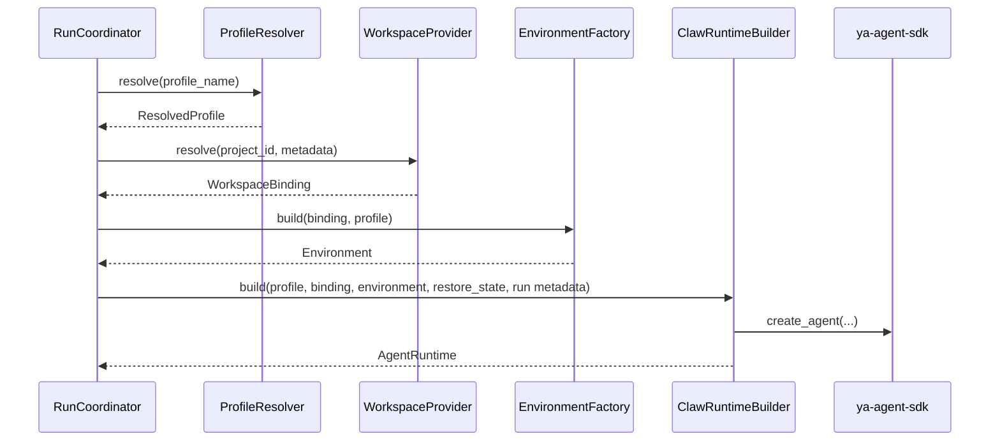

# 06 - Runtime Assembly

This document defines how YA Claw turns one durable run intent into one executable SDK runtime.

## Runtime Assembly Goal

The runtime assembly path should make each boundary explicit:

1. resolve profile
2. resolve workspace binding
3. build environment
4. construct `ClawAgentContext`
5. create `AgentRuntime`
6. execute through one `RunCoordinator`

## Assembly Objects

### ResolvedProfile

`ResolvedProfile` is the concrete execution-ready expansion of a profile row.

Suggested fields:

- `name`
- `model`
- `model_settings`
- `model_config`
- `system_prompt`
- `toolsets`
- `subagent_configs`
- `need_user_approve_tools`
- `need_user_approve_mcps`
- `workspace_backend_hint`
- `metadata`

### WorkspaceBinding

`WorkspaceBinding` is a declarative value object.

Suggested fields:

- `project_id`
- `host_path`
- `virtual_path`
- `cwd`
- `readable_paths`
- `writable_paths`
- `environment_overrides`
- `metadata`
- `backend_hint`

### ClawWorkspaceBindingSnapshot

`ClawAgentContext` should carry a serializable snapshot rather than a live environment object.

Suggested fields:

- `project_id`
- `virtual_path`
- `cwd`
- `readable_paths`
- `writable_paths`
- `metadata`
- `backend_hint`

### ClawAgentContext

`ClawAgentContext` extends `AgentContext` and carries YA Claw execution metadata.

Suggested fields:

- `session_id`
- `claw_run_id`
- `profile_name`
- `project_id`
- `restore_from_run_id`
- `dispatch_mode`
- `workspace_binding`
- `source_kind`
- `source_metadata`
- `claw_metadata`

### ClawRuntimeBuilder

`ClawRuntimeBuilder` is the factory that assembles the runtime.

Suggested inputs:

- `ResolvedProfile`
- `WorkspaceBinding`
- `Environment`
- optional `ResumableState`
- run and session metadata
- source metadata such as API, schedule, or bridge ingress

Suggested output:

- `AgentRuntime[ClawAgentContext, OutputT, Environment]`

## Assembly Flow



## Environment Construction Rule

Environment construction belongs to `EnvironmentFactory`.
`WorkspaceProvider` should not own concrete environment instantiation.

This keeps:

- workspace resolution declarative
- environment construction replaceable
- runtime assembly easy to test

## Context Construction Rule

`ClawAgentContext` should be the stable home for YA Claw metadata.
The coordinator should not carry an ever-growing argument list for runtime metadata.

Recommended context construction inputs:

- base SDK `env`
- resolved model config
- run and session identifiers
- workspace binding snapshot
- profile identity
- source metadata
- optional restored state

## Runtime Builder Responsibilities

`ClawRuntimeBuilder` should:

- pass the concrete environment into `create_agent`
- use `context_type=ClawAgentContext`
- inject restored `ResumableState` when present
- attach SDK toolsets from profile resolution
- attach approval policy
- attach subagent configs
- construct system prompt or template variables from resolved profile and binding

## Example Construction Shape

```python
runtime = runtime_builder.build(
    profile=resolved_profile,
    binding=workspace_binding,
    environment=environment,
    restore_state=restore_state,
    session_id=session.id,
    run_id=run.id,
    project_id=run.project_id,
)
```

## Testing Boundaries

Runtime assembly should be testable in layers:

1. `ProfileResolver` unit tests
2. `WorkspaceProvider` unit tests
3. `EnvironmentFactory` unit tests
4. `ClawRuntimeBuilder` unit tests with stub profile and binding
5. `RunCoordinator` integration tests from queued run to terminal state

## Design Principle

YA Claw execution should read like an assembly pipeline.
Each stage should expose one clear input and one clear output.
