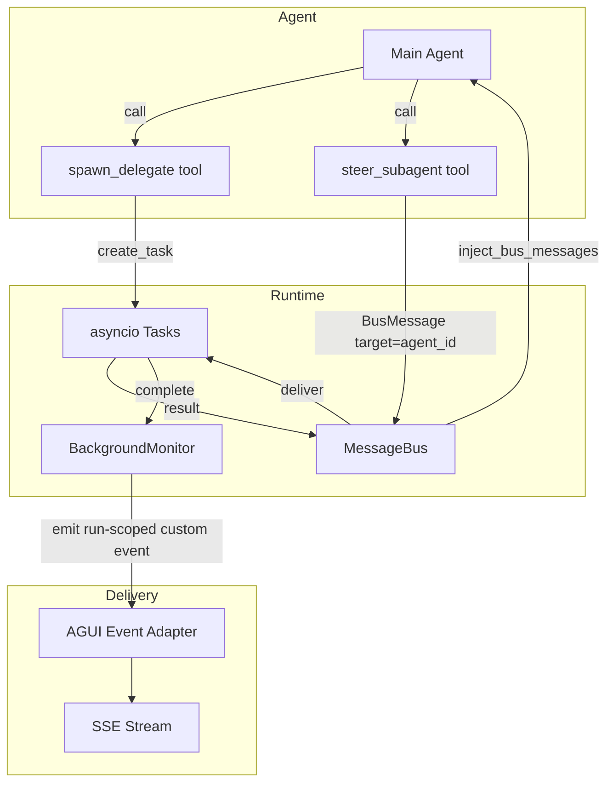

# 07 - Async Subagents

YA Claw supports non-blocking background subagent dispatch during run execution.
The main agent may spawn subagent tasks and continue working while results arrive
on the shared message bus.

## Motivation

Blocking `delegate` calls force the main agent to wait for each subagent to complete.
For personal assistant workloads, the agent should:

- spawn parallel investigations
- delegate long-running work and pick up results later
- steer running background subagents with additional guidance

## Design Principle

Async subagent dispatch is a runtime concern. The mechanism depends on how the
runtime delivers events and manages task completion. YA Claw copies the tool
implementations from yaacli and adapts them to the server runtime's AGUI event model.

SDK ownership stops at the `delegate` primitive (blocking subagent execution in-process).
`spawn_delegate` and `steer_subagent` belong to the runtime that wires them.

## Architecture



## BackgroundMonitor

`ya_claw.execution.background.BackgroundMonitor` tracks background subagent tasks
within one run's lifecycle. Each run creates one monitor. The monitor is never
shared across runs.

It holds:

- `_run_id` -- target run for lifecycle events
- `_tasks: dict[str, asyncio.Task]` -- active background tasks keyed by agent_id
- `_task_info: dict[str, BackgroundTaskInfo]` -- metadata per active task
- `_core_toolset` reference -- needed to access the blocking `delegate` tool instance
- `_runtime_state` -- appends run-scoped lifecycle events to the active SSE buffer

### Registration

The BackgroundMonitor is created inside `RunCoordinator._execute_agent_run` after
the run-scoped environment is built. The coordinator registers it in the environment's
resource registry before building the agent runtime:

```python
background_monitor = BackgroundMonitor(run_id=run_id, runtime_state=runtime_state)
env.resources.set(BACKGROUND_MONITOR_KEY, background_monitor)
```

The run environment owns this resource and closes it when the runtime exits.

### Lifecycle Events

Background task state changes produce AGUI custom events:

| Event                        | Emitted when                       |
| ---------------------------- | ---------------------------------- |
| `ya_claw.subagent_spawned`   | Task created via spawn_delegate    |
| `ya_claw.subagent_completed` | Task finished successfully         |
| `ya_claw.subagent_failed`    | Task raised an exception           |
| `ya_claw.subagent_cancelled` | Task cancelled during run cleanup  |
| `ya_claw.subagent_steered`   | Steer message sent to running task |

## spawn_delegate Tool

Copied from yaacli with adaptations:

- Gets `delegate` tool instance from BackgroundMonitor
- Runs `delegate.call()` as `asyncio.create_task()`
- Posts result to main agent via `BusMessage`
- Emits AGUI lifecycle events on spawn and completion

Signature: `spawn_delegate(subagent_name: str, prompt: str, agent_id: str | None = None) -> str`

Supports resume: pass `agent_id` of a previously completed subagent.

## steer_subagent Tool

Copied from yaacli:

- Sends `BusMessage(target=agent_id)` to a running background subagent
- Inject by the `inject_bus_messages` filter on the subagent's next LLM call
- Suggests resume via `spawn_delegate` if target has already completed

Signature: `steer_subagent(agent_id: str, message: str) -> str`

## Integration with RunCoordinator

The coordinator's `_execute_agent_run` creates a run-scoped BackgroundMonitor and
registers it in the environment resources so tools can access it via `ctx.deps.resources`.
After the main stream finishes, the coordinator drains background tasks. If the drain
times out, the monitor cancels remaining tasks and emits `ya_claw.subagent_cancelled`
events before the run commits.

The coordinator's `_forward_runtime_signals` already polls user steering inputs. Background
subagent results delivered via bus are picked up by the main agent on subsequent model turns
within the current run.

## Recovery and Continuity

Background tasks are in-process and run-scoped. A process restart discards all running
background tasks. A run terminal transition drains or cancels current background tasks
before committed artifacts are written.

Future work may persist background task state in the run store for restart recovery.

## Code Layout

```
ya_claw/execution/background.py   -- BackgroundMonitor
ya_claw/toolsets/background.py    -- SpawnDelegateTool, SteerSubagentTool
```

Both are registered in the ClawRuntimeBuilder as builtin tools.
