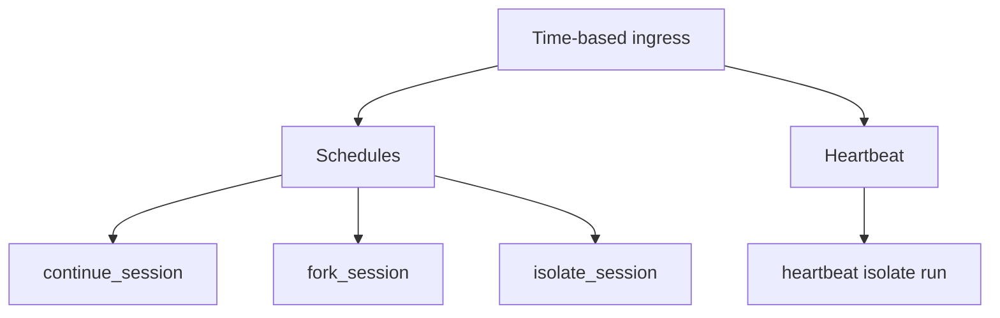
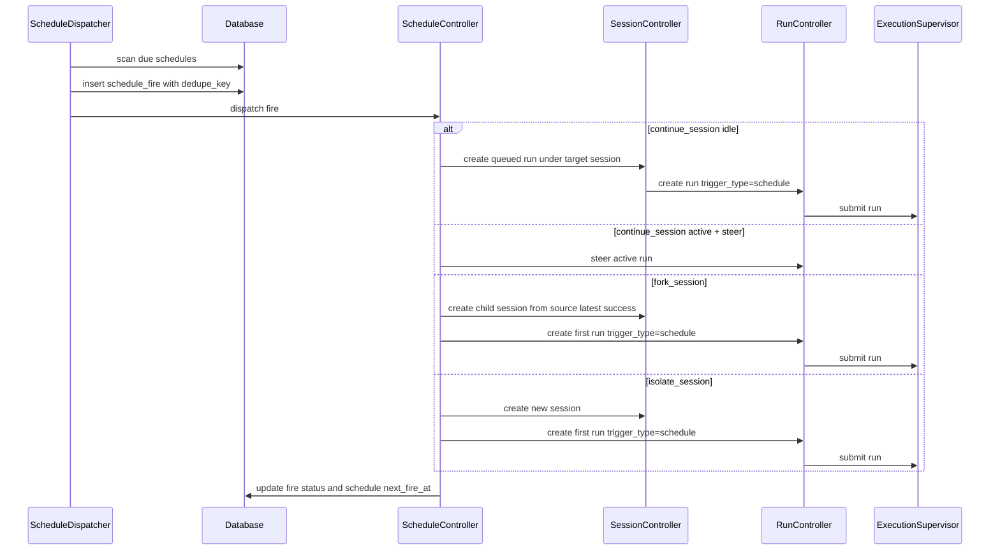
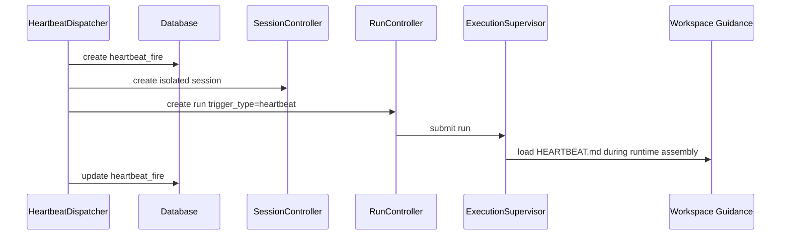

# 08 - Schedules and Heartbeat

YA Claw has two time-based ingress surfaces:

- **Schedules** are user or agent managed timer resources that create or steer agent work.
- **Heartbeat** is a runtime-owned internal timer that runs operational workspace checks from `HEARTBEAT.md`.

Both surfaces submit work through the same queued-run execution model. Their ownership, API surface, and guidance loading rules stay separate.

## Design Goals

- let agents manage their own schedule resources through a built-in toolset
- support conversation-like timer messages through session continuation and steering
- support timer work that starts from an existing session state and writes results into a new session
- support isolated timer work that creates a clean session each fire
- keep heartbeat configuration runtime-owned and visible to the console
- load `HEARTBEAT.md` only for heartbeat-triggered runs
- keep the single-workspace model: all runs share the configured workspace binding

## Time-based Work Types



### `schedule + continue_session`

A schedule fire targets an existing session and behaves like a timed user message.

Required execution fields:

- `execution_mode = "continue_session"`
- `target_session_id`
- `on_active = "steer" | "skip" | "queue"`

Delivery behavior:

- when the target session is idle, the runtime creates a queued run under `target_session_id`
- when the target session has an active run and `on_active="steer"`, the runtime sends the rendered input to the active run steering queue
- when the target session has an active run and `on_active="skip"`, the fire is recorded as skipped
- when the target session has an active run and `on_active="queue"`, the fire remains pending until the session becomes idle

This mode is the default for conversation reminders, recurring check-ins, and timed follow-up prompts.

### `schedule + fork_session`

A schedule fire starts a new session from the latest successful state of a source session.

Required execution fields:

- `execution_mode = "fork_session"`
- `source_session_id`

Delivery behavior:

- the runtime reads `source_session.head_success_run_id`
- the runtime creates a child session with `parent_session_id = source_session_id`
- the first run in the child session restores from the source session's latest successful run
- the child session proceeds independently after creation

This mode is useful for periodic reports, audits, or branches that should begin from conversational continuity and then produce their own history.

### `schedule + isolate_session`

A schedule fire creates a clean session and runs from the schedule prompt.

Required execution fields:

- `execution_mode = "isolate_session"`

Delivery behavior:

- the runtime creates a new session for each fire
- the first run has `trigger_type="schedule"`
- the run starts with a clean agent state
- the run uses the configured workspace binding and regular workspace guidance
- the run loads schedule input and regular workspace guidance only

This mode is useful for standalone recurring tasks that need workspace access, clean agent state, and durable run history.

### `heartbeat`

Heartbeat is a runtime-owned timer.

Behavior:

- the runtime uses configured heartbeat settings
- each fire creates an isolated queued run
- the run has `trigger_type="heartbeat"`
- the runtime loads `HEARTBEAT.md` from the workspace root and injects it as heartbeat guidance
- heartbeat fires are queryable by the console
- heartbeat management stays outside the agent schedule toolset

## Trigger Model

Schedules support these trigger kinds:

| Kind       | Fields                                   | Meaning                       |
| ---------- | ---------------------------------------- | ----------------------------- |
| `cron`     | `cron_expr`, `timezone`                  | fire according to a cron rule |
| `interval` | `interval_seconds`, optional `starts_at` | fire repeatedly by interval   |
| `once`     | `starts_at`                              | fire a single time            |
| `manual`   | created by `:trigger` on demand          | fire immediately              |

The runtime stores `next_fire_at` as an absolute timestamp. Cron and timezone parsing happens in the schedule controller. Dispatcher scans use `next_fire_at` only.

## Schedule Data Model

### `schedules`

Suggested fields:

- `id`
- `name`
- `description`
- `status`: `active | paused | deleted`
- `owner_kind`: `user | agent | api`
- `owner_session_id`
- `owner_run_id`
- `profile_name`
- `trigger_kind`: `cron | interval | once`
- `cron_expr`
- `interval_seconds`
- `timezone`
- `starts_at`
- `ends_at`
- `next_fire_at`
- `execution_mode`: `continue_session | fork_session | isolate_session`
- `target_session_id`
- `source_session_id`
- `on_active`: `steer | skip | queue`
- `input_parts_template`
- `metadata`
- `last_fire_at`
- `last_fire_id`
- `last_session_id`
- `last_run_id`
- `fire_count`
- `failure_count`
- `created_at`
- `updated_at`

### Schedule validation rules

- `continue_session` requires `target_session_id`
- `fork_session` requires `source_session_id`
- `isolate_session` creates a fresh session for each fire and leaves target/source session fields empty
- `on_active` applies to `continue_session`
- `input_parts_template` uses the same JSON-compatible input part model as run creation
- schedule-owned metadata must be queryable and safe to return to the console

### `schedule_fires`

Suggested fields:

- `id`
- `schedule_id`
- `scheduled_at`
- `fired_at`
- `status`: `pending | submitted | steered | skipped | failed`
- `dedupe_key`
- `target_session_id`
- `source_session_id`
- `created_session_id`
- `run_id`
- `active_run_id`
- `input_parts`
- `error_message`
- `metadata`
- `created_at`
- `updated_at`

`dedupe_key` should use this stable shape:

```text
{schedule_id}:{scheduled_at.isoformat()}
```

The dedupe key makes process restart recovery and repeated dispatcher scans idempotent.

## Heartbeat Data Model

Heartbeat configuration is runtime-owned and comes from settings. The console reads the effective configuration through the heartbeat API.

Suggested effective config fields:

- `enabled`
- `interval_seconds`
- `profile_name`
- `prompt`
- `guidance_path`
- `guidance_exists`
- `on_active`
- `next_fire_at`
- `last_fire_at`
- `last_session_id`
- `last_run_id`

### `heartbeat_fires`

Suggested fields:

- `id`
- `scheduled_at`
- `fired_at`
- `status`: `pending | submitted | skipped | failed`
- `dedupe_key`
- `session_id`
- `run_id`
- `error_message`
- `metadata`
- `created_at`
- `updated_at`

Heartbeat can share schedule fire implementation internally when convenient, while API and toolset ownership remain separate.

## Dispatcher Semantics

### Schedule dispatcher

`ScheduleDispatcher` is a supervised in-process component.

Responsibilities:

- scan active schedules with `next_fire_at <= now`
- create idempotent `schedule_fires`
- render schedule input parts
- dispatch each fire according to `execution_mode`
- apply `on_active` policy for `continue_session`
- update schedule counters and next fire time
- emit console notifications for schedule and fire state changes



### Heartbeat dispatcher

`HeartbeatDispatcher` is a supervised in-process component.

Responsibilities:

- compute heartbeat due time from runtime settings
- create idempotent `heartbeat_fires`
- create isolated queued runs with `trigger_type="heartbeat"`
- make the effective heartbeat status visible to the console
- emit console notifications for heartbeat state changes



## Runtime Assembly Rules

### Schedule runs

Schedule runs use regular runtime assembly:

- `source_kind = "schedule"`
- `source_metadata.schedule_id`
- `source_metadata.schedule_fire_id`
- configured profile or default profile
- configured workspace binding
- regular workspace guidance loading

### Heartbeat runs

Heartbeat runs use heartbeat-specific guidance loading:

- `source_kind = "heartbeat"`
- `source_metadata.heartbeat_fire_id`
- configured heartbeat profile or default profile
- configured workspace binding
- regular workspace guidance loading
- heartbeat guidance loading from `HEARTBEAT.md`

`HEARTBEAT.md` is loaded from the configured workspace root and exposed to the agent as a tagged guidance block:

```xml
<heartbeat-guidance path="/workspace/HEARTBEAT.md">
...
</heartbeat-guidance>
```

## Agent Schedule Toolset

YA Claw includes a built-in `schedule` toolset for running agents.

The agent-facing toolset is a simplified facade over the full schedule model. Agents express timer intent with plain text and booleans. The runtime maps that facade into the internal schedule record.

The toolset follows the same internal-client pattern as the existing `session` toolset:

- the client resource carries the current `session_id`, `run_id`, current profile, and bearer token
- tool calls route through internal HTTP/controller APIs
- bearer tokens stay inside the client resource
- ownership fields are assigned by the runtime
- heartbeat operations are excluded from the toolset

### Facade rules

Agent-facing schedule tools use these rules:

- schedule input is `prompt: string`
- the runtime converts `prompt` into one text input part
- schedule profile inherits the current run profile
- pause and resume use `enabled: boolean`
- session behavior uses booleans: `continue_current_session`, `start_from_current_session`, `steer_when_running`
- timing uses one of `cron`, `interval_seconds`, or `run_at`
- advanced fields stay on the HTTP/admin schedule API

### Facade mapping

| Agent field                                                          | Internal field                                                           |
| -------------------------------------------------------------------- | ------------------------------------------------------------------------ |
| `prompt`                                                             | `input_parts_template = [{"type":"text","text": prompt}]`                |
| inherited current profile                                            | `profile_name`                                                           |
| `enabled=true`                                                       | `status="active"`                                                        |
| `enabled=false`                                                      | `status="paused"`                                                        |
| `continue_current_session=true`                                      | `execution_mode="continue_session"`, `target_session_id=current session` |
| `continue_current_session=false`, `start_from_current_session=true`  | `execution_mode="fork_session"`, `source_session_id=current session`     |
| `continue_current_session=false`, `start_from_current_session=false` | `execution_mode="isolate_session"`                                       |
| `steer_when_running=true`                                            | `on_active="steer"`                                                      |
| `steer_when_running=false`                                           | `on_active="queue"`                                                      |
| `cron`                                                               | `trigger_kind="cron"`, `cron_expr=cron`                                  |
| `interval_seconds`                                                   | `trigger_kind="interval"`                                                |
| `run_at`                                                             | `trigger_kind="once"`, `starts_at=run_at`                                |

`continue_current_session` takes priority over `start_from_current_session` in the mapping. A continuing schedule naturally uses the target session continuation pointer.

### Tool instructions

The schedule toolset should inject concise guidance:

```text
Use schedule tools to create, list, update, delete, and manually trigger schedules that you own. Provide a plain text prompt and one timing rule. Use continue_current_session for timed messages in this conversation. Use start_from_current_session for recurring branches from this conversation's latest committed state. Use enabled to pause or resume. Heartbeat is runtime-owned and is visible through console APIs.
```

### Ownership and scope

When an agent creates a schedule:

- `owner_kind = "agent"`
- `owner_session_id = current session id`
- `owner_run_id = current run id`
- `profile_name = current run profile`

Agent-visible schedule scope:

- schedules owned by the current session
- schedules targeting the current session through `continue_session`
- schedules using the current session as source through `fork_session`

Agent mutation scope:

- update, delete, and manual trigger require `owner_kind="agent"` and `owner_session_id=current session id`
- `continue_current_session=true` targets the current session
- `start_from_current_session=true` sources from the current session
- `isolate_session` remains owned by the current session even though each fire creates a new session

### Tools

| Tool               | Purpose                                                             |
| ------------------ | ------------------------------------------------------------------- |
| `list_schedules`   | list agent-visible schedules, optionally with recent fire summaries |
| `create_schedule`  | create a schedule owned by the current agent session                |
| `update_schedule`  | update mutable facade fields, including `enabled`                   |
| `delete_schedule`  | soft-delete a schedule                                              |
| `trigger_schedule` | create a manual fire for an owned schedule                          |

### Tool argument shapes

`list_schedules` suggested arguments:

```json
{
  "schedule_id": null,
  "include_disabled": true,
  "include_recent_runs": true,
  "limit": 20
}
```

`create_schedule` suggested arguments:

```json
{
  "name": "Daily follow-up",
  "prompt": "Review current progress and suggest the next concrete action.",
  "cron": "0 9 * * *",
  "interval_seconds": null,
  "run_at": null,
  "timezone": "Asia/Shanghai",
  "enabled": true,
  "continue_current_session": true,
  "start_from_current_session": true,
  "steer_when_running": true
}
```

Timing fields are mutually exclusive:

- `cron` for cron schedules
- `interval_seconds` for interval schedules
- `run_at` for one-time schedules

`update_schedule` accepts a patch over:

- `name`
- `prompt`
- `cron`
- `interval_seconds`
- `run_at`
- `timezone`
- `enabled`
- `continue_current_session`
- `start_from_current_session`
- `steer_when_running`

`trigger_schedule` suggested arguments:

```json
{
  "schedule_id": "schedule_123",
  "prompt_override": "Run this schedule now and focus on blockers."
}
```

`prompt_override` is plain text. Empty `prompt_override` uses the stored schedule prompt.

### Tool return shapes

Schedule tools return compact facade records:

```json
{
  "schedule_id": "schedule_123",
  "name": "Daily follow-up",
  "enabled": true,
  "prompt": "Review current progress and suggest the next concrete action.",
  "timing": {
    "cron": "0 9 * * *",
    "interval_seconds": null,
    "run_at": null,
    "timezone": "Asia/Shanghai",
    "next_fire_at": "2026-04-26T09:00:00+08:00"
  },
  "mode": {
    "continue_current_session": true,
    "start_from_current_session": true,
    "steer_when_running": true
  },
  "last_fire": {
    "status": "submitted",
    "session_id": "session_123",
    "run_id": "run_456",
    "created_at": "2026-04-25T09:00:00+08:00"
  }
}
```

Manual trigger returns the created fire summary with `status`, `created_session_id`, `run_id`, `active_run_id`, and `error_message`.

## HTTP API Surface

Schedules are first-class API resources:

| Method   | Path                                      | Purpose              |
| -------- | ----------------------------------------- | -------------------- |
| `GET`    | `/api/v1/schedules`                       | list schedules       |
| `POST`   | `/api/v1/schedules`                       | create schedule      |
| `GET`    | `/api/v1/schedules/{schedule_id}`         | inspect schedule     |
| `PATCH`  | `/api/v1/schedules/{schedule_id}`         | update schedule      |
| `DELETE` | `/api/v1/schedules/{schedule_id}`         | soft-delete schedule |
| `POST`   | `/api/v1/schedules/{schedule_id}:pause`   | pause schedule       |
| `POST`   | `/api/v1/schedules/{schedule_id}:resume`  | resume schedule      |
| `POST`   | `/api/v1/schedules/{schedule_id}:trigger` | create manual fire   |
| `GET`    | `/api/v1/schedules/{schedule_id}/fires`   | list schedule fires  |

Heartbeat has a read-oriented console API:

| Method | Path                        | Purpose                                    |
| ------ | --------------------------- | ------------------------------------------ |
| `GET`  | `/api/v1/heartbeat/config`  | read effective heartbeat config            |
| `GET`  | `/api/v1/heartbeat/status`  | read heartbeat runtime status              |
| `GET`  | `/api/v1/heartbeat/fires`   | list heartbeat fires                       |
| `POST` | `/api/v1/heartbeat:trigger` | create manual heartbeat fire for admin use |

## Console Surface

The web console should include:

- a Schedules section with list, detail, fire history, pause/resume, manual trigger, and edit actions
- a Heartbeat section or settings panel with effective config, `HEARTBEAT.md` existence, next fire time, last fire, and recent fire history
- Overview cards for active schedule count, next schedule fire, heartbeat enabled state, and last heartbeat result

## Notifications

Suggested notification event types:

- `schedule.created`
- `schedule.updated`
- `schedule.deleted`
- `schedule.fire.created`
- `schedule.fire.updated`
- `heartbeat.fire.created`
- `heartbeat.fire.updated`

## Configuration

Suggested runtime settings:

| Variable                             | Purpose                                |
| ------------------------------------ | -------------------------------------- |
| `YA_CLAW_SCHEDULE_DISPATCH_ENABLED`  | enable schedule dispatcher             |
| `YA_CLAW_SCHEDULE_TICK_SECONDS`      | schedule dispatcher scan interval      |
| `YA_CLAW_SCHEDULE_MAX_DUE_PER_TICK`  | maximum due schedules handled per scan |
| `YA_CLAW_HEARTBEAT_ENABLED`          | enable heartbeat dispatcher            |
| `YA_CLAW_HEARTBEAT_INTERVAL_SECONDS` | heartbeat interval                     |
| `YA_CLAW_HEARTBEAT_PROFILE`          | heartbeat profile name                 |
| `YA_CLAW_HEARTBEAT_PROMPT`           | heartbeat input prompt                 |
| `YA_CLAW_HEARTBEAT_ON_ACTIVE`        | heartbeat active-run policy            |

## Design Principle

Schedules are agent-manageable timer resources. Heartbeat is a runtime-owned operational timer. Both become durable queued runs before execution begins.
