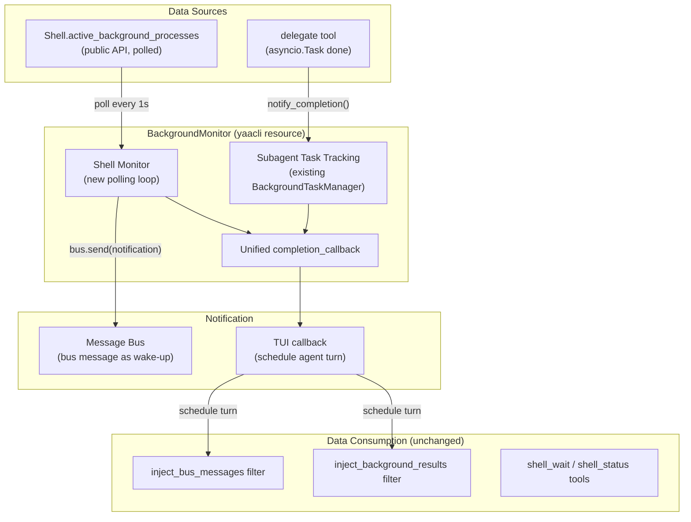

# Shell Monitor

## Overview

Merge shell process completion monitoring into the existing `BackgroundTaskManager`,
creating a unified `BackgroundMonitor` resource that handles both background subagent
tasks and background shell process notifications.

## Problem

Background shell processes (`shell_exec(background=True)`) complete silently. If the
agent is idle when a process finishes, results sit unconsumed until the user sends a
new message. Background subagents already have auto-wake via `BackgroundTaskManager` +
message bus, but shell processes lack this mechanism.

## Design

### Core Idea

`BackgroundMonitor` = existing `BackgroundTaskManager` + shell process polling.

- **Subagent management**: unchanged (asyncio.Task tracking, delegate tool access,
  completion callback)
- **Shell monitoring**: new polling loop that detects process completion via Shell's
  public API, sends bus message as wake-up trigger
- **Unified callback**: single TUI callback for both subagent and shell completions

### Architecture

### Shell Monitoring Flow

1. `BackgroundMonitor.start_shell_monitor(shell, bus, agent_id)` starts the polling loop
2. Every `poll_interval` (1s), check `shell.active_background_processes`
3. Compare with known active set to detect:
   - New processes: record metadata (command, started_at)
   - Completed processes: process ID left the active set
4. On completion detected:
   - Send bus message: `"Background process {pid} completed: {command}"`
     (source=`"shell-monitor"`, target=main agent)
   - Invoke `completion_callback(pid)` for TUI wake-up
5. Agent wakes up, existing filters handle data injection:
   - `inject_bus_messages` delivers the notification
   - `inject_background_results` delivers full stdout/stderr/exit_code

### What Stays the Same

- Shell ABC: zero changes
- Shell tools (shell_exec, shell_wait, shell_kill, shell_status, shell_input, shell_signal): unchanged
- `inject_background_results` filter: unchanged
- `inject_bus_messages` filter: unchanged
- SpawnDelegateTool / SteerSubagentTool: only import path changes

### Constraints

- `spawn_delegate` and `steer_subagent` tools remain main-agent-only (`agent_id != "main"` check)
- Shell monitor bus messages target main agent only (`target=self._agent_id`)
- No new tools exposed to the model -- shell monitoring is transparent infrastructure

### Known Limitations

- **Fast-complete processes** (start + complete within poll interval): not detected by monitor.
  Results still consumed by `inject_background_results` filter on next agent turn.
- **No exit_code in bus notification**: metadata not available via public API after completion.
  Full results come from the filter.
- **No intermediate output monitoring**: only completion is detected. Future enhancement
  could add output-level notifications.

## Changes

### `packages/yaacli/yaacli/background.py`

- Rename `BackgroundTaskManager` to `BackgroundMonitor`
- Keep `BACKGROUND_MANAGER_KEY` as `"background_monitor"` (update constant)
- Add shell monitoring fields and `start_shell_monitor()` / `_poll_loop()` / `_check_shell()`
- Keep all existing subagent methods unchanged

### `packages/yaacli/yaacli/toolsets/background.py`

- Update imports: `BackgroundTaskManager` -> `BackgroundMonitor`
- Update helper function name if needed

### `packages/yaacli/yaacli/environment.py`

- Update imports and type references

### `packages/yaacli/yaacli/app/tui.py`

- Update imports and type references
- Call `monitor.start_shell_monitor(shell, bus, agent_id)` in `__aenter__`
- Reuse existing `_on_background_task_complete` callback (already checks bus messages)

### `packages/yaacli/tests/test_background.py`

- Update class references
- Add tests for shell monitoring
