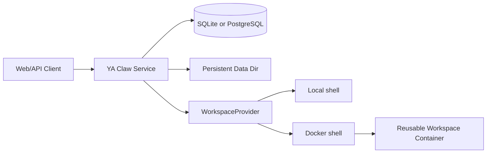

# YA Claw Deployment

Use this skill when deploying, configuring, operating, or troubleshooting YA Claw.

## Recommended Deployment Shape

Use the Docker workspace provider for production-like deployments. Choose the exact shape from the workspace provider matrix.

The Docker shell shapes give agents an isolated workspace container with Python, Node.js, Chromium, `agent-browser`, `lark-cli`, and bundled workspace skills.

## Start Here

Choose the deployment path:

- Workspace provider matrix: read [`references/workspace-provider/overview.md`](references/workspace-provider/overview.md)
- Service Docker + Docker shell: read [`references/docker.md`](references/docker.md) and [`references/workspace-provider/service-docker-docker-shell.md`](references/workspace-provider/service-docker-docker-shell.md)
- Service local + Docker shell: read [`references/systemd.md`](references/systemd.md) and [`references/workspace-provider/service-local-docker-shell.md`](references/workspace-provider/service-local-docker-shell.md)
- Service local + local shell: read [`references/workspace-provider/service-local-local-shell.md`](references/workspace-provider/service-local-local-shell.md)
- SQLite or PostgreSQL storage: read [`references/database.md`](references/database.md)
- Profile seeding: read [`references/profiles.md`](references/profiles.md)
- Bridge deployment: read [`references/bridge/overview.md`](references/bridge/overview.md) and [`references/bridge/lark.md`](references/bridge/lark.md)
- Health checks, backup, restore, upgrades, and troubleshooting: read [`references/operations.md`](references/operations.md)

## Required Baseline

Every deployment needs:

- `YA_CLAW_API_TOKEN`
- persistent `YA_CLAW_DATA_DIR`
- persistent `YA_CLAW_WORKSPACE_DIR`
- selected workspace backend: `local` or `docker`
- Docker access for the YA Claw service process when backend is `docker`
- `YA_CLAW_WORKSPACE_PROVIDER_DOCKER_HOST_WORKSPACE_DIR` when the service runs in Docker and uses Docker shell execution
- model/provider credentials available in the YA Claw service process
- seeded or pre-created AgentProfile rows

## Default Runtime Values

- HTTP port: `9042`
- runtime data dir: `~/.ya-claw/data`
- SQLite path: `~/.ya-claw/ya_claw.sqlite3`
- run store: `~/.ya-claw/data/run-store`
- workspace dir: `~/.ya-claw/data/workspace`
- default profile: `default`
- Docker workspace image: `ghcr.io/wh1isper/ya-claw-workspace:latest`
- Docker service host bind: `0.0.0.0`

## Deployment Checklist

01. Generate a long random `YA_CLAW_API_TOKEN`.
02. Choose SQLite or PostgreSQL.
03. Mount or create persistent data and workspace directories.
04. Choose one workspace provider shape.
05. Grant the service Docker access when the shape uses Docker shell execution.
06. Configure profile seed when packaged profiles should be loaded at startup.
07. Start the service with `ya-claw start`.
08. Verify `/healthz`.
09. Verify authenticated API or web shell access.
10. Start a test session and confirm model credentials, workspace tools, and profile behavior.

## Reference Routing

| Topic                     | File                                                                                     | Read when                                                                                                       |
| ------------------------- | ---------------------------------------------------------------------------------------- | --------------------------------------------------------------------------------------------------------------- |
| Environment variables     | [`references/environment.md`](references/environment.md)                                 | You need exact `YA_CLAW_*` settings, defaults, or production env shape                                          |
| Docker deployment         | [`references/docker.md`](references/docker.md)                                           | You deploy the YA Claw server as a Docker service                                                               |
| Workspace provider matrix | [`references/workspace-provider/overview.md`](references/workspace-provider/overview.md) | You choose between service local + Docker shell, service Docker + Docker shell, and service local + local shell |
| Docker workspace provider | [`references/workspace-provider/docker.md`](references/workspace-provider/docker.md)     | You configure Docker Engine access, path mapping, workspace mounts, and container reuse                         |
| systemd                   | [`references/systemd.md`](references/systemd.md)                                         | You run YA Claw as a supervised host service                                                                    |
| Database                  | [`references/database.md`](references/database.md)                                       | You choose SQLite or PostgreSQL, migrate, backup, or restore storage                                            |
| Profiles                  | [`references/profiles.md`](references/profiles.md)                                       | You seed profiles or manage AgentProfile configuration                                                          |
| Bridge overview           | [`references/bridge/overview.md`](references/bridge/overview.md)                         | You configure bridge dispatch, adapter enablement, and event-to-run routing                                     |
| Lark bridge               | [`references/bridge/lark.md`](references/bridge/lark.md)                                 | You connect Lark/Feishu events to YA Claw                                                                       |
| Bridge operations         | [`references/bridge/operations.md`](references/bridge/operations.md)                     | You verify embedded bridge startup, Lark ingress, dedupe, profiles, and workspace replies                       |
| Operations                | [`references/operations.md`](references/operations.md)                                   | You need health checks, logs, upgrades, backup, restore, or troubleshooting                                     |

When editing this skill inside the repository, keep `scripts/build-skill-zips.py` aligned so release artifacts include the canonical skill contents.
