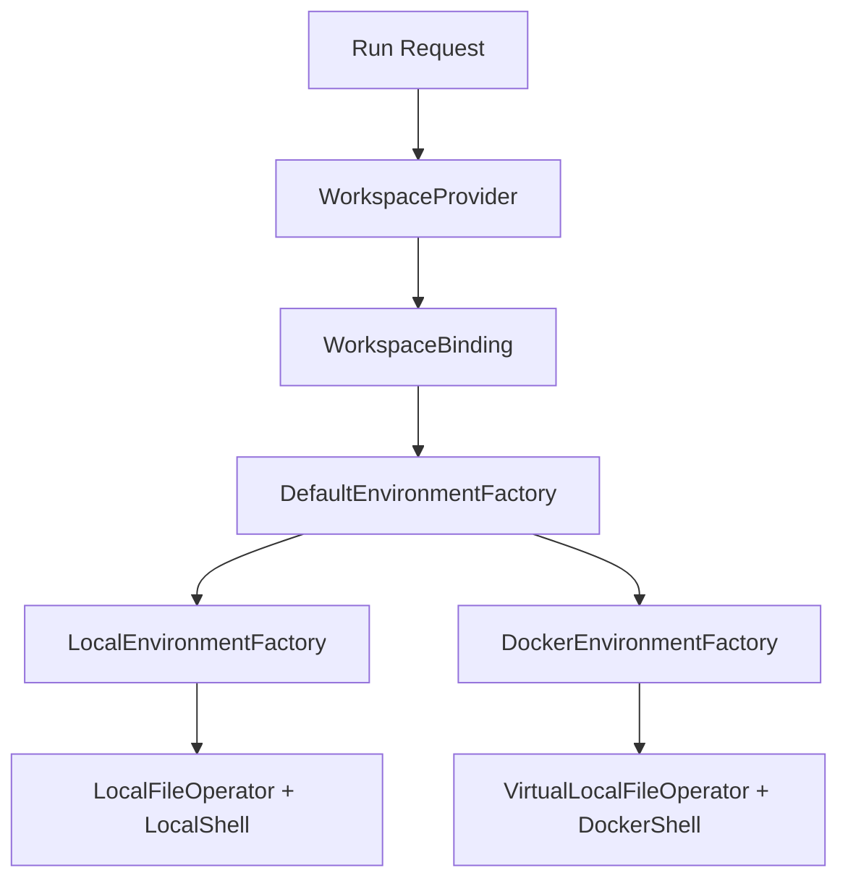

# Workspace Provider Matrix

YA Claw has one configured service workspace and builds each agent environment from a `WorkspaceBinding`.

The current deployment matrix has three practical shapes:

| Shape                         | Service process          | Workspace backend | File operations                             | Shell execution                                     | Read when                                                          |
| ----------------------------- | ------------------------ | ----------------- | ------------------------------------------- | --------------------------------------------------- | ------------------------------------------------------------------ |
| Service local + Docker shell  | Host process             | `docker`          | service-visible path mapped to `/workspace` | reusable Docker workspace container at `/workspace` | [`service-local-docker-shell.md`](service-local-docker-shell.md)   |
| Service Docker + Docker shell | Docker service container | `docker`          | service-visible path mapped to `/workspace` | reusable Docker workspace container at `/workspace` | [`service-docker-docker-shell.md`](service-docker-docker-shell.md) |
| Service local + local shell   | Host process             | `local`           | real host workspace path                    | real host workspace path                            | [`service-local-local-shell.md`](service-local-local-shell.md)     |

## Core Concepts

`YA_CLAW_WORKSPACE_DIR` is always the workspace path visible to the YA Claw service process.

`YA_CLAW_WORKSPACE_PROVIDER_DOCKER_HOST_WORKSPACE_DIR` is the workspace path visible to the Docker daemon. Set it when the service runs inside Docker and uses the Docker socket to create a sibling workspace container.

`DockerWorkspaceProvider` returns:

- `host_path`: service-visible workspace path
- `docker_host_path`: Docker daemon-visible workspace path
- `virtual_path`: `/workspace`
- `cwd`: `/workspace`
- `backend_hint`: `docker`

`LocalWorkspaceProvider` returns:

- `host_path`: real workspace path
- `virtual_path`: real workspace path
- `cwd`: real workspace path
- `backend_hint`: `local`

## Selection Guidance

Use service Docker + Docker shell for packaged server deployments. This shape uses the `Dockerfile.ya-claw` image and the official workspace image.

Use service local + Docker shell for host-managed deployments that still want the official isolated workspace tool image.

Use service local + local shell for trusted machines where the service user owns the workspace and all needed tools already exist on the host.
