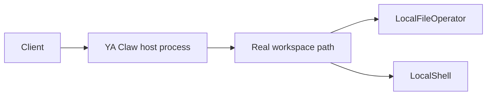

# Service Local + Local Shell

Use this shape when YA Claw runs as a trusted host process and agent file/shell operations should use the real host workspace path.

## Runtime Shape



## Configuration

```env
YA_CLAW_WORKSPACE_PROVIDER_BACKEND=local
YA_CLAW_WORKSPACE_DIR=/var/lib/ya-claw/workspace
```

## Path Semantics

| Binding field                | Value                        |
| ---------------------------- | ---------------------------- |
| service-visible `host_path`  | `/var/lib/ya-claw/workspace` |
| agent-visible `virtual_path` | `/var/lib/ya-claw/workspace` |
| agent cwd                    | `/var/lib/ya-claw/workspace` |

`LocalWorkspaceProvider` uses the real workspace path as `virtual_path` and `cwd`. `LocalEnvironmentFactory` creates a `LocalFileOperator` and `LocalShell` restricted to the workspace path and temporary directory.

## Host Requirements

The host must provide the tools agents need through the service user environment, such as Python, Node.js, Git, browser tooling, and any CLIs referenced by profiles or MCP servers.

Workspace permissions should allow the service user to read and write:

```bash
sudo mkdir -p /var/lib/ya-claw/workspace
sudo chown -R ya-claw:ya-claw /var/lib/ya-claw/workspace
sudo -u ya-claw test -w /var/lib/ya-claw/workspace
```

## Verification

```bash
sudo -u ya-claw sh -lc 'cd /var/lib/ya-claw/workspace && pwd && touch .write-test && rm .write-test'
curl http://127.0.0.1:9042/healthz
```

A test run that asks the agent to print `pwd` should report the real workspace path.
